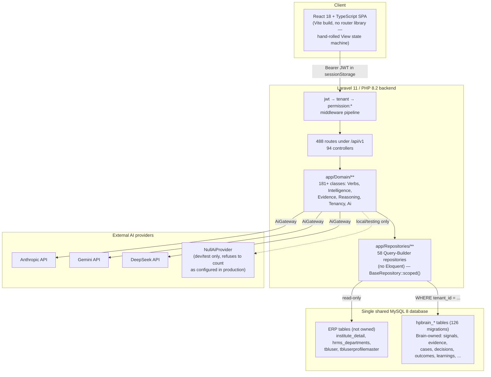
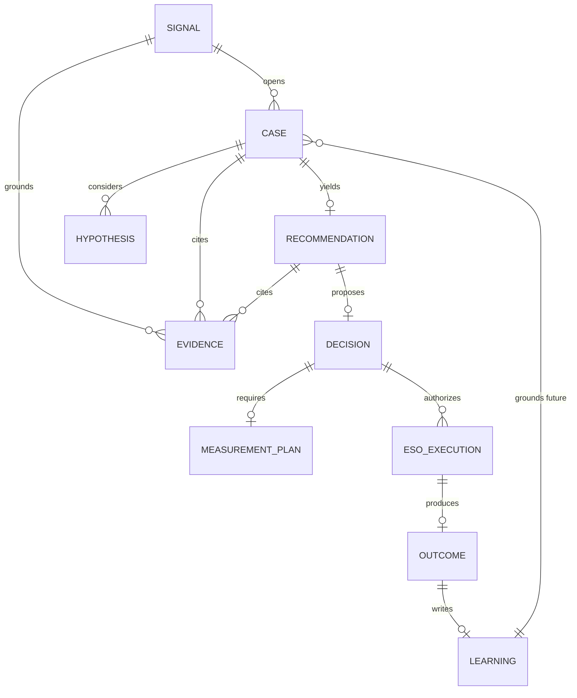

# HP Enterprise Brain

## Version 1 — Product Blueprint & Launch Plan

| | |
|---|---|
| **Document purpose** | Ground-truth V1 product definition, derived from direct inspection of the repository (code, migrations, routes, tests, docs) rather than from prior planning documents. |
| **Version / status** | Draft v1.0 — for product/engineering review, not yet ratified |
| **Prepared** | 2026-09-28 |
| **Repository** | `C:\Users\omshivay\Desktop\ADK\hp-enterprise-brain`, branch `harshit` |
| **Scope** | Defines the smallest complete, launchable V1 of HP Enterprise Brain and the work required to get there. Does not change any code, schema, or configuration. |

### How to read this document

Every substantive claim carries one of six labels, used consistently throughout:

| Label | Meaning |
|---|---|
| **Existing — Verified** | Confirmed by reading the actual source (code, migration, or a real test exercising it end-to-end). |
| **Existing — Partially Verified** | The code exists and does something real, but is not fully reachable, not fully wired, or has a documented caveat. |
| **Existing — Not Verified** | Present in the repository but not independently confirmed working in this pass. |
| **Proposed for V1** | Does not exist yet; recommended to be built before launch. |
| **Deferred to Future Version** | Deliberately out of scope for V1. |
| **Open Question** | Cannot be resolved from the repository alone; needs a product or engineering decision. |

This audit found that the project's own historical documents are a mixed bag: some are live, measured snapshots; several are proposals that were never implemented; and one (`docs/PART-3-REMEDIATION-REPORT.md`) exists specifically because three prior "completion reports" claimed passing tests while the application did not even boot. Every claim below was re-derived from source, not copied from those documents. Where a document and the code disagreed, the code wins, and the discrepancy is called out.

---

## Table of Contents

1. [Executive Summary](#1-executive-summary)
2. [Product Vision & Value Proposition](#2-product-vision--value-proposition)
3. [Existing Product Assessment](#3-existing-product-assessment)
4. [V1 Scope & Exclusions](#4-v1-scope--exclusions)
5. [User Roles & Permissions](#5-user-roles--permissions)
6. [Module Hierarchy](#6-module-hierarchy)
7. [Screen Inventory](#7-screen-inventory)
8. [End-to-End Workflows](#8-end-to-end-workflows)
9. [Technical Architecture](#9-technical-architecture)
10. [Database Blueprint](#10-database-blueprint)
11. [API & Service Blueprint](#11-api--service-blueprint)
12. [Security & Privacy](#12-security--privacy)
13. [Integrations & Configuration](#13-integrations--configuration)
14. [Deployment Architecture & Release Requirements](#14-deployment-architecture--release-requirements)
15. [Implementation Roadmap](#15-implementation-roadmap)
16. [Acceptance Criteria & Launch Gates](#16-acceptance-criteria--launch-gates)
17. [Risks, Assumptions & Open Questions](#17-risks-assumptions--open-questions)
18. [Future-Version Considerations](#18-future-version-considerations)
19. [Final V1 Readiness Assessment](#19-final-v1-readiness-assessment)
20. [Glossary](#20-glossary)

---

## 1. Executive Summary

HP Enterprise Brain is a Laravel 11 / PHP 8.2 / MySQL 8 backend, paired with a React 18 + TypeScript single-page application, that sits **above** an institute's existing ERP as an organizational-intelligence layer. It does not own Organization, Department, or Person records — it reads them live from the ERP (`institute_detail`, `hrms_departments`, `tbluser`) — and it reasons *with* them by writing its own `hpbrain_`-prefixed tables into the same shared MySQL database.

The core, differentiating capability — a governed reasoning pipeline that turns raw operational data into an evidenced, human-approved decision, and then writes the outcome back as reusable organizational learning — is **real and proven**. `tests/Feature/GoldenIntelligenceFlowTest.php` exercises the entire chain (signal → evidence → reasoning → decision approval → measurement plan → execution → outcome → learning → memory grounding) over real HTTP endpoints against a real database, including two deliberate "honesty checkpoints" where the system must return an explicit `UNDETERMINED` result rather than fabricate an answer.

The project has been through one serious credibility event: three consecutive "Part 3" milestone reports claimed passing tests for a "Universal AI Brain" platform, while a remediation audit (`docs/PART-3-REMEDIATION-REPORT.md`) later found the application did not even boot — a duplicate method declaration was a fatal error at class-load, meaning zero of those claimed tests had ever actually executed. The remediation was real and is reflected in the current, working codebase (94 controllers, 126 migrations, 488 API routes, 103 backend test files, ~50 frontend test files), but it is the reason this blueprint treats every historical document as a claim to verify, not a fact to repeat.

**What V1 should be**: the proven core loop (Organization/Department/People foundation → ingestion → signals → evidence → cases → reasoning → recommendations → human-approved decisions → measurement → human-executed action → outcomes → learning), for the two vertical shapes the system has real production or near-production data for today (a school and a telecom operator), secured by the existing JWT/RBAC/tenant-isolation model with a short list of hardening fixes, and shipped without the still-simulated or still-dark capabilities (AI evaluation, RAG retrieval, autonomous execution, the SIMULATE verb, and a fully industry-agnostic UI) being presented as delivered.

---

## 2. Product Vision & Value Proposition

**What it is.** An organizational-intelligence and execution system that layers on top of an institute's existing ERP without owning or duplicating its master data, and that is honest about what it does and does not know — every claim traces to evidence, and an absence of evidence produces an explicit `UNDETERMINED`, never a guess presented as fact (`app/Domain/Undetermined/VerbResult.php`, `SufficiencyCheck.php` — **Existing — Verified**, exercised by `GoldenIntelligenceFlowTest.php:122-137`).

**The problem it solves.** Institute ERPs (school management systems, telecom operations systems) accumulate operational data — fee receipts, complaint logs, attendance, work orders — that nobody turns into organizational insight. HP Enterprise Brain ingests that data, detects signals (SLA breaches, missing root causes, fee-collection risk, academic gaps), builds a case with evidence, proposes a recommendation, routes it through human approval, tracks the resulting action, measures the outcome, and folds what worked back into reusable "organizational memory" that improves the next case.

**Who uses it today (evidence-backed).**
- A school (**"Lions"**, and an in-progress third pilot, **"Scholar Valley"** — the untracked `app/Console/Commands/SeedScholarValleySchool.php` and `database/seeders/data/scholar_valley/*.csv` fixtures in the current working tree show this onboarding is actively in progress on the `harshit` branch at the time of this audit) — real academic-result (388,401 rows), fee-collection (10,430 receipts), and attendance data, per `docs/SCHOOL-DATASETS.md`.
- A telecom operator (**"FiberValley"**) — 65,268 complaint rows, 5,790 work orders, and staff attendance, imported via a custom streaming XLSX reader, per `docs/FIBERVALLEY-INTEGRATION.md`.
- A hospital tenant was proven end-to-end **at the data layer only** (login, entity resolution, signal rules, demand snapshots — `docs/UNIVERSAL-INTELLIGENCE-PROGRESS.md` Phase 8), but its screens were never built or converted to industry-neutral terminology. Treat "multi-industry" as **Existing — Partially Verified**: real for data modeling, unproven for the UI a third vertical's users would actually see.

**Current product maturity.** Post-remediation, functioning, and covered by a substantial test suite (103 backend test files including a genuine end-to-end proof; ~50 frontend test files). Not yet production-hardened: no CI pipeline exists to keep it that way, several security-hardening items are documented gaps rather than closed items, and a live functional audit (`docs/API-FUNCTIONAL-AUDIT.md`, 2026-08-06) found real broken endpoints that this blueprint could not confirm are still broken or already fixed as of this pass (see [§17](#17-risks-assumptions--open-questions)).

---

## 3. Existing Product Assessment

### 3.1 What's implemented and working (Existing — Verified)

| Area | Evidence |
|---|---|
| Organization/Department/Person read from live ERP data, never duplicated | `README.md`; `database/fixtures/dev-erp-source.sql`; `app/Domain/Universal/EntityResolver.php`; 168 `hpbrain_entity_mappings` seed rows (`EntityMappingSeeder`) |
| Signal detection from real operational data | `hpbrain_operational_records` (the generic per-tenant fact table holding all non-master-data ERP exports) + `hpbrain_signal_rules` (configurable, data-driven, not hardcoded) |
| Evidence → Case → Hypothesis → Reasoning → Recommendation → Decision chain | `tests/Feature/GoldenIntelligenceFlowTest.php`, steps 3–8, real HTTP round trips |
| Decision approval with separation of duties | Same test, lines 256-283: a proposer cannot self-approve (403), a manager-as-proposer cannot approve their own proposal (409 `self_approval_forbidden`), a different manager can |
| Measurement plan required before execution (Invariant 4) | `hpbrain_measurement_plans`; `GoldenIntelligenceFlowTest.php:297-324` |
| Execution, outcome, learning, and memory-grounding, with idempotent replay | Same test, steps 9–11 (lines 326-393); a second, independent test proves a later case is provably informed by an earlier one's learning (lines 427-502) |
| Honest `UNDETERMINED` instead of fabrication when evidence or an AI provider is missing | `VerbResult.php`, `SufficiencyCheck.php`; `AiGateway::isConfigured()` refuses to treat the no-network `NullAiProvider` as "configured" outside local/testing, forcing UNDETERMINED rather than canned text in production |
| Real AI provider integrations | `AnthropicProvider.php`, `GeminiProvider.php`, `DeepSeekProvider.php` — genuine `Http::post()` calls to each vendor's real API, not stubs |
| JWT auth with rotation/revocation, RBAC, tenant isolation | `AuthController.php`, `hpbrain_refresh_tokens`, `AuthenticateJwt`/`EnsureTenantScope`/`RequirePermission` middleware — see [§12](#12-security--privacy) |
| Tenant isolation enforced structurally | `BaseRepository::scoped()` — every repository must filter by `tenant_id`; no Eloquent, so no accidental unscoped model query is possible, but correctness still depends on every repository calling `scoped()` |
| A capability/skills model with an evidence-gated, non-regressing six-state proficiency scale | `hpbrain_capability_proficiency`, `app/Domain/Capability/CapabilityState.php` |
| A working ingestion pipeline for CSV/XLSX operational data, idempotent by content hash | `app/Domain/Ingestion/*`, `tests/Feature/StreamingCsvIngestionTest.php`, `FiberValleyImportTest.php` |

### 3.2 What's partially implemented (Existing — Partially Verified)

| Item | Caveat |
|---|---|
| The seven-verb Capability Interface (ADR-004) | Five of seven verbs exist and are real (Explain, Assess, Evaluate, Recommend, Coach). **SIMULATE has no implementation class at all.** **EXECUTE is deliberately dark** — governed and flag-gated, throws if invoked, and is only ever exercised in tests with a human executor. |
| `EvidenceService`'s freshness-decay math | Real and unit-tested, but not called from `EvidenceController` — evidence is stored with client-supplied confidence, bypassing the decay curve. Built, not reachable from the API. |
| The AI & Intelligence admin console (12 controllers, ~5,500 lines) | Genuinely database-backed, not a stub screen — but two of its twelve controllers (`AiStackReportController`, `AiStackToolAgentController`) are explicitly non-AI (template substitution / allow-listed read-only lookups) despite living under "AI Intelligence." |
| AI evaluation | `EvaluationService::runEvaluation()` marks every case `passed` with status `simulated` — it measures nothing yet, per `docs/PART-3-REMEDIATION-REPORT.md` §5. |
| RAG (retrieval-augmented generation) | No document-ingestion pipeline exists; the architecture is specified, not built. |
| AI Workspace `regenerate`/`explain`/`follow-up` | Honestly return `not_implemented` (an improvement over an earlier state where they returned canned text indistinguishable from real output). |
| Event backbone consumption | `docs/EVENT_BACKBONE.md` states no consumer runs — but `routes/console.php:30-33` schedules `brain:process-events --once` every minute, and the golden-flow test explicitly drains it. This is a genuine discrepancy between a doc and the code; see [§17](#17-risks-assumptions--open-questions). |
| Multi-industry UI | The entity/data layer is proven industry-agnostic (a hospital tenant onboarded by data insertion alone); the 30-screen frontend is not — it is school/telecom-shaped in practice, and `useConfig().terminology` exists but screens don't consistently use it. |

### 3.3 What's proposed but not built (Deferred to Future Version)

- The SIMULATE verb (declared in the `Verb` enum, no concrete class anywhere in `app/Domain/Verbs/`).
- Autonomous EXECUTE (by design — "EXECUTE stays dark: human only" is asserted directly in the golden-flow test).
- A Neo4j-backed knowledge graph (ADR-008 explicitly defers this; the current Graph Explorer runs on MySQL recursive CTEs, revisit "if traversals exceed 3 hops or ~10⁶ relationships per tenant").
- A genuinely industry-neutral frontend for a third vertical.

---

## 4. V1 Scope & Exclusions

| Classification | Meaning |
|---|---|
| **V1 Core** | Required for the first usable release |
| **V1 Supporting** | Necessary to operate or support the core product |
| **Stabilization** | Existing functionality that needs fixes or verification before it can be trusted |
| **V1 Optional** | Useful but not essential for launch |
| **Future Version** | Deliberately deferred |
| **Out of Scope** | Not part of the defined V1 |

| Capability | Classification | Reason |
|---|---|---|
| Organization / Department / People foundation (read from ERP, Brain-side profile/capability data) | **V1 Core** | Everything else depends on this being correct; already working |
| Data ingestion (CSV/XLSX → `hpbrain_operational_records`) | **V1 Core** | The only way real signals get generated; proven on two real datasets |
| Signal detection (data-driven `hpbrain_signal_rules`) | **V1 Core** | The entry point of the intelligence loop |
| Evidence, Case, Hypothesis, Reasoning (Explain/Assess/Evaluate verbs) | **V1 Core** | Proven end-to-end; this is the product's differentiator |
| Recommendation, human-approved Decision (separation of duties) | **V1 Core** | Proven, and the point at which the product produces value a user acts on |
| Measurement Plan → human-executed ESO → Outcome → Learning → Memory | **V1 Core** | Closes the loop; proven, including cross-case learning reuse |
| JWT auth, RBAC (5 roles), tenant isolation | **V1 Core** | Non-negotiable for a multi-tenant product handling real PII and ERP data |
| Capability/skills model (KASBA, six-state proficiency) | **V1 Supporting** | Feeds Assess/Coach verbs and department/person intelligence screens |
| AI Assistant (conversational, via `ConversationController`) | **V1 Supporting** | Real, DB-backed conversation history; the live nav item, not the dead `AiWorkspace.tsx` files |
| Executive Dashboard, Decision Analytics, Knowledge Library, Memory screen, Graph Explorer, Global Search | **V1 Supporting** | Consume the core loop's output; needed for a user to actually see value, not needed to produce it |
| Event backbone consumer verification | **Stabilization** | A scheduled command exists and a doc says it doesn't run — this must be resolved, not assumed, before outcomes/learning are trusted in production (see [§17](#17-risks-assumptions--open-questions)) |
| FK-constraint / tenant-ownership hand-checks in early tables | **Stabilization** | `REFERENCES` clauses in the earliest migrations are decorative (MySQL/InnoDB ignores column-level `REFERENCES`); real `CONSTRAINT ... FOREIGN KEY` only appears in later migrations |
| Viewer role triggering paid AI calls on 3 routes gated only by `permission:read` | **Stabilization** | Named as a live, unresolved item in `docs/DECISIONS-PENDING.md` |
| API-Functional-Audit findings (org-units 500s, AI Workspace 500, broken Ingestion-screen routes) | **Stabilization** | Dated 2026-08-06; not re-verified in this pass — must be re-tested against current `HEAD` before launch |
| Dead frontend screens (`AiWorkspace.tsx` ×2, template/dashboard-builder/audit/events/ai-admin/dynamic-navigation components) | **Stabilization** | Not launch-blocking, but actively confusing for future maintenance; recommend deletion |
| Security headers (CSP/HSTS/X-Frame-Options), MFA/SSO, HttpOnly session tokens | **V1 Optional** → recommend promoting to Stabilization given real student/employee PII is in scope | Documented gaps in `docs/SECURITY-HARDENING-CHECKLIST.md`; tokens currently live in `sessionStorage`, not HttpOnly cookies |
| AI evaluation (real, non-simulated), RAG retrieval, full cost-governance dashboards | **Future Version** | Scaffolding exists; the "intelligence" is not delivered — do not market as working in V1 |
| SIMULATE verb, autonomous EXECUTE | **Future Version** | No implementation; EXECUTE is intentionally dark by architectural decision (ADR-004) |
| Full multi-industry, terminology-driven frontend for new verticals | **Future Version** | Entity layer is ready; UI conversion work has not started |
| Neo4j-backed graph | **Future Version** | Explicitly deferred by ADR-008 |
| Self-service tenant onboarding / industry template marketplace | **Out of Scope** | No evidence this is a near-term goal; onboarding today is engineer-run (seeders, artisan commands) |

---

## 5. User Roles & Permissions

Derived directly from `app/Domain/Authorization/Role.php` and `Permission.php` — this is a flat RBAC model (role → fixed permission set), enforced only at the route-middleware layer (`RequirePermission`). There are **no Policy classes and no Gates** in the codebase.

| Role | Purpose | Permissions granted | V1 notes |
|---|---|---|---|
| **Viewer** | Read-only stakeholder (e.g., a department head who wants visibility, not control) | `read` | **Existing — Partially Verified**: 3 routes today let a Viewer trigger a paid AI call despite being gated only on `read` — a Stabilization item |
| **Analyst** | Investigates signals, builds evidence and cases | Viewer's set + `create`, `update`, `evidence.curate` | Existing — Verified |
| **Manager** | Approves decisions, authorizes execution | Analyst's set + `decision.approve`, `eso.execute` | Existing — Verified; separation-of-duties enforced (a manager cannot approve their own proposal) |
| **Admin** / **Tenant Admin** | Full tenant control: settings, API keys, tenant lifecycle, events | All permissions, including `settings.manage`, `apikey.manage`, `events.manage`, `tenant.manage` | Existing — Verified; the entire "AI & Intelligence" console and ~30 "Universal Platform Foundation" CRUD resources are gated at `settings.manage` |

Role is resolved once, at login, from the ERP's free-text profile field (`AuthController::resolveRole()`, substring match on titles like "manager," "admin," "analyst") and embedded as a JWT claim — it is **never re-derived from the database on subsequent requests**. A profile title that doesn't match any known role maps to `member`, which is not a recognized `Role` enum value and is therefore **denied, fail-closed**, as `unknown_role`.

**Open Question**: role derivation by substring match on an ERP free-text field is fragile — an institute that titles a role "Assistant Manager" or "Deputy Admin" could resolve unpredictably. Recommend an explicit, auditable role-mapping step during tenant onboarding rather than substring inference, before onboarding a third or fourth customer.

---

## 6. Module Hierarchy

```
HP Enterprise Brain
├── Organization Foundation                         [V1 Core]
│   ├── Organization (profile, structure, units)
│   ├── Department (incl. school "Academic Sections" mode)
│   ├── People / Students (person profiles, digital twin)
│   └── Capability (KASBA skills/competency model)
├── Data Ingestion                                   [V1 Core]
│   └── CSV/XLSX operational-record import, per-tenant field mapping
├── Intelligence Loop                                [V1 Core]
│   ├── Signals            (detection, triage)
│   ├── Evidence           (provenance, freshness)
│   ├── Cases              (hypotheses, root-cause)
│   ├── Deliberation       (recommendation ↔ decision linkage)
│   ├── Reasoning Workspace
│   └── Execution Center   (human-executed ESOs, outcomes)
├── Analytics                                        [V1 Supporting]
│   ├── Executive Dashboard
│   ├── Decision Analytics / Decision Intelligence
│   └── Organizational Knowledge (Mental Models)
├── Knowledge                                        [V1 Supporting]
│   ├── Graph Explorer      (MySQL CTEs, not Neo4j — ADR-008)
│   ├── KASBA Explorer
│   ├── Knowledge Library
│   ├── Memory              (organizational learning)
│   ├── Global Search
│   └── ESO Library
├── AI Assistant                                     [V1 Supporting]
│   └── Conversational assistant (ConversationController — the live screen)
├── AI & Intelligence Console                        [V1 Optional]
│   └── Providers, models, policies, templates, evaluation, usage/cost,
│       recommendation approval, per-module "AI Stack" panels
├── Automation                                       [V1 Optional]
│   ├── Agent Monitor
│   ├── Task Orchestrator
│   └── Policy Management
└── Platform Administration                          [V1 Optional / engineer-run]
    ├── Settings, tenant lifecycle
    └── Universal Platform config (industries, terminology, feature flags,
        modules, navigation, dashboards, branding, themes, forms)
```

For each V1 Core module, acceptance requires: the screen renders against a real tenant's ERP data, every write path is tenant-scoped and permission-gated, and the underlying service is exercised by at least one Feature test hitting the real route (not a mock).

---

## 7. Screen Inventory

The frontend (`web/src/App.tsx`) has **no router library** — navigation is a hand-rolled `View` string-union rendered by a single conditional block, with each screen lazy-loaded. The table below consolidates the ~30 distinct views (excluding aliases and hidden sub-routes) and classifies each for V1.

| Screen | Component | Level | Primary API | V1 disposition |
|---|---|---|---|---|
| Command Center (home) | `CommandCenter.tsx` | Organization | `intelligence`, `organization`, `capability`, `ingestion`, `operations` | V1 Core |
| Organization List/Create/Edit/Archive | `Organization*.tsx` | Organization | `organization.ts` | V1 Core |
| Departments (+ Academic Sections mode) | `DepartmentApp.tsx`, `AcademicSectionView.tsx` | Department | `department.ts`, `student.ts` | V1 Core |
| People / Students | `PersonApp.tsx`, `StudentList/Detail.tsx` | People | `person.ts`, `student.ts` | V1 Core |
| Capabilities | `CapabilityApp.tsx` + intelligence panels | Module | `capability.ts` | V1 Core |
| Ingestion Workspace | `IngestionWorkspace.tsx` | Module/Admin | `ingestion.ts` | V1 Core |
| Signal Dashboard / Signal Chain | `SignalDashboard.tsx`, `SignalChainView.tsx` | Module | `signal.ts`, `intelligence.ts` | V1 Core |
| Evidence Workspace | `EvidenceWorkspace.tsx` | Module | `intelligence`, `signal`, `ai`, `operations` | V1 Core |
| Cases Workspace | `CasesWorkspace.tsx` | Module | `case.ts`, `intelligence` | V1 Core |
| Deliberation Workspace | `DeliberationWorkspace.tsx` | Module | `intelligence` (decision), `operations` | V1 Core |
| Intelligence Workspace | `IntelligenceWorkspace.tsx` | Module | `intelligence`, `operations` | V1 Core |
| Execution Center | `ExecutionCenter.tsx` | Module | `intelligence`, `eso.ts` | V1 Core |
| Executive Dashboard | `ExecutiveDashboard.tsx` | Analytics | `organizationIntelligence`, `operations` | V1 Supporting |
| Decision Analytics / Decision Intelligence | `DecisionAnalyticsPanel.tsx`, `DecisionIntelligence.tsx` | Analytics | `organizationIntelligence` | V1 Supporting |
| Mental Model Browser | `MentalModelBrowser.tsx` | Analytics/Knowledge | `organizationIntelligence` | V1 Supporting |
| Graph Explorer | `GraphExplorer.tsx` + `graph/*` | Knowledge | `graph.ts` | V1 Supporting |
| KASBA Explorer | `KasbaExplorer.tsx` | Module/Knowledge | `kasba.ts`, `capability.ts` | V1 Supporting |
| Knowledge Library | `KnowledgeLibrary.tsx` | Knowledge | `knowledgeLibrary.ts` | V1 Supporting |
| Memory | `MemoryScreen.tsx` | Knowledge | `organizationalMemory.ts` | V1 Supporting |
| ESO Library | `EsoLibraryScreen.tsx` | Knowledge | `eso.ts`, `organizationIntelligence` | V1 Supporting |
| Global Search | `GlobalSearch.tsx` | Knowledge | `intelligence.ts`, `graph.ts` | V1 Supporting |
| **AI Assistant** | `AIAssistant.tsx` | AI | `conversation.ts` (→ `ConversationController`) | V1 Supporting — this is the live screen |
| AI & Intelligence console | `AiIntelligenceApp.tsx` + 8 screens | Admin | `aiIntelligence/*` | V1 Optional |
| Per-module AI Stack panels | `ai-stack/*` (18 module screens) | Admin | `aiStack/*` | V1 Optional |
| Agent Monitor | `AgentMonitor.tsx` | Automation | `intelligence.ts` | V1 Optional |
| Task Orchestrator | `TaskMonitor.tsx` | Automation | `task.ts` | V1 Optional |
| Policy Management | `PolicyManagement.tsx` | Admin | `policy.ts` | V1 Optional |
| Settings | `Settings.tsx` | Admin | `notification.ts`, `organization.ts` | V1 Core (tenant lifecycle lives here) |
| Login / Signup | `Login.tsx`, `Signup.tsx` | Auth | `auth/login`, `auth/signup` | V1 Core |

**Confirmed dead code — recommend deletion, not launch of, in V1** (not referenced from `App.tsx`'s view switch, verified by import search): `components/ai/AiWorkspace.tsx`, `components/workspace/AIWorkspace.tsx` (both superseded by the live `AIAssistant.tsx`), `components/templates/*`, `components/dashboard/*` (DashboardBuilder), `components/audit/AuditDashboard.tsx`, `components/events/*`, `components/ai-admin/*` (superseded by `ai-intelligence/screens/*`), `components/navigation/DynamicNavigation.tsx`, and `components/workspace/OrganizationIntelligenceHome.tsx` (explicitly commented as retired in favor of Command Center, left in place deliberately).

---

## 8. End-to-End Workflows

### 8.1 The Golden Intelligence Loop (V1 Core)

**Existing — Verified** in full, by `tests/Feature/GoldenIntelligenceFlowTest.php`, over real HTTP endpoints.

```mermaid
sequenceDiagram
    participant Data as Operational Data
    participant Sig as Signal
    participant Ev as Evidence
    participant Case as Case / Hypothesis
    participant Rec as Recommendation
    participant Dec as Decision (human-approved)
    participant Exec as ESO Execution (human)
    participant Out as Outcome
    participant Mem as Learning / Memory

    Data->>Sig: signal rule fires (hpbrain_signal_rules)
    Sig->>Ev: POST /evidence (provenance + hash required)
    Note over Ev: No evidence yet → EXPLAIN returns<br/>UNDETERMINED / no_grounding_evidence (honesty checkpoint 1)
    Ev->>Case: case + hypothesis created, citing evidence id
    Case->>Rec: RECOMMEND verb (AI-assisted, EsoBindingRule-gated)
    Rec->>Dec: POST /decisions (born "proposed")
    Note over Dec: Self-approval forbidden (403);<br/>proposer-as-manager forbidden (409)
    Dec->>Exec: measurement plan required, then ESO execution (executorType: human)
    Exec->>Out: POST /outcomes
    Out->>Mem: async event consumer writes Learning, then Memory<br/>(idempotent — replay does not duplicate)
```

| Field | Detail |
|---|---|
| **Trigger** | A signal rule matches new operational data, or an analyst manually raises a signal |
| **Actor** | System (signal detection) → Analyst (evidence, case, hypothesis) → Manager (decision approval) → human Executor (ESO execution) |
| **Required input** | Operational records already ingested; evidence with provenance (rejected 422 without it) |
| **Processing** | Explain → Assess/Evaluate → Recommend, each governed (role check) → grounded (evidence required) → guarded (UNDETERMINED if insufficient) |
| **DB entities** | `hpbrain_signals`, `hpbrain_evidence`, `hpbrain_cases`/`hpbrain_hypotheses`, `hpbrain_recommendations`, `hpbrain_decisions`, `hpbrain_measurement_plans`, `hpbrain_eso_executions`, `hpbrain_outcomes`, `hpbrain_learnings` |
| **Result shown to user** | A decision awaiting approval, then an execution to carry out, then a measured outcome, then a citation in the next similar case ("this recommendation is grounded in a learning from case #…") |
| **Approval requirements** | Decision approval requires `decision.approve` (Manager+) and a different person than the proposer |
| **Failure/recovery** | Missing evidence → explicit `UNDETERMINED`, not a fabricated answer; a rejected decision is a valid terminal state |
| **Audit** | Every state transition emits a domain event (`OBSERVATION_MADE`, `EVIDENCE_RECORDED`, `DECISION_REACHED`, `EXECUTION_STARTED`, `OUTCOME_RECORDED`, `LEARNING_WRITTEN`, `MEMORY_UPDATED`) into `hpbrain_event_store`, plus an `hpbrain_audit_logs` row on every permission denial |
| **Completion criteria** | A learning row exists, is marked reusable, and is retrievable by a later, related case (proven by the test's second scenario) |

### 8.2 Data Ingestion (V1 Core)

**Existing — Verified**, proven against two real datasets (school academic/fee data, telecom complaint/work-order data).

1. **Trigger**: an admin uploads a CSV/XLSX export, or a scheduled/manual sync runs against `hpbrain_data_sources`.
2. **Actor**: Admin or Tenant Admin (`permission:settings.manage` on the Ingestion screens).
3. **Input**: a file plus a field map (per-tenant, declared in `config/import_profiles.php` or discovered via `SchemaDetector`).
4. **Processing**: streaming parse (chosen deliberately over full in-memory loading — 8MB peak vs. ~1GB for a naive approach on a 65k-row file) → row-level validation → content-hash-based idempotency → write to `hpbrain_operational_records`.
5. **DB entities**: `hpbrain_data_sources`, `hpbrain_import_jobs`, `hpbrain_import_logs`, `hpbrain_operational_records`.
6. **Result**: an import summary (rows processed/skipped/failed); newly eligible operational records become visible to signal rules.
7. **Failure/recovery**: per-row failures are logged to `hpbrain_import_logs` without aborting the whole batch; a rollback path exists on `hpbrain_import_jobs` (one defect — a broken rollback — was found and fixed during the FiberValley integration).
8. **Completion criteria**: `hpbrain_operational_records` row counts match the source file, re-running the same file produces zero new rows (idempotent).

**Known caveat (Open Question)**: `docs/API-FUNCTIONAL-AUDIT.md` (2026-08-06) found the Ingestion screen wired to non-existent/misprefixed routes whose failure was silently swallowed as an "empty state" rather than surfaced as an error. This predates significant later work and was **not re-verified in this pass** — it must be re-tested before launch.

### 8.3 Organization Foundation & Capability Assessment (V1 Core)

1. **Trigger**: a user navigates to Departments, People, or Capabilities.
2. **Actor**: any authenticated role (read); Analyst+ for writes to Brain-owned data (capability assignments, proficiency).
3. **Input**: none required to view — Organization/Department/Person render directly from the live ERP tables.
4. **Processing**: `EntityResolver` maps the ERP's actual columns to universal fields per tenant's `hpbrain_entity_mappings`; for school tenants with zero ERP department rows, `AcademicSectionView.tsx` substitutes a derived academic-section view built from student data.
5. **DB entities**: ERP tables (read-only: `institute_detail`, `hrms_departments`, `tbluser`), plus Brain-owned `hpbrain_capabilities`, `hpbrain_capability_proficiency`, `hpbrain_students` (a derived projection, not source-of-truth, rebuilt by `students:rebuild`).
6. **Result**: a department/person profile with KASBA capability standing; advancing a proficiency level requires an `evidenceRef` (silent regression is rejected).
7. **Completion criteria**: the screen renders correctly for a tenant whose ERP has zero rows in a given master table (proven for schools with no HR department rows).

### 8.4 AI Assistant Conversation (V1 Supporting)

1. **Trigger**: a user opens the AI Assistant screen and asks a question.
2. **Actor**: any authenticated role holding `create` (message/session writes require it).
3. **Input**: a natural-language question, optionally scoped to an entity (person, department, case).
4. **Processing**: `AiIntelligenceAskController` → `AskPipeline` → `AiModelClient` → a real AI provider call; the transcript persists via `ConversationStore`. A failed or ungrounded answer returns HTTP 200 with `answer: null` and a reason, matching the platform-wide honesty pattern — not a 500, not a fabricated string.
5. **DB entities**: `hpbrain_ai_conversations`, `hpbrain_ai_conversation_turns`.
6. **Result**: a grounded answer, or an explicit "I don't have enough to answer that" state.
7. **Completion criteria**: the answer, when given, cites the evidence/entity it drew from.

---

## 9. Technical Architecture



| Layer | Stack | Status |
|---|---|---|
| Frontend | React 18.3, TypeScript 5.5, Vite 5.4, no router library, no state-management library (local `useState`/`useContext`), Recharts + d3 for visuals, Vitest + Testing Library | Existing — Verified |
| Backend | Laravel 11, PHP 8.2+, hand-rolled JWT via `firebase/php-jwt` (no Sanctum), Query Builder throughout (**zero Eloquent models** — confirmed, `app/Models/` does not exist) | Existing — Verified |
| Database | MySQL 8, **one shared connection** for both the ERP and the Brain (`hpbrain_`-prefixed tables coexist with ~171 non-Brain ERP tables in the same `hp_erp` database) | Existing — Verified |
| Tenancy | JWT-claim-authoritative + per-repository `WHERE tenant_id` convention; no schema-per-tenant, no Eloquent global scope | Existing — Verified |
| AI/intelligence pipeline | Seven-verb architecture (ADR-004), five verbs implemented, EXECUTE dark, SIMULATE unbuilt | Existing — Partially Verified |
| Ingestion | Streaming CSV/XLSX readers, content-hash idempotency, generic `hpbrain_operational_records` sink | Existing — Verified |
| Evidence & provenance | SHA-256 hash on evidence, exponential freshness decay (built, only partially wired) | Existing — Partially Verified |
| Decisions & outcomes | Approval workflow with separation of duties, measurement-plan gate before execution | Existing — Verified |
| Memory & learning | `MemoryGrounding` — reusable learnings retrieved and cited across cases | Existing — Verified (was previously broken — referenced non-existent columns — fixed and now proven) |
| Graph | MySQL `WITH RECURSIVE` CTEs behind a `GraphQueryPort` seam; Neo4j deliberately deferred (ADR-008) | Existing — Verified (as MySQL-based), Neo4j itself Deferred |
| External services | Anthropic, Gemini, DeepSeek (real HTTP integrations); an external `HP_LOGIN_API_URL` env var exists but no active usage was found in the current login flow (**Open Question** — possibly vestigial) | Mixed |
| Deployment | Manual Laravel deploy checklist (`docs/DEPLOYMENT.md`); **no CI/CD pipeline exists** (`.github/workflows/` absent) | Existing — Not Verified / Gap |

---

## 10. Database Blueprint

All 126 migration files were inspected directly. Every Brain-owned table is prefixed `hpbrain_`; primary/foreign keys are `VARCHAR(36)` UUIDs; confidence/probability columns are explicitly `DECIMAL(6,4)` (an earlier bug let undeclared-scale `DECIMAL` silently round every confidence score to an integer — fixed by `2026_08_04_000100_precision_on_decimal_columns.php`). Inline `REFERENCES` clauses in the earliest migrations are cosmetic only — MySQL/InnoDB ignores column-level `REFERENCES` — real `CONSTRAINT ... FOREIGN KEY` only appears in migrations after `2026_07_30`.



| Domain bucket | Representative tables | Notes |
|---|---|---|
| Core organizational entities & tenancy | `hpbrain_tenants`, `hpbrain_organizations`, `hpbrain_departments`, `hpbrain_organization_units`, `hpbrain_entity_mappings`, `hpbrain_terminology` | Organization/Department/Person **master data is not here** — it's read live from the ERP |
| Users / auth / permissions | `hpbrain_auth_users`, `hpbrain_refresh_tokens`, `hpbrain_api_keys`, `hpbrain_roles`, `hpbrain_person_roles`, `hpbrain_skills`, `hpbrain_competencies` | `hpbrain_auth_users` is a legacy fallback path, not the primary login table (that's the ERP's `tbluser`) |
| Data ingestion & source records | `hpbrain_data_sources`, `hpbrain_import_jobs`, `hpbrain_import_logs`, `hpbrain_operational_records`, `hpbrain_students` (derived projection) | `hpbrain_operational_records` is the single busiest table in the schema — a dozen follow-up migrations exist purely to index it at 300–400k+ rows per tenant |
| Signals & evidence | `hpbrain_signals`, `hpbrain_signal_rules`, `hpbrain_evidence`, `hpbrain_metric_snapshots` | |
| Cases & findings | `hpbrain_cases`, `hpbrain_case_signals`, `hpbrain_hypotheses`, `hpbrain_case_evidence`, `hpbrain_reasoning_steps`, `hpbrain_risks` | |
| Decisions & outcomes | `hpbrain_recommendations`, `hpbrain_decisions`, `hpbrain_measurement_plans`, `hpbrain_outcomes`, `hpbrain_eso_executions`, `hpbrain_executors` | |
| Context / memory / learning | `hpbrain_learnings`, `hpbrain_mental_models`, `hpbrain_context_entities`, `hpbrain_eso_efficacy_records` | |
| Knowledge & graph | `hpbrain_knowledge_assets`, `hpbrain_process_definitions`, `hpbrain_reasoning_patterns` | |
| Capability / ESO / policy configuration | `hpbrain_capabilities`, `hpbrain_capability_proficiency`, `hpbrain_eso_definitions`, `hpbrain_policies`, `hpbrain_feature_flags` | |
| AI governance | Two non-overlapping generations: an older `hpbrain_ai_providers`/`_prompt_templates`/`_quotas`/`_safety_rules` set, and a newer (Sept 2026) `hpbrain_ai_models`/`_templates`/`_policies`/`_conversations`/`_usage_events` console — deliberately kept separate so the older `/ai/*` screens don't break | |
| Audit & observability | `hpbrain_audit_logs`, `hpbrain_event_store`, `hpbrain_dead_letter_queue`, `hpbrain_consumer_state`, `hpbrain_metrics`, `hpbrain_notifications` | |
| School domain (Brain-side supplementary) | `hpbrain_guardians`, `hpbrain_students` | Core Person is still ERP-owned; these are Brain-owned enrichments |

**Data model status**: Existing — Verified for structure and relationships (read from actual migration DDL). **Not verified**: live referential integrity under concurrent write load, and whether all 126 migrations have actually been applied to the production `hp_erp` database (this blueprint did not run `migrate:status` against it, per the no-execution constraint on this task).

---

## 11. API & Service Blueprint

488 routes are registered, all under a single `/api/v1` prefix (`routes/api.php`, 1,008 lines). There are no `apiResource()` shortcuts — every route is explicit, which is why the count is high relative to 94 controllers. Grouped by function:

| Group | Example resources | Middleware beyond the default `jwt+tenant+permission:read` |
|---|---|---|
| Auth | `auth/login`, `auth/signup`, `auth/refresh`, `auth/logout`, `auth/change-password` | `throttle:10,1` / `throttle:20,1` / `throttle:5,10` on the public routes |
| Foundation | `organizations`, `departments`, `people`, `students` | `create`/`update` on writes |
| Intelligence loop | `signals`, `evidence`, `cases`, `hypotheses`, `reasoning`, `recommendations`, `decisions` | `create`/`update`; decision approve/reject needs `decision.approve` |
| Execution | `eso-definitions`, `eso-executions` | `eso.execute` |
| Events / audit / observability / analytics | `events`, `audit`, `observability/*`, `analytics/*` | `events.manage` on event retry/replay/delete; audit/observability/analytics are read-only |
| Conversation / AI Assistant | `conversations/*` | `create` on message/session writes |
| Reasoning engine (verb pipeline) | `reasoning-engine/{explain,assess,recommend,evaluate}` | explain/assess are plain `read` (deliberate — these never call an AI provider); recommend/evaluate need `create` |
| ~30 Universal Platform Foundation resources | `industries`, `terminology`, `entity-mappings`, `feature-flags`, `modules`, `navigation`, `dashboards`, `branding`, `themes`, `forms`, `organization-units`, `roles`, `skills`, `onboarding`, `imports`, `ingestion`, … | **Every route gated `permission:settings.manage`**, including several GETs — this is an admin-only configuration surface, not end-user facing |
| AI config (older) | `ai/providers`, `ai/prompt-templates`, `ai/evaluations`, `ai/quotas` | writes need `settings.manage`; `ai/feedback` stays open at `read` |
| AI & Intelligence console (newer, 12 controllers) | `ai-intelligence/*` | entire subtree gated `settings.manage` at the group level |

**A documentation/code discrepancy worth flagging**: `README.md` states "the dev-token route is registered only when `APP_ENV !== 'production'`." **This route does not exist anywhere in the current codebase** — `AuthenticateJwt.php`'s own docblock recounts that an earlier build had a dev-bypass backdoor which was deliberately removed as a security remediation, and two independent audit docs confirm this. Treat the README's claim as **stale**; there is no dev-token route to configure or disable.

**Not invented / not verified in this pass**: exact request/response JSON shapes for each of the 488 routes (out of scope for a blueprint of this kind — see `docs/API-CONTRACTS.md` and `docs/FRONTEND_BACKEND_API_MATRIX.md` for prior attempts at this, both noted as dated and likely superseded by `docs/API-FUNCTIONAL-AUDIT.md`'s live-tested findings).

---

## 12. Security & Privacy

| Control | Status | Detail |
|---|---|---|
| Authentication | **Existing — Verified** | JWT (HS256, `firebase/php-jwt`), access token 15 min TTL, refresh token 7 days, rotated and revocation-tracked in `hpbrain_refresh_tokens`. Identity resolved from the ERP's `tbluser`; `Jwt.php` fatally refuses to boot in production with an empty or `'dev-only-secret'` JWT secret. |
| Session/token handling | **Existing — Partially Verified / Gap** | Tokens live in the browser's `sessionStorage` (tab-scoped, `localStorage` copies actively cleared), not HttpOnly cookies — an XSS on the SPA could exfiltrate a live session. No CSRF exposure (stateless, no cookies, no session). |
| Role-based permissions | **Existing — Verified** | Flat RBAC, 5 roles, enforced entirely by `RequirePermission` middleware; fails closed on any unknown role or permission string; every denial is written to `hpbrain_audit_logs`. |
| Tenant isolation | **Existing — Verified, with a caveat** | JWT-claim-authoritative; `EnsureTenantScope` 403s any URL/token tenant mismatch. Below the HTTP layer, isolation is a **repository convention** (`BaseRepository::scoped()`), not a database-enforced global scope — correctness depends on every one of 58 repositories consistently calling it. |
| Object-level access control | **Existing — Not Verified** | No per-resource ACL layer exists beyond role + tenant; whether a Viewer in Tenant A can address another department's record within the same tenant was not independently re-tested in this pass beyond what `TenantIsolationMatrixTest.php` covers. |
| Input validation | **Existing — Partially Verified** | Validation is inline in controllers; no Form Request classes were found — acceptable but harder to audit uniformly than a dedicated validation layer. |
| SQL injection | **Existing — Verified (by construction)** | Query Builder with parameter binding throughout; no raw string interpolation observed in the areas inspected. |
| XSS | **Existing — Not Verified** | React's default escaping applies; no explicit `dangerouslySetInnerHTML` usage was catalogued in this pass. |
| CSRF | **Not applicable** | Stateless, token-authenticated API; explicitly no session/cookie auth. |
| Security headers (CSP, HSTS, X-Frame-Options) | **Existing — Not Verified / Gap** | `docs/SECURITY-HARDENING-CHECKLIST.md` marks these as documented, not enforced. |
| Secret management | **Existing — Verified** | AI provider API keys stored encrypted (`ApiKeyVault`), never returned in plaintext by the config controller; `.env.example` lists variable names only. |
| Audit logging | **Existing — Verified** | Every permission denial and key domain event writes to `hpbrain_audit_logs` / `hpbrain_event_store`. |
| Rate limiting | **Existing — Partially Verified** | Applied only to the three public auth routes (`throttle:10,1` etc.); **no rate limiting exists on any authenticated route**, including AI-calling ones. |
| Known, named, unresolved gap | **Open Question / Stabilization** | A Viewer (read-only role) can trigger 3 paid-AI-call routes gated only on `permission:read` (`docs/DECISIONS-PENDING.md`). |
| MFA / SSO | **Deferred to Future Version** | Not implemented. |
| Data export / deletion | **Existing — Verified for tenant deletion** | `TenantPurgeService` performs a cascading purge across every `hpbrain_*` table owning a tenant's rows, gated on `delete`+`tenant.manage`; per-subject (individual person) data export/erasure was not found as a distinct capability — **Open Question** if a privacy regulation requires it for this deployment. |
| Backup and recovery | **Existing — Not Verified** | No backup/restore tooling or policy was found in the repository; this is presumably operated at the shared MySQL host level, outside this codebase's scope. |

---

## 13. Integrations & Configuration

| Integration | Purpose | Config | Status |
|---|---|---|---|
| Institute ERP (shared MySQL) | Source of truth for Organization/Department/Person | Single `DB_*` connection in `.env`; no separate ERP connection block exists — Brain and ERP tables share one physical database | Existing — Verified |
| Anthropic | Primary AI provider | `AI_PROVIDER`, `AI_MODEL`, `ANTHROPIC_API_KEY`, `AI_TIMEOUT_SECONDS` | Existing — Verified (real HTTP integration) |
| Gemini | Alternate AI provider | `config/brain.php` reads `GEMINI_API_KEY`/`GEMINI_TIMEOUT_SECONDS`, but **these are missing from `.env.example`** | Existing — Verified in code; **config gap** — add to `.env.example` |
| DeepSeek | Alternate AI provider | Same gap: `DEEPSEEK_API_KEY`/`DEEPSEEK_TIMEOUT_SECONDS` used in code, absent from `.env.example` | Existing — Verified in code; config gap |
| External HP login API | Unclear | `HP_LOGIN_API_URL` env var exists; no active call site found in the current `AuthController` login flow | **Open Question** — possibly vestigial, confirm before relying on or removing it |
| Queue | Async event processing | `QUEUE_CONNECTION` (sync or database-backed); no Redis/Horizon | Existing — Verified |
| Cache | Read-path caching | `CACHE_STORE`; a prior incident found a database-backed cache on the same slow remote host was *slower* than no cache, and it was moved off `database` (`docs/PERFORMANCE-DIAGNOSIS.md`) | Existing — Verified (fixed) |
| Mail | None configured | No `MAIL_*` variables present | Not integrated — **Open Question** whether password-reset or notification email is expected for V1 |

---

## 14. Deployment Architecture & Release Requirements

**Current state**: a manual Laravel deployment checklist (`docs/DEPLOYMENT.md`: `composer install --no-dev`, `migrate --force`, `config:cache`, `route:cache`, `queue:restart`), run against a single shared, remote MySQL host that also serves the live institute ERP. Development happens on Windows via `setup.ps1`. **No CI/CD pipeline exists** (`.github/workflows/` is absent from the repository).

**A documented, measured performance constraint**: the remote database host has ~1.2s connection-handshake latency and ~480ms per query even for `SELECT 1` (`docs/PERFORMANCE-DIAGNOSIS.md`), and a missing index once caused a query to hang 950+ seconds under concurrent load in production. Any release process must assume this network cost is real and design around it (connection pooling/persistence, minimizing round trips), not treat it as a one-off incident.

### V1 Release Checklist

| Item | Status | Requirement |
|---|---|---|
| Environment configuration | Proposed for V1 | `APP_DEBUG=false`, a freshly generated `JWT_SECRET`, a real `CORS_ORIGIN` — all documented in `README.md`'s production section |
| Database migrations | Open Question | This audit did not run `migrate:status` against the live database; confirm all 126 migrations are actually applied before go-live |
| Scheduled jobs (`schedule:run` cron) | **Proposed for V1 — P0** | `routes/console.php` schedules `brain:process-events`, `brain:snapshot`, `brain:detect`, `intelligence:warm`, `operations:warm` — **none of these run unless a host cron calls `php artisan schedule:run` every minute**; confirm this is configured, since outcomes/learning depend on the event consumer |
| Required integrations | Existing — Verified | At minimum one AI provider key (Anthropic, Gemini, or DeepSeek) — recall `AI_PROVIDER` can be intentionally left empty for a no-AI deployment, which is a valid, honest state (UNDETERMINED everywhere an AI call would be needed) |
| Build & test execution | **Not executed in this audit** | 103 backend test files and ~50 frontend test files exist; none were run as part of producing this document (by design — this was a read-only inspection, and the shared database is sensitive to load) |
| HTTPS / secure configuration | Open Question | Not discoverable from the application layer; presumably handled by a reverse proxy/load balancer outside this repo |
| Backups | Open Question | No backup tooling found in-repo |
| Logging & monitoring | Existing — Partially Verified | `hpbrain_logs`, `hpbrain_metrics`, `hpbrain_health_checks` exist as tables; no external APM/monitoring integration was found |
| Smoke tests | Proposed for V1 | At minimum: login, one signal-to-decision cycle, one ingestion run, against the target environment before declaring go-live |
| Rollback strategy | Existing — Documented, Not Verified | `DEPLOYMENT.md` notes "rehearse rollback before you need it," contrasting a failed prior deployment where this wasn't done — no evidence a rollback has actually been rehearsed |
| Post-deployment verification | Proposed for V1 | Re-run the `docs/API-FUNCTIONAL-AUDIT.md`-style live check against production before declaring V1 launched |

---

## 15. Implementation Roadmap

### P0 — Required before a safe, usable V1 release

| Work item | Business reason | Affected modules | Acceptance criteria |
|---|---|---|---|
| Close the Viewer-triggers-paid-AI-call gap | An unpaid-for read-only user can currently incur real AI spend | AI Assistant, reasoning-engine routes | The 3 named routes require `create` or a dedicated AI-usage permission, not bare `read` |
| Confirm the scheduled event consumer (`brain:process-events`) actually runs in the target production environment | Outcomes and learning depend on the outbox draining; a doc claims it never does, code schedules it every minute — this contradiction must be resolved, not assumed | Event backbone, Learning, Memory | A production host-level cron confirmed running `schedule:run`; a real event observed moving from `pending` to `processed` in production |
| Re-verify the `docs/API-FUNCTIONAL-AUDIT.md` findings against current `HEAD` | Dated 2026-08-06; may or may not still be true; three real endpoint failures were previously found (org-units 500, AI Workspace 500, silently-broken Ingestion routes) | Organization Units, AI Workspace, Ingestion | Each of the three findings is confirmed fixed or explicitly re-opened as a tracked bug |
| Add real foreign-key constraints (or an enforced application-level equivalent) where currently decorative-only | Tenant ownership is checked "by hand" in nine modules because early-migration `REFERENCES` clauses do nothing in InnoDB | Cases, Evidence, Decisions, and other early-migration tables | A migration audit confirms every cross-table reference in the core loop has a real `CONSTRAINT ... FOREIGN KEY` or an equivalent, tested guard |
| Stand up a minimal CI pipeline | Zero automated verification exists today; the project's own history (the Part-3 remediation) shows how expensive that is | Whole repo | At minimum, PHP and frontend test suites run on every PR; a merge cannot land with the app failing to boot |
| Confirm production `.env` hygiene | `APP_DEBUG=false`, real `JWT_SECRET`, real `CORS_ORIGIN`, AI provider keys present or deliberately absent | Deployment | A production `.env` reviewed against the README's own production checklist |

### P1 — Important, can follow the core release if explicitly accepted

| Work item | Business reason | Acceptance criteria |
|---|---|---|
| Security headers (CSP/HSTS/X-Frame-Options) | Documented gap; the app handles real student/employee PII | Headers present and verified on a production response |
| Move tokens off `sessionStorage` or otherwise mitigate XSS token theft | A successful XSS currently yields a live session | HttpOnly, SameSite cookie-based auth, or an equivalent mitigation, implemented and tested |
| Add `.env.example` entries for `GEMINI_*`/`DEEPSEEK_*` | Config drift — the code reads variables the example file doesn't mention | `.env.example` matches every variable `config/brain.php` actually reads |
| Wire `EvidenceService`'s freshness decay into `EvidenceController` | Built but unreachable; evidence confidence is currently accepted as-is from the client | Evidence records reflect computed, decayed confidence, not raw client input |
| Retire the orphaned `SignalReasoner` class | A second, ungoverned reasoning path is confirmed dead but still present — a maintenance and audit-trail risk if ever re-wired by accident | Class removed, or explicitly marked deprecated with a compile-time or CI guard against reintroduction |
| Remove or fix `AiGateway::completeWithFallback()` | Present, structurally broken (doesn't actually vary by provider), and unused | Removed, or fixed and covered by a test |
| Add the missing `EsoDefinitionController`/`EsoEfficacyController` API surface | `hpbrain_eso_efficacy_records` exists with no controller reading/writing it | A route exists and is tested |
| Delete confirmed-dead frontend screens | Reduces future maintenance confusion (two competing "AI Workspace" implementations, an orphaned dashboard builder, etc.) | The listed dead components (§7) are removed, or a decision is recorded to keep and finish one of them |
| Decide and clearly label AI evaluation, RAG, and AI Workspace regenerate/explain/follow-up | Currently simulated/absent/not-implemented; must not be marketed as delivered | Either implemented, or explicitly labeled "not available" in the product UI rather than silently simulated |
| Clarify or remove `HP_LOGIN_API_URL` | Configured but apparently unused | A decision recorded either way |

### P2 — Optional / future improvement

- Implement the SIMULATE verb.
- Design (but do not ship) an autonomous EXECUTE path — remains dark by architectural decision until there is an explicit governance model for it.
- Convert the frontend to genuinely terminology-driven, industry-neutral screens for a third vertical.
- Evaluate Neo4j per ADR-008's own trigger condition (traversals >3 hops or >10⁶ relationships/tenant).
- Self-service tenant onboarding and an industry-template marketplace.

---

## 16. Acceptance Criteria & Launch Gates

| Gate | How to verify | Pass criteria | Current status |
|---|---|---|---|
| Core intelligence loop works end-to-end | Run `GoldenIntelligenceFlowTest.php` (and its sibling tests) against a real database | All assertions pass, including both honesty checkpoints | **Verified** (as of last known test run; not re-executed in this audit) |
| Tenant isolation holds under a real cross-tenant attempt | Run `TenantIsolationMatrixTest.php`, `TenantIsolationTest.php`, `ContextTenantIsolationTest.php`, `AiTenantIsolationTest.php` | 403 `tenant_mismatch` on every cross-tenant read/write attempt | **Verified** (per test suite; not independently re-executed) |
| Authentication & permissions | Run `ApiAuthorizationTest.php`, `SecurityMatrixTest.php`; manually confirm the Viewer-triggers-AI gap is closed | No route accessible without a valid, correctly-typed JWT; every role's permission boundary holds | **Partially Verified** — the Viewer/AI gap is a known, open exception |
| Data ingestion integrity | Re-run the school and telecom import fixtures; confirm idempotency (re-import produces zero duplicate rows) | Import counts match source; re-import is a no-op | **Verified** (per prior integration reports; not re-executed) |
| API route resolution | `php artisan route:list` / `brain:check-routes` against a booted app | Zero declared routes with no resolvable controller method | **Not Verified in this pass** — last measured "0" in the stale `docs/STATUS.md` snapshot (2026-09-04); code has changed since |
| UI navigation & usability | Manual walkthrough of the V1 Core screens against a real tenant | Every V1 Core screen renders without error for at least one real tenant (school and telecom) | **Not Verified in this pass** — no UI was exercised in a browser during this audit |
| Error handling | Confirm `UNDETERMINED` (not a crash or a fabricated answer) on missing evidence/AI config | Every verb call with insufficient grounding returns a structured `UNDETERMINED`, HTTP 200 | **Verified** (by code and test) |
| Security verification | Re-run `tests/standalone/security.php`; confirm security headers and token-storage mitigation (P1 items) | Tenant isolation, role matrix, and (once implemented) headers/token-storage all pass | **Partially Verified** |
| Automated tests | Execute the full PHP + frontend suite in CI | Suite passes with zero unexplained failures | **Not executed as part of this audit; no CI exists to run it automatically today** |
| Build & deployment | Execute the documented `DEPLOYMENT.md` checklist against a staging environment | Application boots, migrates, and serves the API | **Not Verified in this pass** |
| Backup & recovery | Confirm a backup/restore procedure exists for the shared production database | A tested restore succeeds | **Not Verified — no such procedure found in-repo** |
| Documentation & operational handover | This document, plus a refreshed `docs/STATUS.md` run against current `HEAD` | An engineer unfamiliar with the project can find current, accurate status | **Proposed for V1** — recommend regenerating `docs/STATUS.md` via `php artisan brain:status` as part of the release process, since the current one is dated 2026-09-04 and known-stale |

---

## 17. Risks, Assumptions & Open Questions

**Risks**

1. **The event-consumer contradiction (§3.2, §15 P0)** is the single highest-priority technical risk: if the scheduled consumer does not actually run in production, decisions execute but learning and memory silently never update, and nobody would notice without specifically checking `hpbrain_event_store` for a growing backlog of `pending` rows.
2. **No CI pipeline** means the exact failure mode that caused the Part-3 remediation event (code that doesn't boot, merged and reported as passing) can recur at any time.
3. **Single shared database with the live ERP**: a schema mistake or a runaway query from the Brain side is a direct operational risk to the institute's core ERP, not just to this product.
4. **Role derivation by ERP free-text substring match** is fragile across institutes with different job-title conventions.

**Assumptions made in this document**

- That `docs/STATUS.md`'s 2026-09-04 snapshot (1,009 tests, 6,289 assertions, 25 failures, 422 routes) is directionally reasonable but stale; this audit's own direct counts (103 backend test files, 488 routes) are more current and are what this document relies on.
- That the uncommitted, in-progress work visible in `git status` (changes to `PersonIntelligenceService.php`, `StudentProjectionBuilder.php`, and the new `SeedScholarValleySchool` command with its Scholar Valley fixture data) represents active onboarding of a third pilot tenant, consistent with the existing Lions/FiberValley pattern — not a structural change to the architecture described here.

**Open Questions**

1. Does the event-consumer scheduler actually run against the production database today? (§15, P0 — cannot be resolved without operational access.)
2. Are the three `docs/API-FUNCTIONAL-AUDIT.md` findings (org-units 500, AI Workspace 500, broken Ingestion routes) still present on current `HEAD`?
3. Is `HP_LOGIN_API_URL` load-bearing or vestigial?
4. Is per-subject data export/erasure (e.g., for a departing student or employee) a compliance requirement for this deployment, and if so, does it need to be built before V1?
5. Is email (password reset, notifications) expected for V1, given no `MAIL_*` configuration exists?
6. Has `migrate:status` been confirmed clean against the actual production database?

---

## 18. Future-Version Considerations

- Real (non-simulated) AI evaluation, with genuine scoring against defined rubrics.
- A working RAG pipeline with document ingestion, replacing the currently-unbuilt retrieval layer.
- SIMULATE verb and, eventually, a governed autonomous EXECUTE path.
- A third, fourth, and further vertical, built against a genuinely terminology-driven UI rather than the current school/telecom-shaped screens.
- Neo4j-backed graph traversal, per ADR-008's own revisit trigger.
- Self-service tenant onboarding, reducing the current engineer-run seeder/artisan-command process.
- MFA/SSO for administrative roles.

---

## 19. Final V1 Readiness Assessment

The product has a real, working, well-tested core: the organizational-intelligence loop from signal to decision to outcome to learning is not aspirational — it is proven end-to-end by a genuine HTTP-driven test, including the honesty guarantees (`UNDETERMINED` rather than fabrication) that are this product's actual differentiator. Authentication, RBAC, and tenant isolation are real and mostly sound, with a small number of named, fixable gaps.

What stands between this and a safe V1 launch is not new feature development — it is **six P0 stabilization items** (the event-consumer contradiction, the Viewer/AI permission gap, re-verifying a month-old functional audit, closing the decorative-FK gap, standing up CI, and confirming production environment hygiene), none of which require building new product capability. The temptation to add the still-unproven "universal platform" breadth, real AI evaluation, or autonomous execution to V1 should be resisted — none of it is ready, and claiming it is ready would repeat the exact mistake the Part-3 remediation had to correct.

**This is not a production-ready, fully secure, or 100% complete system as of this audit.** It is a genuinely working core product with a short, concrete, and achievable list of items standing between it and a defensible first release.

---

## 20. Glossary

| Term | Meaning |
|---|---|
| **ESO** | Executable Strategic Objective — a defined, governed procedure that can be executed as the outcome of an approved decision (`hpbrain_eso_definitions`, `hpbrain_eso_executions`). |
| **KASBA** | Knowledge / Ability / Skill / Behaviour / Attitude — the five-dimension capability model used to assess a person's or role's proficiency. |
| **UODM sufficiency gate** | The seven-question check (`SufficiencyCheck.php`) that determines whether enough is known to make a decision, or whether the honest answer is `UNDETERMINED`. |
| **UNDETERMINED** | A first-class, HTTP-200 result state meaning "the system does not have enough grounding to answer" — treated as a successful response, not an error. |
| **Seven-verb architecture** | The fixed set of cognitive operations (EXPLAIN, ASSESS, COACH, SIMULATE, EVALUATE, RECOMMEND, EXECUTE) every AI-assisted reasoning step must go through, per ADR-004. |
| **Memory grounding** | The mechanism by which a reusable learning from a past case is retrieved and cited when reasoning about a new, related case. |
| **hpbrain_ prefix** | The naming convention that lets Brain-owned tables coexist in the same physical database as the institute ERP without colliding with its ~171 existing tables. |
| **EntityResolver** | The component that maps an ERP's actual table/column names to the platform's universal entity model, enabling the same code to serve different institutes' differently-shaped ERPs. |
| **Operational records** | The generic, per-tenant fact table (`hpbrain_operational_records`) that holds all imported non-master-data (complaints, fee receipts, attendance, etc.) without needing a bespoke table per dataset. |

---

*This document was produced by direct inspection of the repository at commit-adjacent state on branch `harshit` (2026-09-28). No application code, database schema, or configuration was modified in the course of producing it. No tests or build commands were executed; all findings are from static file inspection. Where a claim could not be verified from the repository alone, it is labeled "Not Verified" or recorded as an Open Question rather than asserted.*
