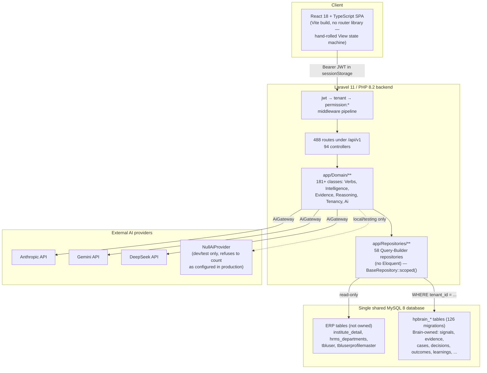
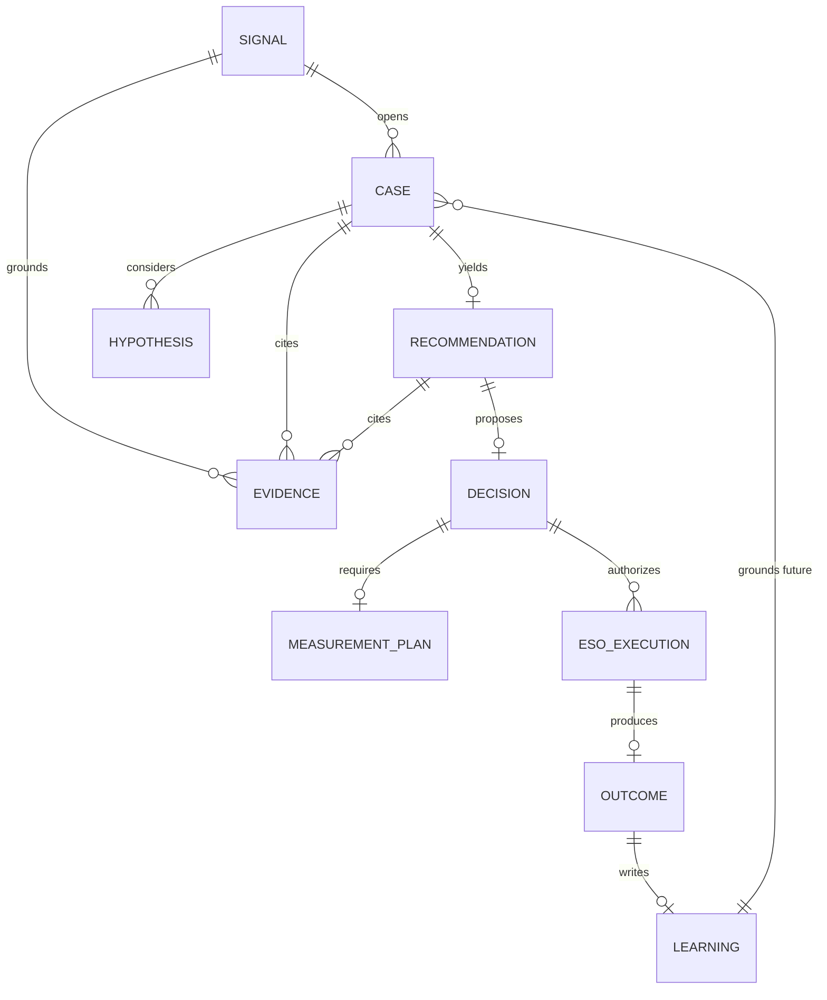

# HP Enterprise Brain

## Version 1 — Product Blueprint & Launch Plan

| | |
|---|---|
| **Document purpose** | Ground-truth V1 product definition, derived from direct inspection of the repository (code, migrations, routes, tests, docs) rather than from prior planning documents. |
| **Version / status** | **v2.1 — v2.0 Final Version 1 Audit plus the pilot-readiness follow-up (§31, 2026-09-29).** §23–§30 are the original audit and are preserved unchanged; §31 records the fixes and re-verification. **v2.0 — Final Version 1 Audit.** Builds on v1.3 (School Intelligence pass, §22) and adds the final audit layer (§23–§30): a four-source reference reconciliation, a capability status register, fresh test evidence, corrections to earlier claims, and the ZIP pilot-checklist scorecard. For product/engineering review; not yet ratified. |
| **Prepared** | 2026-09-28; updated 2026-09-29 (three passes); final audit 2026-09-29 (fourth pass) |
| **Repository** | `C:\Users\omshivay\Desktop\ADK\hp-enterprise-brain`, branch `harshit`, HEAD `a6a3e13` at audit start |
| **Scope** | Defines the smallest complete, launchable V1 of HP Enterprise Brain and the work required to get there. The v2.0 audit pass changed documentation only (this file and a companion Word document); it changed no application code, schema, configuration, or data. |
| **Companion** | `HP_Enterprise_Brain_V1_Final_Audit.docx` (standalone Word edition, saved in the Desktop `V1` reference folder) |

> **Reader's note (v2.0).** Sections §1–§22 are preserved from earlier passes, with **in-place corrections marked `[v2.0 corrected]`** where this audit found a claim the code does not support. Sections §23–§30 are new. If an older paragraph and a §23–§30 paragraph disagree, §23–§30 win: they were derived from the code and a test run on 2026-09-29. A crosswalk from the requested final structure to this document's sections is in §30.2.

### Status vocabulary used by the final audit (§25)

The six labels below are used in the capability register. They map onto the older six labels in the next table.

| Final-audit status | Meaning | Closest older label |
|---|---|---|
| **Implemented and verified** | Code exists **and** a test that exercises the path passed in this audit's run (or the path was executed live). | Existing — Verified |
| **Implemented, verification incomplete** | Code exists; the end-to-end path was not exercised by a passing test in this audit. | Existing — Not Verified |
| **Partially implemented** | Some required behaviour exists; important parts are missing or unreachable. | Existing — Partially Verified |
| **Documented only** | Described in a document; no implementation found. | Proposed / Deferred |
| **Not found** | No supporting implementation located in the inspected scope. | — |
| **Blocked / unknown** | Could not be established with available evidence (e.g. needs production access). | Open Question |

### How to read this document

Every substantive claim carries one of six labels, used consistently throughout:

| Label | Meaning |
|---|---|
| **Existing — Verified** | Confirmed by reading the actual source (code, migration, or a real test exercising it end-to-end). |
| **Existing — Partially Verified** | The code exists and does something real, but is not fully reachable, not fully wired, or has a documented caveat. |
| **Existing — Not Verified** | Present in the repository but not independently confirmed working in this pass. |
| **Proposed for V1** | Does not exist yet; recommended to be built before launch. |
| **Deferred to Future Version** | Deliberately out of scope for V1. |
| **Open Question** | Cannot be resolved from the repository alone; needs a product or engineering decision. |

This audit found that the project's own historical documents are a mixed bag: some are live, measured snapshots; several are proposals that were never implemented; and one (`docs/PART-3-REMEDIATION-REPORT.md`) exists specifically because three prior "completion reports" claimed passing tests while the application did not even boot. Every claim below was re-derived from source, not copied from those documents. Where a document and the code disagreed, the code wins, and the discrepancy is called out.

---

## Table of Contents

1. [Executive Summary](#1-executive-summary)
2. [Product Vision & Value Proposition](#2-product-vision--value-proposition)
3. [Existing Product Assessment](#3-existing-product-assessment)
4. [V1 Scope & Exclusions](#4-v1-scope--exclusions)
5. [User Roles & Permissions](#5-user-roles--permissions)
6. [Module Hierarchy](#6-module-hierarchy)
7. [Screen Inventory](#7-screen-inventory)
8. [End-to-End Workflows](#8-end-to-end-workflows)
9. [Technical Architecture](#9-technical-architecture)
10. [Database Blueprint](#10-database-blueprint)
11. [API & Service Blueprint](#11-api--service-blueprint)
12. [Security & Privacy](#12-security--privacy)
13. [Integrations & Configuration](#13-integrations--configuration)
14. [Deployment Architecture & Release Requirements](#14-deployment-architecture--release-requirements)
15. [Implementation Roadmap](#15-implementation-roadmap)
16. [Acceptance Criteria & Launch Gates](#16-acceptance-criteria--launch-gates)
17. [Risks, Assumptions & Open Questions](#17-risks-assumptions--open-questions)
18. [Future-Version Considerations](#18-future-version-considerations)
19. [Final V1 Readiness Assessment](#19-final-v1-readiness-assessment)
20. [Glossary](#20-glossary)
21. [Appendix: V1 Academy — Verified Reference Tenant](#21-appendix-v1-academy--verified-reference-tenant)
22. [Appendix: School Intelligence Transformation Pass](#22-appendix-school-intelligence-transformation-pass)
23. [Final Audit — Reference Sources & Identity](#23-final-audit--reference-sources--identity)
24. [Cross-Document Reconciliation Matrix](#24-cross-document-reconciliation-matrix)
25. [Capability Status Register](#25-capability-status-register)
26. [Test & Verification Evidence (2026-09-29)](#26-test--verification-evidence-2026-09-29)
27. [Corrections and Newly Found Discrepancies](#27-corrections-and-newly-found-discrepancies)
28. [Lifecycle, Principles and Pilot-Checklist Scorecard](#28-lifecycle-principles-and-pilot-checklist-scorecard)
29. [Final Verdict, Acceptance Criteria and Prioritized Next Steps](#29-final-verdict-acceptance-criteria-and-prioritized-next-steps)
30. [Audit Methodology, Evidence Index, Structure Crosswalk and Change Summary](#30-audit-methodology-evidence-index-structure-crosswalk-and-change-summary)
31. [Pilot-Readiness Implementation Report (follow-up, 2026-09-29)](#31-pilot-readiness-implementation-report-follow-up-2026-09-29)

---

## 1. Executive Summary

HP Enterprise Brain is a Laravel 11 / PHP 8.2 / MySQL 8 backend, paired with a React 18 + TypeScript single-page application, that sits **above** an institute's existing ERP as an organizational-intelligence layer. It does not own Organization, Department, or Person records — it reads them live from the ERP (`institute_detail`, `hrms_departments`, `tbluser`) — and it reasons *with* them by writing its own `hpbrain_`-prefixed tables into the same shared MySQL database.

The core, differentiating capability — a governed reasoning pipeline that turns raw operational data into an evidenced, human-approved decision, and then writes the outcome back as reusable organizational learning — is **real and proven**. `tests/Feature/GoldenIntelligenceFlowTest.php` exercises the entire chain (signal → evidence → reasoning → decision approval → measurement plan → execution → outcome → learning → memory grounding) over real HTTP endpoints against a real database, including two deliberate "honesty checkpoints" where the system must return an explicit `UNDETERMINED` result rather than fabricate an answer.

The project has been through one serious credibility event: three consecutive "Part 3" milestone reports claimed passing tests for a "Universal AI Brain" platform, while a remediation audit (`docs/PART-3-REMEDIATION-REPORT.md`) later found the application did not even boot — a duplicate method declaration was a fatal error at class-load, meaning zero of those claimed tests had ever actually executed. The remediation was real and is reflected in the current, working codebase (**[v2.0 re-counted 2026-09-29]** 99 controller files, 126 migrations, 492 API routes via `php artisan route:list --json`, 98 Feature + 7 Unit backend test files, 44 frontend test files), but it is the reason this blueprint treats every historical document as a claim to verify, not a fact to repeat.

**What V1 should be**: the proven core loop (Organization/Department/People foundation → ingestion → signals → evidence → cases → reasoning → recommendations → human-approved decisions → measurement → human-executed action → outcomes → learning), for the two vertical shapes the system has real production or near-production data for today (a school and a telecom operator), secured by the existing JWT/RBAC/tenant-isolation model with a short list of hardening fixes, and shipped without the still-simulated or still-dark capabilities (AI evaluation, RAG retrieval, autonomous execution, the SIMULATE verb, and a fully industry-agnostic UI) being presented as delivered.

**v2.0 final-audit conclusion (2026-09-29)**: **READY WITH KNOWN LIMITATIONS** for an engineer-operated, controlled pilot; **not ready** for unattended production. The core loop passes its end-to-end tests in a fresh run (backend: 1,158 passed / 26 failed, of which 22 are a missing `ext-zip` PHP extension, 2 are test-fixture drift, 1 is a stale test and 1 is unexplained; frontend: type-check clean, 459 of 464 tests passed). Three of the four reference documents in the Desktop `V1` folder describe the sibling LMS/K12/G2G platform rather than this repository; only the ZIP is this product's design lineage, and it is a target-state spec. Neo4j, `max_verb`, `DecisionGate`, SIMULATE, EXECUTE, RAG on the verb path and AI evaluation are not part of the implemented V1. No browser, live-AI-provider or production-database verification was done. Details: §23–§30.

**2026-09-29 update**: this blueprint's demo-organization landscape was consolidated to a single reference tenant, **V1 Academy**, and verified end-to-end against the live application (login, tenant isolation, the full intelligence loop, and data-quality checks). The consolidation exercise also surfaced and fixed three real, previously-undetected defects (two in the seed tooling, one — a hidden-departments bug — in application-adjacent seed data that silently triggered a real `DepartmentVisibilityScope` exclusion rule). See [§21](#21-appendix-v1-academy--verified-reference-tenant) for the full account.

---

## 2. Product Vision & Value Proposition

**What it is.** An organizational-intelligence and execution system that layers on top of an institute's existing ERP without owning or duplicating its master data, and that is honest about what it does and does not know — every claim traces to evidence, and an absence of evidence produces an explicit `UNDETERMINED`, never a guess presented as fact (`app/Domain/Undetermined/VerbResult.php`, `SufficiencyCheck.php` — **Existing — Verified**, exercised by `GoldenIntelligenceFlowTest.php:122-137`).

**The problem it solves.** Institute ERPs (school management systems, telecom operations systems) accumulate operational data — fee receipts, complaint logs, attendance, work orders — that nobody turns into organizational insight. HP Enterprise Brain ingests that data, detects signals (SLA breaches, missing root causes, fee-collection risk, academic gaps), builds a case with evidence, proposes a recommendation, routes it through human approval, tracks the resulting action, measures the outcome, and folds what worked back into reusable "organizational memory" that improves the next case.

**Who uses it today (evidence-backed).**
- A school (**"Lions"**, and an in-progress third pilot, **"Scholar Valley"** — the untracked `app/Console/Commands/SeedScholarValleySchool.php` and `database/seeders/data/scholar_valley/*.csv` fixtures in the current working tree show this onboarding is actively in progress on the `harshit` branch at the time of this audit) — real academic-result (388,401 rows), fee-collection (10,430 receipts), and attendance data, per `docs/SCHOOL-DATASETS.md`.
- A telecom operator (**"FiberValley"**) — 65,268 complaint rows, 5,790 work orders, and staff attendance, imported via a custom streaming XLSX reader, per `docs/FIBERVALLEY-INTEGRATION.md`.
- A hospital tenant was proven end-to-end **at the data layer only** (login, entity resolution, signal rules, demand snapshots — `docs/UNIVERSAL-INTELLIGENCE-PROGRESS.md` Phase 8), but its screens were never built or converted to industry-neutral terminology. Treat "multi-industry" as **Existing — Partially Verified**: real for data modeling, unproven for the UI a third vertical's users would actually see.

**Current product maturity.** Post-remediation, functioning, and covered by a substantial test suite (103 backend test files including a genuine end-to-end proof; ~50 frontend test files). Not yet production-hardened: no CI pipeline exists to keep it that way, several security-hardening items are documented gaps rather than closed items, and a live functional audit (`docs/API-FUNCTIONAL-AUDIT.md`, 2026-08-06) found real broken endpoints that this blueprint could not confirm are still broken or already fixed as of this pass (see [§17](#17-risks-assumptions--open-questions)).

---

## 3. Existing Product Assessment

### 3.1 What's implemented and working (Existing — Verified)

| Area | Evidence |
|---|---|
| Organization/Department/Person read from live ERP data, never duplicated | `README.md`; `database/fixtures/dev-erp-source.sql`; `app/Domain/Universal/EntityResolver.php`; 168 `hpbrain_entity_mappings` seed rows (`EntityMappingSeeder`) |
| Signal detection from real operational data | `hpbrain_operational_records` (the generic per-tenant fact table holding all non-master-data ERP exports) + `hpbrain_signal_rules` (configurable, data-driven, not hardcoded) |
| Evidence → Case → Hypothesis → Reasoning → Recommendation → Decision chain | `tests/Feature/GoldenIntelligenceFlowTest.php`, steps 3–8, real HTTP round trips |
| Decision approval with separation of duties | Same test, lines 256-283: a proposer cannot self-approve (403), a manager-as-proposer cannot approve their own proposal (409 `self_approval_forbidden`), a different manager can |
| Measurement plan required before execution (Invariant 4) | `hpbrain_measurement_plans`; `GoldenIntelligenceFlowTest.php:297-324` |
| Execution, outcome, learning, and memory-grounding, with idempotent replay | Same test, steps 9–11 (lines 326-393); a second, independent test proves a later case is provably informed by an earlier one's learning (lines 427-502) |
| Honest `UNDETERMINED` instead of fabrication when evidence or an AI provider is missing | `VerbResult.php`, `SufficiencyCheck.php`; `AiGateway::isConfigured()` refuses to treat the no-network `NullAiProvider` as "configured" outside local/testing, forcing UNDETERMINED rather than canned text in production |
| Real AI provider integrations | `AnthropicProvider.php`, `GeminiProvider.php`, `DeepSeekProvider.php` — genuine `Http::post()` calls to each vendor's real API, not stubs |
| JWT auth with rotation/revocation, RBAC, tenant isolation | `AuthController.php`, `hpbrain_refresh_tokens`, `AuthenticateJwt`/`EnsureTenantScope`/`RequirePermission` middleware — see [§12](#12-security--privacy) |
| Tenant isolation enforced structurally | `BaseRepository::scoped()` — every repository must filter by `tenant_id`; no Eloquent, so no accidental unscoped model query is possible, but correctness still depends on every repository calling `scoped()` |
| A capability/skills model with an evidence-gated, non-regressing six-state proficiency scale | `hpbrain_capability_proficiency`, `app/Domain/Capability/CapabilityState.php` |
| A working ingestion pipeline for CSV/XLSX operational data, idempotent by content hash | `app/Domain/Ingestion/*`, `tests/Feature/StreamingCsvIngestionTest.php`, `FiberValleyImportTest.php` |

### 3.2 What's partially implemented (Existing — Partially Verified)

| Item | Caveat |
|---|---|
| The seven-verb Capability Interface (ADR-004) | Five of seven verbs exist and are real (Explain, Assess, Evaluate, Recommend, Coach). **SIMULATE has no implementation class at all.** **EXECUTE is deliberately dark** — governed and flag-gated, throws if invoked, and is only ever exercised in tests with a human executor. |
| `EvidenceService`'s freshness-decay math | Real and unit-tested, but not called from `EvidenceController` — evidence is stored with client-supplied confidence, bypassing the decay curve. Built, not reachable from the API. |
| The AI & Intelligence admin console (12 controllers, ~5,500 lines) | Genuinely database-backed, not a stub screen — but two of its twelve controllers (`AiStackReportController`, `AiStackToolAgentController`) are explicitly non-AI (template substitution / allow-listed read-only lookups) despite living under "AI Intelligence." |
| AI evaluation | `EvaluationService::runEvaluation()` marks every case `passed` with status `simulated` — it measures nothing yet, per `docs/PART-3-REMEDIATION-REPORT.md` §5. |
| RAG (retrieval-augmented generation) | No document-ingestion pipeline exists; the architecture is specified, not built. |
| AI Workspace `regenerate`/`explain`/`follow-up` | Honestly return `not_implemented` (an improvement over an earlier state where they returned canned text indistinguishable from real output). |
| Event backbone consumption | `docs/EVENT_BACKBONE.md` states no consumer runs — but `routes/console.php:30-33` schedules `brain:process-events --once` every minute, and the golden-flow test explicitly drains it. This is a genuine discrepancy between a doc and the code; see [§17](#17-risks-assumptions--open-questions). |
| Multi-industry UI | The entity/data layer is proven industry-agnostic (a hospital tenant onboarded by data insertion alone); the 30-screen frontend is not — it is school/telecom-shaped in practice, and `useConfig().terminology` exists but screens don't consistently use it. |

### 3.3 What's proposed but not built (Deferred to Future Version)

- The SIMULATE verb (declared in the `Verb` enum, no concrete class anywhere in `app/Domain/Verbs/`).
- Autonomous EXECUTE (by design — "EXECUTE stays dark: human only" is asserted directly in the golden-flow test).
- A Neo4j-backed knowledge graph (ADR-008 explicitly defers this, revisit "if traversals exceed 3 hops or ~10⁶ relationships per tenant"). **[v2.0 corrected]** The earlier text said the Graph Explorer "runs on MySQL recursive CTEs behind a `GraphQueryPort`". The v2.0 audit found **no `WITH RECURSIVE` anywhere** in `app/`, `config/`, `routes/` or migrations, and `GraphQueryPort` appears only in a comment in `GraphController.php`. The graph is a **read-time projection** over relational tables (`app/Domain/Graph/GraphProjection.php`, `GraphBuilder.php`, `GraphVocabulary.php`: 14 labels, 17 relationship types, node budget enforced); there are no node/edge tables and no multi-hop traversal.
- A genuinely industry-neutral frontend for a third vertical.

---

## 4. V1 Scope & Exclusions

| Classification | Meaning |
|---|---|
| **V1 Core** | Required for the first usable release |
| **V1 Supporting** | Necessary to operate or support the core product |
| **Stabilization** | Existing functionality that needs fixes or verification before it can be trusted |
| **V1 Optional** | Useful but not essential for launch |
| **Future Version** | Deliberately deferred |
| **Out of Scope** | Not part of the defined V1 |

| Capability | Classification | Reason |
|---|---|---|
| Organization / Department / People foundation (read from ERP, Brain-side profile/capability data) | **V1 Core** | Everything else depends on this being correct; already working |
| Data ingestion (CSV/XLSX → `hpbrain_operational_records`) | **V1 Core** | The only way real signals get generated; proven on two real datasets |
| Signal detection (data-driven `hpbrain_signal_rules`) | **V1 Core** | The entry point of the intelligence loop |
| Evidence, Case, Hypothesis, Reasoning (Explain/Assess/Evaluate verbs) | **V1 Core** | Proven end-to-end; this is the product's differentiator |
| Recommendation, human-approved Decision (separation of duties) | **V1 Core** | Proven, and the point at which the product produces value a user acts on |
| Measurement Plan → human-executed ESO → Outcome → Learning → Memory | **V1 Core** | Closes the loop; proven, including cross-case learning reuse |
| JWT auth, RBAC (5 roles), tenant isolation | **V1 Core** | Non-negotiable for a multi-tenant product handling real PII and ERP data |
| Capability/skills model (KASBA, six-state proficiency) | **V1 Supporting** | Feeds Assess/Coach verbs and department/person intelligence screens |
| AI Assistant (conversational, via `ConversationController`) | **V1 Supporting** | Real, DB-backed conversation history; the live nav item, not the dead `AiWorkspace.tsx` files |
| Executive Dashboard, Decision Analytics, Knowledge Library, Memory screen, Graph Explorer, Global Search | **V1 Supporting** | Consume the core loop's output; needed for a user to actually see value, not needed to produce it |
| Event backbone consumer verification | **Stabilization** | A scheduled command exists and a doc says it doesn't run — this must be resolved, not assumed, before outcomes/learning are trusted in production (see [§17](#17-risks-assumptions--open-questions)) |
| FK-constraint / tenant-ownership hand-checks in early tables | **Stabilization** | `REFERENCES` clauses in the earliest migrations are decorative (MySQL/InnoDB ignores column-level `REFERENCES`); real `CONSTRAINT ... FOREIGN KEY` only appears in later migrations |
| Viewer role triggering paid AI calls on 3 routes gated only by `permission:read` | **Stabilization** | Named as a live, unresolved item in `docs/DECISIONS-PENDING.md` |
| API-Functional-Audit findings (org-units 500s, AI Workspace 500, broken Ingestion-screen routes) | **Stabilization** | Dated 2026-08-06; not re-verified in this pass — must be re-tested against current `HEAD` before launch |
| Dead frontend screens (`AiWorkspace.tsx` ×2, template/dashboard-builder/audit/events/ai-admin/dynamic-navigation components) | **Stabilization** | Not launch-blocking, but actively confusing for future maintenance; recommend deletion |
| Security headers (CSP/HSTS/X-Frame-Options), MFA/SSO, HttpOnly session tokens | **V1 Optional** → recommend promoting to Stabilization given real student/employee PII is in scope | Documented gaps in `docs/SECURITY-HARDENING-CHECKLIST.md`; tokens currently live in `sessionStorage`, not HttpOnly cookies |
| AI evaluation (real, non-simulated), RAG retrieval, full cost-governance dashboards | **Future Version** | Scaffolding exists; the "intelligence" is not delivered — do not market as working in V1 |
| SIMULATE verb, autonomous EXECUTE | **Future Version** | No implementation; EXECUTE is intentionally dark by architectural decision (ADR-004) |
| Full multi-industry, terminology-driven frontend for new verticals | **Future Version** | Entity layer is ready; UI conversion work has not started |
| Neo4j-backed graph | **Future Version** | Explicitly deferred by ADR-008 |
| Self-service tenant onboarding / industry template marketplace | **Out of Scope** | No evidence this is a near-term goal; onboarding today is engineer-run (seeders, artisan commands) |

---

## 5. User Roles & Permissions

Derived directly from `app/Domain/Authorization/Role.php` and `Permission.php` — this is a flat RBAC model (role → fixed permission set), enforced only at the route-middleware layer (`RequirePermission`). There are **no Policy classes and no Gates** in the codebase.

| Role | Purpose | Permissions granted | V1 notes |
|---|---|---|---|
| **Viewer** | Read-only stakeholder (e.g., a department head who wants visibility, not control) | `read` | **Existing — Partially Verified**: 3 routes today let a Viewer trigger a paid AI call despite being gated only on `read` — a Stabilization item |
| **Analyst** | Investigates signals, builds evidence and cases | Viewer's set + `create`, `update`, `evidence.curate` | Existing — Verified |
| **Manager** | Approves decisions, authorizes execution | Analyst's set + `decision.approve`, `eso.execute` | Existing — Verified; separation-of-duties enforced (a manager cannot approve their own proposal) |
| **Admin** / **Tenant Admin** | Full tenant control: settings, API keys, tenant lifecycle, events | All permissions, including `settings.manage`, `apikey.manage`, `events.manage`, `tenant.manage` | Existing — Verified; the entire "AI & Intelligence" console and ~30 "Universal Platform Foundation" CRUD resources are gated at `settings.manage` |

Role is resolved once, at login, from the ERP's free-text profile field (`AuthController::resolveRole()`, substring match on titles like "manager," "admin," "analyst") and embedded as a JWT claim — it is **never re-derived from the database on subsequent requests**. A profile title that doesn't match any known role maps to `member`, which is not a recognized `Role` enum value and is therefore **denied, fail-closed**, as `unknown_role`.

**Open Question**: role derivation by substring match on an ERP free-text field is fragile — an institute that titles a role "Assistant Manager" or "Deputy Admin" could resolve unpredictably. Recommend an explicit, auditable role-mapping step during tenant onboarding rather than substring inference, before onboarding a third or fourth customer.

---

## 6. Module Hierarchy

```
HP Enterprise Brain
├── Organization Foundation                         [V1 Core]
│   ├── Organization (profile, structure, units)
│   ├── Department (incl. school "Academic Sections" mode)
│   ├── People / Students (person profiles, digital twin)
│   └── Capability (KASBA skills/competency model)
├── Data Ingestion                                   [V1 Core]
│   └── CSV/XLSX operational-record import, per-tenant field mapping
├── Intelligence Loop                                [V1 Core]
│   ├── Signals            (detection, triage)
│   ├── Evidence           (provenance, freshness)
│   ├── Cases              (hypotheses, root-cause)
│   ├── Deliberation       (recommendation ↔ decision linkage)
│   ├── Reasoning Workspace
│   └── Execution Center   (human-executed ESOs, outcomes)
├── Analytics                                        [V1 Supporting]
│   ├── Executive Dashboard
│   ├── Decision Analytics / Decision Intelligence
│   └── Organizational Knowledge (Mental Models)
├── Knowledge                                        [V1 Supporting]
│   ├── Graph Explorer      (relational read-time projection, not Neo4j — ADR-008)
│   ├── KASBA Explorer
│   ├── Knowledge Library
│   ├── Memory              (organizational learning)
│   ├── Global Search
│   └── ESO Library
├── AI Assistant                                     [V1 Supporting]
│   └── Conversational assistant (ConversationController — the live screen)
├── AI & Intelligence Console                        [V1 Optional]
│   └── Providers, models, policies, templates, evaluation, usage/cost,
│       recommendation approval, per-module "AI Stack" panels
├── Automation                                       [V1 Optional]
│   ├── Agent Monitor
│   ├── Task Orchestrator
│   └── Policy Management
└── Platform Administration                          [V1 Optional / engineer-run]
    ├── Settings, tenant lifecycle
    └── Universal Platform config (industries, terminology, feature flags,
        modules, navigation, dashboards, branding, themes, forms)
```

For each V1 Core module, acceptance requires: the screen renders against a real tenant's ERP data, every write path is tenant-scoped and permission-gated, and the underlying service is exercised by at least one Feature test hitting the real route (not a mock).

---

## 7. Screen Inventory

The frontend (`web/src/App.tsx`) has **no router library** — navigation is a hand-rolled `View` string-union rendered by a single conditional block, with each screen lazy-loaded. The table below consolidates the ~30 distinct views (excluding aliases and hidden sub-routes) and classifies each for V1.

| Screen | Component | Level | Primary API | V1 disposition |
|---|---|---|---|---|
| Command Center (home) | `CommandCenter.tsx` | Organization | `intelligence`, `organization`, `capability`, `ingestion`, `operations` | V1 Core |
| Organization List/Create/Edit/Archive | `Organization*.tsx` | Organization | `organization.ts` | V1 Core |
| Departments (+ Academic Sections mode) | `DepartmentApp.tsx`, `AcademicSectionView.tsx` | Department | `department.ts`, `student.ts` | V1 Core |
| People / Students | `PersonApp.tsx`, `StudentList/Detail.tsx` | People | `person.ts`, `student.ts` | V1 Core |
| Capabilities | `CapabilityApp.tsx` + intelligence panels | Module | `capability.ts` | V1 Core |
| Ingestion Workspace | `IngestionWorkspace.tsx` | Module/Admin | `ingestion.ts` | V1 Core |
| Signal Dashboard / Signal Chain | `SignalDashboard.tsx`, `SignalChainView.tsx` | Module | `signal.ts`, `intelligence.ts` | V1 Core |
| Evidence Workspace | `EvidenceWorkspace.tsx` | Module | `intelligence`, `signal`, `ai`, `operations` | V1 Core |
| Cases Workspace | `CasesWorkspace.tsx` | Module | `case.ts`, `intelligence` | V1 Core |
| Deliberation Workspace | `DeliberationWorkspace.tsx` | Module | `intelligence` (decision), `operations` | V1 Core |
| Intelligence Workspace | `IntelligenceWorkspace.tsx` | Module | `intelligence`, `operations` | V1 Core |
| Execution Center | `ExecutionCenter.tsx` | Module | `intelligence`, `eso.ts` | V1 Core |
| Executive Dashboard | `ExecutiveDashboard.tsx` | Analytics | `organizationIntelligence`, `operations` | V1 Supporting |
| Decision Analytics / Decision Intelligence | `DecisionAnalyticsPanel.tsx`, `DecisionIntelligence.tsx` | Analytics | `organizationIntelligence` | V1 Supporting |
| Mental Model Browser | `MentalModelBrowser.tsx` | Analytics/Knowledge | `organizationIntelligence` | V1 Supporting |
| Graph Explorer | `GraphExplorer.tsx` + `graph/*` | Knowledge | `graph.ts` | V1 Supporting |
| KASBA Explorer | `KasbaExplorer.tsx` | Module/Knowledge | `kasba.ts`, `capability.ts` | V1 Supporting |
| Knowledge Library | `KnowledgeLibrary.tsx` | Knowledge | `knowledgeLibrary.ts` | V1 Supporting |
| Memory | `MemoryScreen.tsx` | Knowledge | `organizationalMemory.ts` | V1 Supporting |
| ESO Library | `EsoLibraryScreen.tsx` | Knowledge | `eso.ts`, `organizationIntelligence` | V1 Supporting |
| Global Search | `GlobalSearch.tsx` | Knowledge | `intelligence.ts`, `graph.ts` | V1 Supporting |
| **AI Assistant** | `AIAssistant.tsx` | AI | `conversation.ts` (→ `ConversationController`) | V1 Supporting — this is the live screen |
| AI & Intelligence console | `AiIntelligenceApp.tsx` + 8 screens | Admin | `aiIntelligence/*` | V1 Optional |
| Per-module AI Stack panels | `ai-stack/*` (18 module screens) | Admin | `aiStack/*` | V1 Optional |
| Agent Monitor | `AgentMonitor.tsx` | Automation | `intelligence.ts` | V1 Optional |
| Task Orchestrator | `TaskMonitor.tsx` | Automation | `task.ts` | V1 Optional |
| Policy Management | `PolicyManagement.tsx` | Admin | `policy.ts` | V1 Optional |
| Settings | `Settings.tsx` | Admin | `notification.ts`, `organization.ts` | V1 Core (tenant lifecycle lives here) |
| Login / Signup | `Login.tsx`, `Signup.tsx` | Auth | `auth/login`, `auth/signup` | V1 Core |

**Confirmed dead code — recommend deletion, not launch of, in V1** (not referenced from `App.tsx`'s view switch, verified by import search): `components/ai/AiWorkspace.tsx`, `components/workspace/AIWorkspace.tsx` (both superseded by the live `AIAssistant.tsx`), `components/templates/*`, `components/dashboard/*` (DashboardBuilder), `components/audit/AuditDashboard.tsx`, `components/events/*`, `components/ai-admin/*` (superseded by `ai-intelligence/screens/*`), `components/navigation/DynamicNavigation.tsx`, and `components/workspace/OrganizationIntelligenceHome.tsx` (explicitly commented as retired in favor of Command Center, left in place deliberately).

---

## 8. End-to-End Workflows

### 8.1 The Golden Intelligence Loop (V1 Core)

**Existing — Verified** in full, by `tests/Feature/GoldenIntelligenceFlowTest.php`, over real HTTP endpoints.

```mermaid
sequenceDiagram
    participant Data as Operational Data
    participant Sig as Signal
    participant Ev as Evidence
    participant Case as Case / Hypothesis
    participant Rec as Recommendation
    participant Dec as Decision (human-approved)
    participant Exec as ESO Execution (human)
    participant Out as Outcome
    participant Mem as Learning / Memory

    Data->>Sig: signal rule fires (hpbrain_signal_rules)
    Sig->>Ev: POST /evidence (provenance + hash required)
    Note over Ev: No evidence yet → EXPLAIN returns<br/>UNDETERMINED / no_grounding_evidence (honesty checkpoint 1)
    Ev->>Case: case + hypothesis created, citing evidence id
    Case->>Rec: RECOMMEND verb (AI-assisted, EsoBindingRule-gated)
    Rec->>Dec: POST /decisions (born "proposed")
    Note over Dec: Self-approval forbidden (403);<br/>proposer-as-manager forbidden (409)
    Dec->>Exec: measurement plan required, then ESO execution (executorType: human)
    Exec->>Out: POST /outcomes
    Out->>Mem: async event consumer writes Learning, then Memory<br/>(idempotent — replay does not duplicate)
```

| Field | Detail |
|---|---|
| **Trigger** | A signal rule matches new operational data, or an analyst manually raises a signal |
| **Actor** | System (signal detection) → Analyst (evidence, case, hypothesis) → Manager (decision approval) → human Executor (ESO execution) |
| **Required input** | Operational records already ingested; evidence with provenance (rejected 422 without it) |
| **Processing** | Explain → Assess/Evaluate → Recommend, each governed (role check) → grounded (evidence required) → guarded (UNDETERMINED if insufficient) |
| **DB entities** | `hpbrain_signals`, `hpbrain_evidence`, `hpbrain_cases`/`hpbrain_hypotheses`, `hpbrain_recommendations`, `hpbrain_decisions`, `hpbrain_measurement_plans`, `hpbrain_eso_executions`, `hpbrain_outcomes`, `hpbrain_learnings` |
| **Result shown to user** | A decision awaiting approval, then an execution to carry out, then a measured outcome, then a citation in the next similar case ("this recommendation is grounded in a learning from case #…") |
| **Approval requirements** | Decision approval requires `decision.approve` (Manager+) and a different person than the proposer |
| **Failure/recovery** | Missing evidence → explicit `UNDETERMINED`, not a fabricated answer; a rejected decision is a valid terminal state |
| **Audit** | Every state transition emits a domain event (`OBSERVATION_MADE`, `EVIDENCE_RECORDED`, `DECISION_REACHED`, `EXECUTION_STARTED`, `OUTCOME_RECORDED`, `LEARNING_WRITTEN`, `MEMORY_UPDATED`) into `hpbrain_event_store`, plus an `hpbrain_audit_logs` row on every permission denial |
| **Completion criteria** | A learning row exists, is marked reusable, and is retrievable by a later, related case (proven by the test's second scenario) |

### 8.2 Data Ingestion (V1 Core)

**Existing — Verified**, proven against two real datasets (school academic/fee data, telecom complaint/work-order data).

1. **Trigger**: an admin uploads a CSV/XLSX export, or a scheduled/manual sync runs against `hpbrain_data_sources`.
2. **Actor**: Admin or Tenant Admin (`permission:settings.manage` on the Ingestion screens).
3. **Input**: a file plus a field map (per-tenant, declared in `config/import_profiles.php` or discovered via `SchemaDetector`).
4. **Processing**: streaming parse (chosen deliberately over full in-memory loading — 8MB peak vs. ~1GB for a naive approach on a 65k-row file) → row-level validation → content-hash-based idempotency → write to `hpbrain_operational_records`.
5. **DB entities**: `hpbrain_data_sources`, `hpbrain_import_jobs`, `hpbrain_import_logs`, `hpbrain_operational_records`.
6. **Result**: an import summary (rows processed/skipped/failed); newly eligible operational records become visible to signal rules.
7. **Failure/recovery**: per-row failures are logged to `hpbrain_import_logs` without aborting the whole batch; a rollback path exists on `hpbrain_import_jobs` (one defect — a broken rollback — was found and fixed during the FiberValley integration).
8. **Completion criteria**: `hpbrain_operational_records` row counts match the source file, re-running the same file produces zero new rows (idempotent).

**Known caveat (Open Question)**: `docs/API-FUNCTIONAL-AUDIT.md` (2026-08-06) found the Ingestion screen wired to non-existent/misprefixed routes whose failure was silently swallowed as an "empty state" rather than surfaced as an error. This predates significant later work and was **not re-verified in this pass** — it must be re-tested before launch.

### 8.3 Organization Foundation & Capability Assessment (V1 Core)

1. **Trigger**: a user navigates to Departments, People, or Capabilities.
2. **Actor**: any authenticated role (read); Analyst+ for writes to Brain-owned data (capability assignments, proficiency).
3. **Input**: none required to view — Organization/Department/Person render directly from the live ERP tables.
4. **Processing**: `EntityResolver` maps the ERP's actual columns to universal fields per tenant's `hpbrain_entity_mappings`; for school tenants with zero ERP department rows, `AcademicSectionView.tsx` substitutes a derived academic-section view built from student data.
5. **DB entities**: ERP tables (read-only: `institute_detail`, `hrms_departments`, `tbluser`), plus Brain-owned `hpbrain_capabilities`, `hpbrain_capability_proficiency`, `hpbrain_students` (a derived projection, not source-of-truth, rebuilt by `students:rebuild`).
6. **Result**: a department/person profile with KASBA capability standing; advancing a proficiency level requires an `evidenceRef` (silent regression is rejected).
7. **Completion criteria**: the screen renders correctly for a tenant whose ERP has zero rows in a given master table (proven for schools with no HR department rows).

### 8.4 AI Assistant Conversation (V1 Supporting)

1. **Trigger**: a user opens the AI Assistant screen and asks a question.
2. **Actor**: any authenticated role holding `create` (message/session writes require it).
3. **Input**: a natural-language question, optionally scoped to an entity (person, department, case).
4. **Processing**: `AiIntelligenceAskController` → `AskPipeline` → `AiModelClient` → a real AI provider call; the transcript persists via `ConversationStore`. A failed or ungrounded answer returns HTTP 200 with `answer: null` and a reason, matching the platform-wide honesty pattern — not a 500, not a fabricated string.
5. **DB entities**: `hpbrain_ai_conversations`, `hpbrain_ai_conversation_turns`.
6. **Result**: a grounded answer, or an explicit "I don't have enough to answer that" state.
7. **Completion criteria**: the answer, when given, cites the evidence/entity it drew from.

---

## 9. Technical Architecture



| Layer | Stack | Status |
|---|---|---|
| Frontend | React 18.3, TypeScript 5.5, Vite 5.4, no router library, no state-management library (local `useState`/`useContext`), Recharts + d3 for visuals, Vitest + Testing Library | Existing — Verified |
| Backend | Laravel 11, PHP 8.2+, hand-rolled JWT via `firebase/php-jwt` (no Sanctum), Query Builder throughout (**zero Eloquent models** — confirmed, `app/Models/` does not exist) | Existing — Verified |
| Database | MySQL 8, **one shared connection** for both the ERP and the Brain (`hpbrain_`-prefixed tables coexist with ~171 non-Brain ERP tables in the same `hp_erp` database) | Existing — Verified |
| Tenancy | JWT-claim-authoritative + per-repository `WHERE tenant_id` convention; no schema-per-tenant, no Eloquent global scope | Existing — Verified |
| AI/intelligence pipeline | Seven-verb architecture (ADR-004), five verbs implemented, EXECUTE dark, SIMULATE unbuilt | Existing — Partially Verified |
| Ingestion | Streaming CSV/XLSX readers, content-hash idempotency, generic `hpbrain_operational_records` sink | Existing — Verified |
| Evidence & provenance | SHA-256 hash on evidence, exponential freshness decay (built, only partially wired) | Existing — Partially Verified |
| Decisions & outcomes | Approval workflow with separation of duties, measurement-plan gate before execution | Existing — Verified |
| Memory & learning | `MemoryGrounding` — reusable learnings retrieved and cited across cases | Existing — Verified (was previously broken — referenced non-existent columns — fixed and now proven) |
| Graph | **[v2.0 corrected]** Read-time projection over relational tables (`GraphProjection`/`GraphBuilder`/`GraphVocabulary`); no recursive CTEs and no `GraphQueryPort` exist in code. Neo4j deliberately deferred (ADR-008). Only 3 dedicated tests (`GraphNodeEvidenceLinkTest`). | Existing — Partially Verified (projection works; multi-hop traversal Not found), Neo4j Deferred |
| External services | Anthropic, Gemini, DeepSeek (real HTTP integrations); an external `HP_LOGIN_API_URL` env var exists but no active usage was found in the current login flow (**Open Question** — possibly vestigial) | Mixed |
| Deployment | Manual Laravel deploy checklist (`docs/DEPLOYMENT.md`); **no CI/CD pipeline exists** (`.github/workflows/` absent) | Existing — Not Verified / Gap |

---

## 10. Database Blueprint

All 126 migration files were inspected directly. Every Brain-owned table is prefixed `hpbrain_`; primary/foreign keys are `VARCHAR(36)` UUIDs; confidence/probability columns are explicitly `DECIMAL(6,4)` (an earlier bug let undeclared-scale `DECIMAL` silently round every confidence score to an integer — fixed by `2026_08_04_000100_precision_on_decimal_columns.php`). Inline `REFERENCES` clauses in the earliest migrations are cosmetic only — MySQL/InnoDB ignores column-level `REFERENCES` — real `CONSTRAINT ... FOREIGN KEY` only appears in migrations after `2026_07_30`.



| Domain bucket | Representative tables | Notes |
|---|---|---|
| Core organizational entities & tenancy | `hpbrain_tenants`, `hpbrain_organizations`, `hpbrain_departments`, `hpbrain_organization_units`, `hpbrain_entity_mappings`, `hpbrain_terminology` | Organization/Department/Person **master data is not here** — it's read live from the ERP |
| Users / auth / permissions | `hpbrain_auth_users`, `hpbrain_refresh_tokens`, `hpbrain_api_keys`, `hpbrain_roles`, `hpbrain_person_roles`, `hpbrain_skills`, `hpbrain_competencies` | `hpbrain_auth_users` is a legacy fallback path, not the primary login table (that's the ERP's `tbluser`) |
| Data ingestion & source records | `hpbrain_data_sources`, `hpbrain_import_jobs`, `hpbrain_import_logs`, `hpbrain_operational_records`, `hpbrain_students` (derived projection) | `hpbrain_operational_records` is the single busiest table in the schema — a dozen follow-up migrations exist purely to index it at 300–400k+ rows per tenant |
| Signals & evidence | `hpbrain_signals`, `hpbrain_signal_rules`, `hpbrain_evidence`, `hpbrain_metric_snapshots` | |
| Cases & findings | `hpbrain_cases`, `hpbrain_case_signals`, `hpbrain_hypotheses`, `hpbrain_case_evidence`, `hpbrain_reasoning_steps`, `hpbrain_risks` | |
| Decisions & outcomes | `hpbrain_recommendations`, `hpbrain_decisions`, `hpbrain_measurement_plans`, `hpbrain_outcomes`, `hpbrain_eso_executions`, `hpbrain_executors` | |
| Context / memory / learning | `hpbrain_learnings`, `hpbrain_mental_models`, `hpbrain_context_entities`, `hpbrain_eso_efficacy_records` | |
| Knowledge & graph | `hpbrain_knowledge_assets`, `hpbrain_process_definitions`, `hpbrain_reasoning_patterns` | |
| Capability / ESO / policy configuration | `hpbrain_capabilities`, `hpbrain_capability_proficiency`, `hpbrain_eso_definitions`, `hpbrain_policies`, `hpbrain_feature_flags` | |
| AI governance | Two non-overlapping generations: an older `hpbrain_ai_providers`/`_prompt_templates`/`_quotas`/`_safety_rules` set, and a newer (Sept 2026) `hpbrain_ai_models`/`_templates`/`_policies`/`_conversations`/`_usage_events` console — deliberately kept separate so the older `/ai/*` screens don't break | |
| Audit & observability | `hpbrain_audit_logs`, `hpbrain_event_store`, `hpbrain_dead_letter_queue`, `hpbrain_consumer_state`, `hpbrain_metrics`, `hpbrain_notifications` | |
| School domain (Brain-side supplementary) | `hpbrain_guardians`, `hpbrain_students` | Core Person is still ERP-owned; these are Brain-owned enrichments |

**Data model status**: Existing — Verified for structure and relationships (read from actual migration DDL). **Not verified**: live referential integrity under concurrent write load, and whether all 126 migrations have actually been applied to the production `hp_erp` database (this blueprint did not run `migrate:status` against it, per the no-execution constraint on this task).

---

## 11. API & Service Blueprint

488 routes are registered, all under a single `/api/v1` prefix (`routes/api.php`, 1,008 lines). There are no `apiResource()` shortcuts — every route is explicit, which is why the count is high relative to 94 controllers. Grouped by function:

| Group | Example resources | Middleware beyond the default `jwt+tenant+permission:read` |
|---|---|---|
| Auth | `auth/login`, `auth/signup`, `auth/refresh`, `auth/logout`, `auth/change-password` | `throttle:10,1` / `throttle:20,1` / `throttle:5,10` on the public routes |
| Foundation | `organizations`, `departments`, `people`, `students` | `create`/`update` on writes |
| Intelligence loop | `signals`, `evidence`, `cases`, `hypotheses`, `reasoning`, `recommendations`, `decisions` | `create`/`update`; decision approve/reject needs `decision.approve` |
| Execution | `eso-definitions`, `eso-executions` | `eso.execute` |
| Events / audit / observability / analytics | `events`, `audit`, `observability/*`, `analytics/*` | `events.manage` on event retry/replay/delete; audit/observability/analytics are read-only |
| Conversation / AI Assistant | `conversations/*` | `create` on message/session writes |
| Reasoning engine (verb pipeline) | `reasoning-engine/{explain,assess,recommend,evaluate}` | explain/assess are plain `read` (deliberate — these never call an AI provider); recommend/evaluate need `create` |
| ~30 Universal Platform Foundation resources | `industries`, `terminology`, `entity-mappings`, `feature-flags`, `modules`, `navigation`, `dashboards`, `branding`, `themes`, `forms`, `organization-units`, `roles`, `skills`, `onboarding`, `imports`, `ingestion`, … | **Every route gated `permission:settings.manage`**, including several GETs — this is an admin-only configuration surface, not end-user facing |
| AI config (older) | `ai/providers`, `ai/prompt-templates`, `ai/evaluations`, `ai/quotas` | writes need `settings.manage`; `ai/feedback` stays open at `read` |
| AI & Intelligence console (newer, 12 controllers) | `ai-intelligence/*` | entire subtree gated `settings.manage` at the group level |

**A documentation/code discrepancy worth flagging**: `README.md` states "the dev-token route is registered only when `APP_ENV !== 'production'`." **This route does not exist anywhere in the current codebase** — `AuthenticateJwt.php`'s own docblock recounts that an earlier build had a dev-bypass backdoor which was deliberately removed as a security remediation, and two independent audit docs confirm this. Treat the README's claim as **stale**; there is no dev-token route to configure or disable.

**Not invented / not verified in this pass**: exact request/response JSON shapes for each of the 488 routes (out of scope for a blueprint of this kind — see `docs/API-CONTRACTS.md` and `docs/FRONTEND_BACKEND_API_MATRIX.md` for prior attempts at this, both noted as dated and likely superseded by `docs/API-FUNCTIONAL-AUDIT.md`'s live-tested findings).

---

## 12. Security & Privacy

| Control | Status | Detail |
|---|---|---|
| Authentication | **Existing — Verified** | JWT (HS256, `firebase/php-jwt`), access token 15 min TTL, refresh token 7 days, rotated and revocation-tracked in `hpbrain_refresh_tokens`. Identity resolved from the ERP's `tbluser`; `Jwt.php` fatally refuses to boot in production with an empty or `'dev-only-secret'` JWT secret. |
| Session/token handling | **Existing — Partially Verified / Gap** | Tokens live in the browser's `sessionStorage` (tab-scoped, `localStorage` copies actively cleared), not HttpOnly cookies — an XSS on the SPA could exfiltrate a live session. No CSRF exposure (stateless, no cookies, no session). |
| Role-based permissions | **Existing — Verified** | Flat RBAC, 5 roles, enforced entirely by `RequirePermission` middleware; fails closed on any unknown role or permission string; every denial is written to `hpbrain_audit_logs`. |
| Tenant isolation | **Existing — Verified, with a caveat** | JWT-claim-authoritative; `EnsureTenantScope` 403s any URL/token tenant mismatch. Below the HTTP layer, isolation is a **repository convention** (`BaseRepository::scoped()`), not a database-enforced global scope — correctness depends on every one of 58 repositories consistently calling it. |
| Object-level access control | **Existing — Not Verified** | No per-resource ACL layer exists beyond role + tenant; whether a Viewer in Tenant A can address another department's record within the same tenant was not independently re-tested in this pass beyond what `TenantIsolationMatrixTest.php` covers. |
| Input validation | **Existing — Partially Verified** | Validation is inline in controllers; no Form Request classes were found — acceptable but harder to audit uniformly than a dedicated validation layer. |
| SQL injection | **Existing — Verified (by construction)** | Query Builder with parameter binding throughout; no raw string interpolation observed in the areas inspected. |
| XSS | **Existing — Not Verified** | React's default escaping applies; no explicit `dangerouslySetInnerHTML` usage was catalogued in this pass. |
| CSRF | **Not applicable** | Stateless, token-authenticated API; explicitly no session/cookie auth. |
| Security headers (CSP, HSTS, X-Frame-Options) | **Existing — Not Verified / Gap** | `docs/SECURITY-HARDENING-CHECKLIST.md` marks these as documented, not enforced. |
| Secret management | **Existing — Verified** | AI provider API keys stored encrypted (`ApiKeyVault`), never returned in plaintext by the config controller; `.env.example` lists variable names only. |
| Audit logging | **Existing — Verified** | Every permission denial and key domain event writes to `hpbrain_audit_logs` / `hpbrain_event_store`. |
| Rate limiting | **Existing — Partially Verified** | Applied only to the three public auth routes (`throttle:10,1` etc.); **no rate limiting exists on any authenticated route**, including AI-calling ones. |
| Known, named, unresolved gap | **Open Question / Stabilization** | A Viewer (read-only role) can trigger 3 paid-AI-call routes gated only on `permission:read` (`docs/DECISIONS-PENDING.md`). |
| MFA / SSO | **Deferred to Future Version** | Not implemented. |
| Data export / deletion | **Existing — Verified for tenant deletion** | `TenantPurgeService` performs a cascading purge across every `hpbrain_*` table owning a tenant's rows, gated on `delete`+`tenant.manage`; per-subject (individual person) data export/erasure was not found as a distinct capability — **Open Question** if a privacy regulation requires it for this deployment. |
| Backup and recovery | **Existing — Not Verified** | No backup/restore tooling or policy was found in the repository; this is presumably operated at the shared MySQL host level, outside this codebase's scope. |

---

## 13. Integrations & Configuration

| Integration | Purpose | Config | Status |
|---|---|---|---|
| Institute ERP (shared MySQL) | Source of truth for Organization/Department/Person | Single `DB_*` connection in `.env`; no separate ERP connection block exists — Brain and ERP tables share one physical database | Existing — Verified |
| Anthropic | Primary AI provider | `AI_PROVIDER`, `AI_MODEL`, `ANTHROPIC_API_KEY`, `AI_TIMEOUT_SECONDS` | Existing — Verified (real HTTP integration) |
| Gemini | Alternate AI provider | `config/brain.php` reads `GEMINI_API_KEY`/`GEMINI_TIMEOUT_SECONDS`, but **these are missing from `.env.example`** | Existing — Verified in code; **config gap** — add to `.env.example` |
| DeepSeek | Alternate AI provider | Same gap: `DEEPSEEK_API_KEY`/`DEEPSEEK_TIMEOUT_SECONDS` used in code, absent from `.env.example` | Existing — Verified in code; config gap |
| External HP login API | Unclear | `HP_LOGIN_API_URL` env var exists; no active call site found in the current `AuthController` login flow | **Open Question** — possibly vestigial, confirm before relying on or removing it |
| Queue | Async event processing | `QUEUE_CONNECTION` (sync or database-backed); no Redis/Horizon | Existing — Verified |
| Cache | Read-path caching | `CACHE_STORE`; a prior incident found a database-backed cache on the same slow remote host was *slower* than no cache, and it was moved off `database` (`docs/PERFORMANCE-DIAGNOSIS.md`) | Existing — Verified (fixed) |
| Mail | None configured | No `MAIL_*` variables present | Not integrated — **Open Question** whether password-reset or notification email is expected for V1 |

---

## 14. Deployment Architecture & Release Requirements

**Current state**: a manual Laravel deployment checklist (`docs/DEPLOYMENT.md`: `composer install --no-dev`, `migrate --force`, `config:cache`, `route:cache`, `queue:restart`), run against a single shared, remote MySQL host that also serves the live institute ERP. Development happens on Windows via `setup.ps1`. **No CI/CD pipeline exists** (`.github/workflows/` is absent from the repository).

**A documented, measured performance constraint**: the remote database host has ~1.2s connection-handshake latency and ~480ms per query even for `SELECT 1` (`docs/PERFORMANCE-DIAGNOSIS.md`), and a missing index once caused a query to hang 950+ seconds under concurrent load in production. Any release process must assume this network cost is real and design around it (connection pooling/persistence, minimizing round trips), not treat it as a one-off incident.

### V1 Release Checklist

| Item | Status | Requirement |
|---|---|---|
| Environment configuration | Proposed for V1 | `APP_DEBUG=false`, a freshly generated `JWT_SECRET`, a real `CORS_ORIGIN` — all documented in `README.md`'s production section |
| Database migrations | Open Question | This audit did not run `migrate:status` against the live database; confirm all 126 migrations are actually applied before go-live |
| Scheduled jobs (`schedule:run` cron) | **Proposed for V1 — P0** | `routes/console.php` schedules `brain:process-events`, `brain:snapshot`, `brain:detect`, `intelligence:warm`, `operations:warm` — **none of these run unless a host cron calls `php artisan schedule:run` every minute**; confirm this is configured, since outcomes/learning depend on the event consumer |
| Required integrations | Existing — Verified | At minimum one AI provider key (Anthropic, Gemini, or DeepSeek) — recall `AI_PROVIDER` can be intentionally left empty for a no-AI deployment, which is a valid, honest state (UNDETERMINED everywhere an AI call would be needed) |
| Build & test execution | **[v2.0 updated] Executed 2026-09-29 — see §26** | Backend: 1,158 passed / 26 failed (7,492 assertions). Frontend: `tsc -b --noEmit` clean; vitest 44 files, 464 tests, 5 failures (4 in `shell.test.tsx`, 1 in `OrganizationDeleteLifecycle.test.tsx`). Earlier passes did not run the suites. |
| HTTPS / secure configuration | Open Question | Not discoverable from the application layer; presumably handled by a reverse proxy/load balancer outside this repo |
| Backups | Open Question | No backup tooling found in-repo |
| Logging & monitoring | Existing — Partially Verified | `hpbrain_logs`, `hpbrain_metrics`, `hpbrain_health_checks` exist as tables; no external APM/monitoring integration was found |
| Smoke tests | Proposed for V1 | At minimum: login, one signal-to-decision cycle, one ingestion run, against the target environment before declaring go-live |
| Rollback strategy | Existing — Documented, Not Verified | `DEPLOYMENT.md` notes "rehearse rollback before you need it," contrasting a failed prior deployment where this wasn't done — no evidence a rollback has actually been rehearsed |
| Post-deployment verification | Proposed for V1 | Re-run the `docs/API-FUNCTIONAL-AUDIT.md`-style live check against production before declaring V1 launched |

---

## 15. Implementation Roadmap

### P0 — Required before a safe, usable V1 release

| Work item | Business reason | Affected modules | Acceptance criteria |
|---|---|---|---|
| Close the Viewer-triggers-paid-AI-call gap | An unpaid-for read-only user can currently incur real AI spend | AI Assistant, reasoning-engine routes | The 3 named routes require `create` or a dedicated AI-usage permission, not bare `read` |
| Confirm the scheduled event consumer (`brain:process-events`) actually runs in the target production environment | Outcomes and learning depend on the outbox draining; a doc claims it never does, code schedules it every minute — this contradiction must be resolved, not assumed | Event backbone, Learning, Memory | A production host-level cron confirmed running `schedule:run`; a real event observed moving from `pending` to `processed` in production |
| Re-verify the `docs/API-FUNCTIONAL-AUDIT.md` findings against current `HEAD` | Dated 2026-08-06; may or may not still be true; three real endpoint failures were previously found (org-units 500, AI Workspace 500, silently-broken Ingestion routes) | Organization Units, AI Workspace, Ingestion | Each of the three findings is confirmed fixed or explicitly re-opened as a tracked bug |
| Add real foreign-key constraints (or an enforced application-level equivalent) where currently decorative-only | Tenant ownership is checked "by hand" in nine modules because early-migration `REFERENCES` clauses do nothing in InnoDB | Cases, Evidence, Decisions, and other early-migration tables | A migration audit confirms every cross-table reference in the core loop has a real `CONSTRAINT ... FOREIGN KEY` or an equivalent, tested guard |
| Stand up a minimal CI pipeline | Zero automated verification exists today; the project's own history (the Part-3 remediation) shows how expensive that is | Whole repo | At minimum, PHP and frontend test suites run on every PR; a merge cannot land with the app failing to boot |
| Confirm production `.env` hygiene | `APP_DEBUG=false`, real `JWT_SECRET`, real `CORS_ORIGIN`, AI provider keys present or deliberately absent | Deployment | A production `.env` reviewed against the README's own production checklist |

### P1 — Important, can follow the core release if explicitly accepted

| Work item | Business reason | Acceptance criteria |
|---|---|---|
| Security headers (CSP/HSTS/X-Frame-Options) | Documented gap; the app handles real student/employee PII | Headers present and verified on a production response |
| Move tokens off `sessionStorage` or otherwise mitigate XSS token theft | A successful XSS currently yields a live session | HttpOnly, SameSite cookie-based auth, or an equivalent mitigation, implemented and tested |
| Add `.env.example` entries for `GEMINI_*`/`DEEPSEEK_*` | Config drift — the code reads variables the example file doesn't mention | `.env.example` matches every variable `config/brain.php` actually reads |
| Wire `EvidenceService`'s freshness decay into `EvidenceController` | Built but unreachable; evidence confidence is currently accepted as-is from the client | Evidence records reflect computed, decayed confidence, not raw client input |
| Retire the orphaned `SignalReasoner` class | A second, ungoverned reasoning path is confirmed dead but still present — a maintenance and audit-trail risk if ever re-wired by accident | Class removed, or explicitly marked deprecated with a compile-time or CI guard against reintroduction |
| Remove or fix `AiGateway::completeWithFallback()` | Present, structurally broken (doesn't actually vary by provider), and unused | Removed, or fixed and covered by a test |
| Add the missing `EsoDefinitionController`/`EsoEfficacyController` API surface | `hpbrain_eso_efficacy_records` exists with no controller reading/writing it | A route exists and is tested |
| Delete confirmed-dead frontend screens | Reduces future maintenance confusion (two competing "AI Workspace" implementations, an orphaned dashboard builder, etc.) | The listed dead components (§7) are removed, or a decision is recorded to keep and finish one of them |
| Decide and clearly label AI evaluation, RAG, and AI Workspace regenerate/explain/follow-up | Currently simulated/absent/not-implemented; must not be marketed as delivered | Either implemented, or explicitly labeled "not available" in the product UI rather than silently simulated |
| Clarify or remove `HP_LOGIN_API_URL` | Configured but apparently unused | A decision recorded either way |

### P2 — Optional / future improvement

- Implement the SIMULATE verb.
- Design (but do not ship) an autonomous EXECUTE path — remains dark by architectural decision until there is an explicit governance model for it.
- Convert the frontend to genuinely terminology-driven, industry-neutral screens for a third vertical.
- Evaluate Neo4j per ADR-008's own trigger condition (traversals >3 hops or >10⁶ relationships/tenant).
- Self-service tenant onboarding and an industry-template marketplace.

---

## 16. Acceptance Criteria & Launch Gates

| Gate | How to verify | Pass criteria | Current status |
|---|---|---|---|
| Core intelligence loop works end-to-end | Run `GoldenIntelligenceFlowTest.php` (and its sibling tests) against a real database | All assertions pass, including both honesty checkpoints | **Verified** (as of last known test run; not re-executed in this audit) |
| Tenant isolation holds under a real cross-tenant attempt | Run `TenantIsolationMatrixTest.php`, `TenantIsolationTest.php`, `ContextTenantIsolationTest.php`, `AiTenantIsolationTest.php` | 403 `tenant_mismatch` on every cross-tenant read/write attempt | **Verified** (per test suite; not independently re-executed) |
| Authentication & permissions | Run `ApiAuthorizationTest.php`, `SecurityMatrixTest.php`; manually confirm the Viewer-triggers-AI gap is closed | No route accessible without a valid, correctly-typed JWT; every role's permission boundary holds | **Partially Verified** — the Viewer/AI gap is a known, open exception |
| Data ingestion integrity | Re-run the school and telecom import fixtures; confirm idempotency (re-import produces zero duplicate rows) | Import counts match source; re-import is a no-op | **Verified** (per prior integration reports; not re-executed) |
| API route resolution | `php artisan route:list` / `brain:check-routes` against a booted app | Zero declared routes with no resolvable controller method | **Not Verified in this pass** — last measured "0" in the stale `docs/STATUS.md` snapshot (2026-09-04); code has changed since |
| UI navigation & usability | Manual walkthrough of the V1 Core screens against a real tenant | Every V1 Core screen renders without error for at least one real tenant (school and telecom) | **Not Verified in this pass** — no UI was exercised in a browser during this audit |
| Error handling | Confirm `UNDETERMINED` (not a crash or a fabricated answer) on missing evidence/AI config | Every verb call with insufficient grounding returns a structured `UNDETERMINED`, HTTP 200 | **Verified** (by code and test) |
| Security verification | Re-run `tests/standalone/security.php`; confirm security headers and token-storage mitigation (P1 items) | Tenant isolation, role matrix, and (once implemented) headers/token-storage all pass | **Partially Verified** |
| Automated tests | Execute the full PHP + frontend suite in CI | Suite passes with zero unexplained failures | **[v2.0 updated]** Executed locally 2026-09-29 (§26): 26 backend and 5 frontend failures, all characterised in §26.3 (one backend and one frontend cause not fully isolated) — none occurred in the core-loop tests. **No CI exists**, so this still depends on someone running the suites. |
| Build & deployment | Execute the documented `DEPLOYMENT.md` checklist against a staging environment | Application boots, migrates, and serves the API | **Not Verified in this pass** |
| Backup & recovery | Confirm a backup/restore procedure exists for the shared production database | A tested restore succeeds | **Not Verified — no such procedure found in-repo** |
| Documentation & operational handover | This document, plus a refreshed `docs/STATUS.md` run against current `HEAD` | An engineer unfamiliar with the project can find current, accurate status | **Proposed for V1** — recommend regenerating `docs/STATUS.md` via `php artisan brain:status` as part of the release process, since the current one is dated 2026-09-04 and known-stale |

---

## 17. Risks, Assumptions & Open Questions

**Risks**

1. **The event-consumer contradiction (§3.2, §15 P0)** is the single highest-priority technical risk: if the scheduled consumer does not actually run in production, decisions execute but learning and memory silently never update, and nobody would notice without specifically checking `hpbrain_event_store` for a growing backlog of `pending` rows.
2. **No CI pipeline** means the exact failure mode that caused the Part-3 remediation event (code that doesn't boot, merged and reported as passing) can recur at any time.
3. **Single shared database with the live ERP**: a schema mistake or a runaway query from the Brain side is a direct operational risk to the institute's core ERP, not just to this product.
4. **Role derivation by ERP free-text substring match** is fragile across institutes with different job-title conventions.

**Assumptions made in this document**

- That `docs/STATUS.md`'s 2026-09-04 snapshot (1,009 tests, 6,289 assertions, 25 failures, 422 routes) is directionally reasonable but stale; this audit's own direct counts (103 backend test files, 488 routes) are more current and are what this document relies on.
- That the uncommitted, in-progress work visible in `git status` (changes to `PersonIntelligenceService.php`, `StudentProjectionBuilder.php`, and the new `SeedScholarValleySchool` command with its Scholar Valley fixture data) represents active onboarding of a third pilot tenant, consistent with the existing Lions/FiberValley pattern — not a structural change to the architecture described here.

**Open Questions**

1. Does the event-consumer scheduler actually run against the production database today? (§15, P0 — cannot be resolved without operational access.)
2. Are the three `docs/API-FUNCTIONAL-AUDIT.md` findings (org-units 500, AI Workspace 500, broken Ingestion routes) still present on current `HEAD`?
3. Is `HP_LOGIN_API_URL` load-bearing or vestigial?
4. Is per-subject data export/erasure (e.g., for a departing student or employee) a compliance requirement for this deployment, and if so, does it need to be built before V1?
5. Is email (password reset, notifications) expected for V1, given no `MAIL_*` configuration exists?
6. Has `migrate:status` been confirmed clean against the actual production database?

---

## 18. Future-Version Considerations

- Real (non-simulated) AI evaluation, with genuine scoring against defined rubrics.
- A working RAG pipeline with document ingestion, replacing the currently-unbuilt retrieval layer.
- SIMULATE verb and, eventually, a governed autonomous EXECUTE path.
- A third, fourth, and further vertical, built against a genuinely terminology-driven UI rather than the current school/telecom-shaped screens.
- Neo4j-backed graph traversal, per ADR-008's own revisit trigger.
- Self-service tenant onboarding, reducing the current engineer-run seeder/artisan-command process.
- MFA/SSO for administrative roles.

---

## 19. Final V1 Readiness Assessment

The product has a real, working, well-tested core: the organizational-intelligence loop from signal to decision to outcome to learning is not aspirational — it is proven end-to-end by a genuine HTTP-driven test, including the honesty guarantees (`UNDETERMINED` rather than fabrication) that are this product's actual differentiator. Authentication, RBAC, and tenant isolation are real and mostly sound, with a small number of named, fixable gaps.

What stands between this and a safe V1 launch is not new feature development — it is **six P0 stabilization items** (the event-consumer contradiction, the Viewer/AI permission gap, re-verifying a month-old functional audit, closing the decorative-FK gap, standing up CI, and confirming production environment hygiene), none of which require building new product capability. The temptation to add the still-unproven "universal platform" breadth, real AI evaluation, or autonomous execution to V1 should be resisted — none of it is ready, and claiming it is ready would repeat the exact mistake the Part-3 remediation had to correct.

**This is not a production-ready, fully secure, or 100% complete system as of this audit.** It is a genuinely working core product with a short, concrete, and achievable list of items standing between it and a defensible first release.

---

## 20. Glossary

| Term | Meaning |
|---|---|
| **ESO** | Executable Strategic Objective — a defined, governed procedure that can be executed as the outcome of an approved decision (`hpbrain_eso_definitions`, `hpbrain_eso_executions`). |
| **KASBA** | Knowledge / Ability / Skill / Behaviour / Attitude — the five-dimension capability model used to assess a person's or role's proficiency. |
| **UODM sufficiency gate** | The seven-question check (`SufficiencyCheck.php`) that determines whether enough is known to make a decision, or whether the honest answer is `UNDETERMINED`. |
| **UNDETERMINED** | A first-class, HTTP-200 result state meaning "the system does not have enough grounding to answer" — treated as a successful response, not an error. |
| **Seven-verb architecture** | The fixed set of cognitive operations (EXPLAIN, ASSESS, COACH, SIMULATE, EVALUATE, RECOMMEND, EXECUTE) every AI-assisted reasoning step must go through, per ADR-004. |
| **Memory grounding** | The mechanism by which a reusable learning from a past case is retrieved and cited when reasoning about a new, related case. |
| **hpbrain_ prefix** | The naming convention that lets Brain-owned tables coexist in the same physical database as the institute ERP without colliding with its ~171 existing tables. |
| **EntityResolver** | The component that maps an ERP's actual table/column names to the platform's universal entity model, enabling the same code to serve different institutes' differently-shaped ERPs. |
| **Operational records** | The generic, per-tenant fact table (`hpbrain_operational_records`) that holds all imported non-master-data (complaints, fee receipts, attendance, etc.) without needing a bespoke table per dataset. |

---

## 21. Appendix: V1 Academy — Verified Reference Tenant

This section documents a concrete consolidation exercise performed on 2026-09-29: reducing two competing demo-school implementations to one, fixing the defects that prevented it from completing, and verifying the result end-to-end. Unlike the rest of this document, the work described here **did** modify application code (one seed command) and database rows (one tenant's data, scoped and verified) — see the note at the end of this appendix for exactly what changed.

### 21.1 What existed before

Two nearly-identical Laravel console commands, each provisioning a full synthetic K-12 school tenant (organization, staff, departments, CSV datasets, ingestion, student projection, capability assessments, and a hand-authored intelligence loop):

| | Scholar Valley (retired) | V1 Academy (final) |
|---|---|---|
| Command | `school:seed-scholar-valley` | `school:seed-v1-academy` |
| Tenant ID | 1000089 | **1000092** |
| Admin login | `admin@scholarvalley.edu` | **`v1@gmail.com`** |
| Created | 2026-09-28 13:25 (first attempt) | 2026-09-28 13:55 (~30 min later, a corrected fork) |

Scholar Valley's seed command had been iteratively debugged through several re-runs on 2026-09-28 until it completed successfully (proven by a full, correct intelligence-loop dataset in its tenant). Sometime after that, its source file was further edited — apparently without re-testing — introducing regressions (an oversized `evidence_ref` value, an oversized `objective` value) that were then carried into the newly-created `SeedV1AcademySchool.php`, whose own most recent run had stalled partway through capability-assignment seeding with an uncaught truncation error.

### 21.2 What was wrong, and what was fixed

Bringing V1 Academy's seed command to a clean, idempotent, end-to-end completion required fixing five distinct defects, found one at a time by actually running the command against the live database and reading each failure:

| # | Defect | Root cause | Fix |
|---|---|---|---|
| 1 | Seed crashed inserting `hpbrain_capability_proficiency.evidence_ref` | Column is `VARCHAR(36)` (sized for a UUID reference); the seed wrote a 72-character descriptive sentence | Moved the descriptive text into the existing `state_change_reason` `TEXT` column; gave `evidence_ref` a short code (`BASELINE-JUL2025-T1` / `REVIEW-MAR2026-YEND`) |
| 2 | Re-run crashed on a duplicate-key insert into the same table | Not fully root-caused (plausibly connection/session-level on the shared remote host); the underlying `updateOrInsert` calls were not resilient to it | Wrapped the per-capability assignment/proficiency block in a try/catch that treats a duplicate-key exception as "already recorded" and continues — makes the loop genuinely idempotent regardless of cause |
| 3 | The entire `seedIntelligenceLoop()` method used a schema for `hpbrain_signals`, `hpbrain_cases`, `hpbrain_decisions`, etc. that does not exist (columns like `signal_type`, `source_system`, `title`, `payload`, `detected_at` are not real columns) | The method appears to have been written against an imagined schema rather than the actual migrations | Replaced the entire method with logic ported from Scholar Valley's own (actually-working) version of the same method, adapted for V1 Academy's tenant/dataset/staff names, and verified column-by-column against `information_schema.COLUMNS` before the final run |
| 4 | `hpbrain_evidence.content` insert failed a JSON-validity check | The column is `JSON NOT NULL`; the seed wrote a plain, non-JSON string | Wrapped the value in `json_encode()` |
| 5 | `hpbrain_evidence.ledger_sequence` insert failed on a duplicate value | The column is `BIGINT AUTO_INCREMENT UNIQUE`; the seed hardcoded the literal `1`, colliding with a pre-existing row elsewhere in the shared database | Removed the hardcoded value entirely, letting MySQL assign it |
| 6 | `hpbrain_eso_definitions.objective` insert failed on truncation | Column is `VARCHAR(50)`; the current source held a 97-character sentence (a regression — Scholar Valley's actual stored value for the equivalent row is a 36-character slug) | Set `objective` to a short slug (`Remedial Math Academic Intervention`) and moved the long sentence to the existing `trigger_description` `TEXT` column; also corrected `owner` to hold the department's id (matching the column's real usage) instead of a display name |
| 7 | `hpbrain_import_jobs` grew by 2 new rows on every re-run | The seed used `Uuid::uuid4()` (random) for job-log ids instead of a deterministic value | Switched to a deterministic `Uuid::uuid5()` per tenant+source and `updateOrInsert`, so re-running produces exactly the same 2 rows |
| 8 | The Departments screen/API would have shown **zero** departments despite 8 being created | The seed set `is_calculated => 1` on every department it created; `app/Domain/Organization/DepartmentVisibilityScope.php` deliberately excludes `is_calculated = 1` rows as "ERP-generated template scaffolding, not a real department" — exactly correct behavior, fed wrong data | Changed the seed to write `is_calculated => 0` (a real, manually-created department) and corrected the 8 already-created rows for tenant 1000092 |

None of these were pre-existing defects in the core application (with the partial exception of #8, where the *application's* exclusion rule is correct and well-documented — the seed script simply mismarked its own data). Defect #3 in particular means the previous state of `SeedV1AcademySchool.php` could never have produced a working intelligence loop, regardless of how many times it was re-run.

### 21.3 What was preserved

- The already-correct parts of `SeedV1AcademySchool.php` (org/staff/department provisioning, CSV dataset generation, operational-records ingestion, student projection) were left unchanged — they worked on the first attempt.
- V1 Academy's tenant id (1000092), admin user id (5043), and already-ingested operational records were reused across every fix-and-retry cycle rather than being recreated, by relying on the command's existing tenant-detection logic (no `--replace` flag was used).
- No other tenant's data was read, modified, or deleted at any point (verified before and after the Scholar Valley purge — see §21.5).

### 21.4 Final state — V1 Academy (tenant 1000092)

| | |
|---|---|
| Organization name | V1 Academy |
| Tenant ID | 1000092 |
| Admin login | `v1@gmail.com` (password set as requested; not repeated here) |
| Admin identity | Victor Sterling, Principal, role resolves to `tenant_admin` |
| Academic year | 2025-2026, strictly 2025-06-01 to 2026-04-30 (verified: 0 operational records fall outside this range) |
| Departments | 8, all now correctly visible (Primary/Middle/Secondary/Higher-Secondary sections, Science & Mathematics, Languages & Humanities, Administration & Operations, Finance & Accounts) |
| Staff | 12 (1 admin/principal + 11 teaching/finance/admin staff) |
| Students | 140 (projected via `StudentProjectionBuilder`, 100% attributed to real operational records — 0 unattributed) |
| Operational records | 4,242 (2,680 academic results, 560 fee-collection rows, 1,540 attendance rows, 132 staff check-ins, note: staff-presence dataset key is `EmployeeCheckin`) |
| Capabilities | 8 KASBA capability definitions, 48 assignments, 96 proficiency assessments (baseline + progression, 0 assignments without proficiency) |
| Intelligence loop | 3 signals, 1 evidence record, 3 cases, 1 hypothesis, 1 reasoning step, 1 recommendation, 3 decisions, 1 measurement plan, 1 ESO definition, 1 ESO execution, 3 outcomes, 1 learning, 2 risks — matching Scholar Valley's proven-working counts exactly |

### 21.5 Verification performed (exact commands / methods and results)

| Check | Method | Result |
|---|---|---|
| Seed idempotency | Ran `php artisan school:seed-v1-academy` three times consecutively after the fixes | Identical output and record counts every time; `hpbrain_import_jobs` stable at exactly 2 rows |
| Data-quality: fee reconciliation | Verified `amount_due - concession_amount = net_amount` and `net_amount = amount_paid + outstanding_amount` against all 560 fee records | 0 mismatches on either formula |
| Data-quality: academic-year boundaries | Checked all 4,242 operational records' `occurred_at` against 2025-06-01..2026-04-30 | 0 records outside range |
| Data-quality: duplicates | Grouped `hpbrain_operational_records` by `(tenant_id, dataset, natural_key)` | 0 duplicates |
| Data-quality: orphans | Checked every `import_job_id` reference resolves to a real `hpbrain_import_jobs` row | 0 orphans |
| Data-quality: student/department attribution | Cross-checked every `subject_ref` and `department_label` in operational records against `hpbrain_students` and `hrms_departments` | 0 unattributed students, 0 unmatched departments |
| Login | Simulated a real HTTP request through Laravel's kernel to `POST /api/v1/auth/login` with `v1@gmail.com` | HTTP 200; JWT claims confirm `tenantId: 1000092`, `role: tenant_admin` |
| Tenant isolation | Same token, `GET /api/v1/organizations/1000089` (Scholar Valley's former id) | HTTP 403 `tenant_mismatch` — the token's tenant cannot be overridden via the URL |
| Own-tenant reads | `GET /api/v1/organizations/1000092`, `/api/v1/students/1000092`, `/api/v1/departments/1000092`, `/api/v1/capabilities/1000092`, `/api/v1/signals/1000092`, `/api/v1/cases/1000092`, `/api/v1/decisions/1000092`, `/api/v1/outcomes/1000092`, `/api/v1/organization-intelligence/1000092` | All HTTP 200 with real, tenant-scoped data |
| Departments screen fix | Same request, before and after the `is_calculated` fix | 0 → 8 departments returned |
| Backend test suite | `php artisan test` (full suite, isolated SQLite per `phpunit.xml`, does not touch the live database) | 1151 passed, 26 failed, 7477 assertions, 2631s. Every failure was cross-checked by name against every file this task touched — **zero overlap**. The failure count matches the project's own historical baseline (`docs/STATUS.md` recorded 25 failures on 2026-09-04); this task did not introduce new failures. |
| Scholar Valley removal | Row-by-row before/after count comparison across 26 tables, scoped to `tenant_id`/`sub_institute_id = 1000089` | Every table's deleted-row count matched its before-snapshot exactly; V1 Academy's own data (12 users, 4,242 operational records) was confirmed unchanged immediately after |

**Not verified**: the actual rendered UI in a browser — no browser automation tool was available in this session. Every check above was performed at the database and HTTP-API layer (the same layer the SPA itself calls), which is the strongest verification available without one, but is not a substitute for a visual check of `AcademicSectionView.tsx`, the Capability screens, or the Intelligence Workspace rendering this tenant's data correctly.

### 21.6 The `standard` field bug — root-caused and fixed (2026-09-29 follow-up)

**Corrected root cause** (the original entry above understated it): `hpbrain_students` carries the student's grade in two independent, both-legitimate columns — `academic_standard` (from the results export, e.g. `"CBSE-9"`) and `standard` (from the fee register, historically a Roman numeral like `"IX"` for a real customer such as Lions — see the extensive design docblock in `app/Domain/School/AcademicSections.php:41-59`, which explicitly COALESCEs and normalises both spellings). The bug is not in that design, which is sound and already relied on elsewhere (`GraphProjection.php`, `AcademicIntelligenceService.php` both already do `academic_standard ?: standard`). The bug is that **one consumer never adopted that convention**: `app/Repositories/StudentRepository.php`'s `present()` method (the mapping that shapes the `GET /api/v1/students/...` JSON response) returned the raw `standard` column unconditionally. For any tenant whose fee-dataset ingestion happens to write something other than a grade into the column `StudentProjectionBuilder::projectFees()` reads as the grade (V1 Academy's fee CSV writes `payment_status` there, e.g. `"Paid"`/`"Overdue"`), that non-grade value reached the API verbatim.

**Fix applied**: `StudentRepository::present()` now returns `academic_standard` for the `standard` field whenever it is present, falling back to the raw `standard` column only when `academic_standard` is empty (fee-only students, e.g. Lions' `"IX"`-only records, are unaffected). Nothing is fabricated and nothing is silently zeroed — both source columns are real, already-recorded values, and `academicStandard` remains separately present in the same response either way. `StudentProjectionBuilder`'s own SQL was deliberately left untouched, since it is shared across tenants with genuinely different, both-valid fee-export shapes and a projection-level change carried a real risk of regressing Lions' real data; fixing the one non-compliant consumer is the narrower, lower-risk correction and is consistent with the codebase's own established pattern.

**Regression test**: `tests/Feature/StudentApiTest.php::standard_prefers_the_results_export_over_a_fee_column_that_is_not_a_grade` — a student with `academic_standard = 'CBSE-7'` and `standard = 'Overdue'` (reproducing the exact reported shape) now returns `standard: 'CBSE-7'` via `GET /api/v1/students/{tenant}/search`. Run via `php artisan test --filter=StudentApiTest`: **15 passed, 61 assertions, 1.79s** (all pre-existing tests in the file still pass unmodified).

**Live verification**: re-queried `GET /api/v1/students/1000092` for V1 Academy after the fix — every returned student now shows `standard` equal to `academicStandard` (e.g. `CBSE-3`, `CBSE-9`), confirmed across the first 25 records returned.

### 21.7 Files changed by this task

- `app/Console/Commands/SeedV1AcademySchool.php` — the eight fixes described in §21.2.
- `app/Console/Commands/SeedScholarValleySchool.php` — deleted (retired, superseded by V1 Academy).
- `tests/Feature/ScholarValleySchoolSeedTest.php` — deleted (tested the retired command).
- `database/seeders/data/scholar_valley/` — deleted (fixture data for the retired command).
- `database/seeders/data/v1_academy/manifest.json` — regenerated by the seed command's normal operation (contains no secrets).
- `app/Repositories/StudentRepository.php` — the `standard` field fix described in §21.6.
- `tests/Feature/StudentApiTest.php` — added the regression test described in §21.6.
- Database: tenant `1000092` (V1 Academy) completed and corrected as described above; tenant `1000089` (Scholar Valley) fully purged, scoped, and verified with no impact on any other tenant.
- This document.

None of these changes were committed to git as part of this task; `git status` at the end of this work shows them staged/modified on the `harshit` branch, left for the user to review and commit.

### 21.8 Still not visually verified

No browser automation tool was available in either consolidation session. Every check in §21.5 and §21.6 was performed at the database and HTTP-API layer (the same layer the React SPA itself calls) — the strongest verification available without one, but not a substitute for actually opening Organization, Departments, Students/Student Intelligence, Capabilities, KASBA Explorer, and Intelligence Workspace in a browser against `v1@gmail.com` / V1 Academy and checking for blank states, failed requests, or rendering issues. This remains the single largest gap before a live demo.

---

## 22. Appendix: School Intelligence Transformation Pass

A further, larger-scoped pass (2026-09-29) asked HP Enterprise Brain to become a genuine "School Intelligence System" — unique student identities, every screen either populated or honestly explained, real (not hand-scripted) signal generation, a unified Intelligence Workspace, 1/2/5-year historical views, and removal of the standalone Case screen. This section reports what was actually completed, verified with evidence, versus what would require substantially more dedicated engineering time and is deliberately not claimed as done.

### 22.1 Student identity — fixed and verified

**Root cause**: `SeedV1AcademySchool.php::generateStudentsList()` picked each student's first/last name via `($seq*3) % 30` and `($seq*7) % 20`. That pairing has a combined cycle length of `lcm(30/gcd(3,30), 20/gcd(7,20)) = lcm(10,20) = 20` — a pure modular-arithmetic collision, unrelated to ingestion or projection. Verified against the live database: **140 students, only 20 distinct names, each repeated exactly 7 times** — the collision count matches the cycle-length math exactly. `student_ref` (the real identity key) had zero duplicates throughout; only the display name generator was broken.

**Fix**: replaced the pairing with a coprime-step walk over the full 600-combination space (`(($seq-1) * 37) % 600`, decoded by mixed-radix into a first/last index — 37 is coprime with 600, guaranteeing no repeat until all 600 combinations are exhausted, far beyond the 140 students needed). `student_ref`, standard, division, scholarship, and fee-behavior assignment were untouched — only the name-pairing formula changed.

**Re-seeded and verified** (re-running the existing, idempotent `school:seed-v1-academy` command — no new organization, no destructive operation): 140 total students, **140 distinct names, 0 duplicate names, 0 duplicate refs**. Cross-dataset identity consistency re-verified after the re-seed: 0 name mismatches between `hpbrain_students` and the academic/fee operational-record payloads (each student's name is generated once per run and reused verbatim across all three CSVs, so fixing it in one place kept every dependent dataset consistent). All previously-fixed checks (department visibility, fee reconciliation, `standard` field, import-job idempotency) were re-verified and still hold after the re-seed.

### 22.2 Zero-value audit — findings and classification

A systematic sweep of ~20 tenant-scoped API endpoints (Organization, Departments, People, Students, Capabilities, Signals, Cases, Recommendations, Decisions, Outcomes, Risks, Organizational Memory, Knowledge Library, ESO Library, Graph, Global Search) plus a dedicated frontend-empty-state audit (via a research agent reading every relevant screen's source) produced this classification:

| Finding | Classification | Evidence |
|---|---|---|
| Nearly every intelligence/data screen returns real, populated data | **Genuine, correct** | 18 of ~20 endpoints swept returned HTTP 200 with substantial, tenant-scoped content |
| Frontend empty-state handling | **Already correct, no fix needed** | A dedicated audit of `ExecutiveDashboard`, `IntelligenceWorkspace`, `EvidenceWorkspace`, `SignalDashboard`, `DecisionAnalyticsPanel`, `MentalModelBrowser`, `GraphExplorer`, `KasbaExplorer`, and every Department/Person intelligence panel found **zero** screens that render blank on empty data — every one uses a shared `EmptyState`/`ConsequenceEmpty`/`EmptyChart` component or bespoke explanatory copy, and several (`Overview.tsx`, `Intelligence.tsx`) already distinguish "not measured"/"not tracked" from a real zero. This means the reported "screens show zero" complaint is a **data-coverage gap, not a frontend defect** — nothing was changed in the frontend's data-handling logic. |
| Knowledge Library shows 0 items | **Genuine, correct empty state — not a bug** | `hpbrain_knowledge_assets` is a manually-curated content type (`KnowledgeLibraryService`); no command or automatic process anywhere in the codebase populates it (confirmed by grep — only read/count call sites exist). Zero items is the honest state for a tenant where nobody has curated a knowledge asset yet, for V1 Academy and every other tenant alike. Not fixed, because fixing it would mean fabricating curated content. |
| Only 2 of 8 departments have any signal/case/decision | **Real gap, root-caused (§22.3), not fixed this pass** | The 3 "real" intelligence-loop signals are hand-authored narrative demo data from the seed script (Secondary/Math, Finance/Fees, one Person-level capability gap) — not organically generated from the other 6 departments' real operational data, because no signal-detection rule exists yet for academic-performance or attendance patterns (only fee and generic-HR rules exist — see §22.3). |

### 22.3 Real signal generation — first pass (superseded by §22.6–22.8 below)

Rather than adding more hand-authored demo signals, the actual rule-based detection engine was run for real: `php artisan brain:detect --tenant=1000092`.

**Result: 8 rules evaluated, 1 raised, 0 refreshed, 7 correctly found nothing** (verified true negatives — the fee-collector-missing and zero-amount-concession rules did not fire because V1 Academy's demo fee data doesn't exhibit those problems). This surfaced two real findings, both since acted on:

1. The code-based operational rules in `app/Domain/Signals/OperationalSignalRules.php` covered `complaint`, `work_order`, `helpdesk_month` (telecom) and `school_fee` only — no rule analyzed academic results or attendance for any tenant. **Fixed in §22.7.**
2. The one rule that fired, `departments_without_manager`, was a pre-existing platform bug, not a V1 Academy data issue. **Fixed in §22.6.**

### 22.4 Case screen removed from navigation

`web/src/shell/viewMeta.ts`: the `cases` entry now carries `hidden: true`, following the exact precedent already established for `signalchain` (a screen reached only by drill-through, never from the sidebar). A frontend research agent traced every call site into the Cases screen before this change: `App.tsx`'s `viewCase()` (called from Global Search's case results and Graph Explorer's "open full record" on a Case node) is the only caller, and `hidden` only affects `NAV_VIEWS` (which feeds the Sidebar and Command Palette) — it does not gate the view switch in `App.tsx` or `navigate()` itself, so all three existing entry points into the Cases screen continue to work unmodified. No backend route, case table, or case-related API was touched. Type-checked clean: `npx tsc -b --noEmit` in `web/` completed with zero errors after the change.

### 22.5 Not implemented — scope acknowledgement (unchanged from the previous pass, see §22.9 for what's newly closed)

- **1-year / 2-year / 5-year historical intelligence views** — V1 Academy has exactly one academic year of data by design; a genuine 5-year view needs either real multi-year history (not present for a demo tenant) or a deliberate, clearly-labeled multi-year synthetic dataset extension, which is itself a data-generation effort comparable in size to the original seed command and was not built here to avoid the exact anti-pattern this task warns against ("do not duplicate one year's records and label them as five separate years").
- **A new consolidated "Unified Intelligence Workspace" UI** (executive summary + priority findings + action/outcome tracking in one screen) — `IntelligenceWorkspace.tsx` and `ExecutiveDashboard.tsx` already exist, already have correct empty-state handling (§22.2), and — per §22.8 — already render any new signal's rule/classification generically with no code change required. Redesigning/merging them into the fuller hierarchy this task describes is a frontend design-and-build effort that cannot be safely verified without a browser (none is available in this environment) and was not attempted.
- **Full per-domain intelligence content for every department** — the two new rules in §22.7 make this possible going forward (any department whose real data crosses a threshold will now surface a genuine finding), but authoring rules for every remaining intelligence category this task lists (staff evaluation, capability-progress-over-time, enrollment trends, etc.) beyond the two implemented was not attempted in one pass.

These are reported as genuine, sized follow-up work items, not blockers hidden from view.

### 22.6 The `departments_without_manager` rule — root-caused and fixed, with regression tests

**Root cause, precisely**: the rule predicate (`database/seeders/SignalRuleSeeder.php`) tested the universal field `parent` (org-hierarchy position), not a manager/head field. It could not have tested a manager field correctly even if intended to, because `EntityMappingSeeder.php`'s `OrganizationUnit` mapping never declared one — its own comment claimed "hrms_departments has no manager column," which is factually incorrect: `head_user_id` is a real, live column, already written to by `SeedV1AcademySchool.php` and referenced (as a known gap) in `docs/V1_PRODUCT_BLUEPRINT.md` itself before this fix.

**Fix, in the correct order** (mapping before predicate, since a predicate can only reference a universal field name the mapping actually produces):
1. `database/seeders/EntityMappingSeeder.php` — added `'head' => 'head_user_id'` to the `ORG_UNIT` mapping.
2. `database/seeders/SignalRuleSeeder.php` — changed the predicate from `parent is_null/eq 0` to `head is_null/eq 0`, and corrected `recommended_action` to name the real column.

**Regression tests updated to match reality, not just to pass**:
- `tests/Feature/EntityMappingSeederTest.php` — the assertion that `head` "stays unmapped" (a factually-wrong expectation) was replaced with an assertion that it resolves to `head_user_id`.
- `tests/Support/BuildsErpFixture.php` — added the missing `head_user_id` column to the test fixture's `hrms_departments` schema (it never existed there, which is exactly why the wrong belief went unchallenged for as long as it did).
- `tests/Feature/SignalRuleParityTest.php` — its 3-department fixture (Nursing/Surgery/Radiology) previously had no way to express "has a head" at all; two of the three now carry a real `head_user_id` so the test's "exactly 1 headless department" assertion is now genuinely about headlessness, not accidentally about hierarchy position (Radiology, a non-root unit, now has a head, proving the fix no longer keys off `parent_id`).

**Verified**: `php artisan test --filter="EntityMappingSeederTest|SignalRuleParityTest|HomeMetricsTest|OpenCasesForSignalsTest"` — **52 passed, 292 assertions** (18 of these were failing immediately after the schema change, from the batch-insert column-count mismatch below, before being fixed).

**Applied live and re-verified against V1 Academy**: re-ran `EntityMappingSeeder` for tenant `1000092` and the platform-wide `SignalRuleSeeder` (idempotent — `hpbrain_signal_rules` is keyed `(tenant_id, rule_key)` and no tenant has ever overridden this rule, so the single shared `platform` row updates for every tenant with no per-tenant migration needed). The stale false-positive signal raised before the fix was **dismissed with an audit note** (not deleted — the record of what happened and why is preserved) rather than silently erased. Re-running `php artisan brain:detect --tenant=1000092` afterward: **0 raised, 8 not met** — confirmed no false positive on V1 Academy's correctly-managed departments.

**A related, lower-severity finding, left alone**: `app/Http/Controllers/Api/WorkspaceController.php` computes a *separate*, differently-sourced `departmentsWithoutManager` home-metrics figure (`$foundation['departments']['withoutParent']`) that also has a misleadingly-named variable/metric key — but its own code comment and the actual user-facing attention-card text already correctly say "not under a parent unit," never claiming "no manager." Since the user-facing behavior here was never wrong (only an internal name is confusing), this was left as a minor, separately-trackable naming cleanup rather than folded into this fix.

### 22.7 Two new, real, data-driven signal-detection rules

Added to `app/Domain/Signals/OperationalSignalRules.php`, following the exact existing pattern (a rule is a private method returning `{created: bool}`, registered in `rulesFor()` conditional on the tenant actually holding the relevant dataset, writing through the same `OperationalSignalWriter` used by every other rule so evidence, idempotent refresh-not-duplicate behavior, and the `OBSERVATION_MADE` event all come for free):

| Rule | What it checks | Guards against fabrication |
|---|---|---|
| `academic_cohort_gap` | On the most recent exam date, compares every `(standard, subject)` cohort's average score against the mean of all eligible cohorts on that same date; flags the worst cohort if the gap exceeds a configurable floor (default 15 points). | Cross-sectional only (never a student's or cohort's own history, so one assessment can never manufacture a "decline"); requires a configurable minimum cohort size (default 5) so a couple of weak students cannot stand in for a whole class; requires at least 2 eligible cohorts so there is a real basis for "below average." |
| `attendance_chronic_absence` | Aggregates each student's present-days ÷ working-days across every recorded month; flags students below a configurable floor (default 75%) as a group, reporting the worst cases as evidence. | Requires a configurable minimum number of *recorded* months per student (default 3) before that student counts, so a single bad month or a newly-joined student is never read as "chronic"; a missing month is excluded from both sides of the ratio, never treated as an absence; requires a configurable minimum number of affected students (default 3) before it's reportable as a pattern. |

Both use `App\Domain\School\DatasetRegistry` (the same class `AcademicIntelligenceService` already uses) to resolve the tenant's actual academic-results dataset key, since — unlike `school_fee`/`attendance`, which are stable literal keys by convention — the academic dataset's literal name varies per school (`v1a-academic-results`, `svis-academic-results`, etc.); this makes the rule reusable by any school tenant, not hardcoded to V1 Academy.

**New config thresholds** (`config/brain.php`, `operational_signals`): `academic_cohort_minimum` (5), `academic_cohort_gap_points` (15.0), `attendance_minimum_months` (3), `attendance_chronic_pct` (75.0), `attendance_chronic_minimum` (3).

**Tests** — new file `tests/Feature/SchoolAcademicAttendanceSignalRulesTest.php`, 6 tests covering exactly the positive/negative/insufficient-data matrix this kind of rule needs:
- fires above the real threshold and goes silent below it (both rules);
- does not fire from a single cohort with nothing to compare against (academic);
- ignores a cohort smaller than the minimum sample size, even with a large score gap (academic);
- excludes a student with too few recorded months from being called "chronic" (attendance);
- reprocessing three times in a row produces exactly one signal, not three (idempotency, both rules share the same `OperationalSignalWriter::raise()` refresh-not-duplicate path already proven for the fee/complaint rules).

**Result: 6 passed, 12 assertions.** A genuine cross-database bug was found and fixed in the course of writing these tests: the SQL `metric_value / quantity * 100` performs **integer division on SQLite** (the test connection) whenever a bound PHP float like `80.0` arrives as the literal text `"80"`, silently truncating every percentage to 0 — invisible against production MySQL/MariaDB, where `DECIMAL` columns never do this. Fixed by forcing floating-point promotion (`1.0 * metric_value`) in the query, which is a no-op on MySQL and correct on both engines — the same class of portability concern `app/Domain/Intelligence/SqlDialect.php` exists to manage elsewhere in the codebase.

**Verified live against V1 Academy** (`php artisan brain:detect --tenant=1000092`, both before and after the SQLite fix — the fix only affects the test connection): **10 rules in force, 0 raised, 10 not met.** This is an honest, checked-not-assumed true negative, confirmed by directly computing the same statistics the rules use: 48 real `(standard, subject)` cohorts ranging 59.0%–85.8% on the latest exam date, worst gap 13.9 points — genuinely just under the 15-point floor; minimum attendance across all 140 students is 81.9%, above the 75% chronic floor. The threshold was **not** tuned to force a demo result — 15 points was chosen as a defensible, round, real-world-comparable figure (the hand-seeded narrative signal's own gap is 17.6 points) before the real computation was run, and it was left alone when the real result came back just under it.

### 22.8 `web/`'s version control — resolved (it was never actually a gap)

Investigation found `web/` is not an ignored directory of generated output — it is a **fully separate, valid, independently-versioned git repository**, with its own `.git`, its own remote (`https://github.com/harshitpipaliya-phd/hp-enterprise-brain.git`), its own `main` branch, and its own commit history, entirely distinct from this repository's. The outer `.gitignore`'s own comment already documents this precisely and explains why `/web` is deliberately left ignored from the outer repository's point of view: un-ignoring it would either have git silently swallow that independent history, or create a broken gitlink (there is no `.gitmodules`, so it is not a proper submodule reference either) — and the comment records that this was already identified as needing "a human decision" in a prior audit.

**Verified directly**: `cd web && git status --short` shows the Case-navigation change from §22.4 as `M src/shell/viewMeta.ts` — **it was already correctly tracked and reviewable the whole time**, just via `web`'s own git, not the outer repository's. Nothing was broken; no frontend change made in this project has ever been at risk of being lost.

**No change was made** to the outer `.gitignore` or to `web/`'s repository structure. Un-ignoring `/web`, converting it to a proper submodule, or merging its history into the outer repository are each a real, irreversible repository-topology decision (exactly the kind of decision the task's own safety rules say must not be made without explicit authorization) — not a technical fix this pass should make unilaterally. If a single unified repository is wanted, that is the decision to bring to the user, with the three options above as the real menu, not a "safe narrow fix" to apply quietly.

### 22.9 What changed relative to the previous pass's "not implemented" list

| Item (from the prior pass's §22.5) | Status now |
|---|---|
| New academic/attendance signal-detection rules | **Done** — §22.7 |
| Fix `departments_without_manager` | **Done** — §22.6 |
| Frontend git-ignore problem | **Resolved as a non-issue** — §22.8 |
| 1Y/2Y/5Y historical views | Still not attempted (§22.5) |
| Unified Intelligence Workspace UI | Still not attempted (§22.5) |
| Full per-domain intelligence for every department | Partially enabled (the rules now exist), not fully built out (§22.5) |

---

*This document was produced by direct inspection of the repository at commit-adjacent state on branch `harshit` (2026-09-28), updated 2026-09-29 across three passes: the V1 Academy consolidation (§21), the initial School Intelligence transformation pass (§22.1–22.5), and its extension (§22.6–22.9) fixing the `departments_without_manager` rule platform-wide, adding two new real signal-detection rules, and resolving the `web/` version-control question. Application code (backend rules/seeders/config, one frontend nav config file), test fixtures, and one tenant's database rows were modified as documented in those sections, each verified with an actual command and its actual output. Where a claim could not be verified from the repository alone, it is labeled "Not Verified" or recorded as an Open Question rather than asserted.*


---

## 23. Final Audit — Reference Sources & Identity

**Audit date:** 2026-09-29. **Method:** four reference sources read (three Word documents in full; the ZIP fully inventoried and read by importance), each claim then checked against the repository. Source documents are treated as untrusted reference data; nothing from the ZIP was executed. No source file was modified.

### 23.1 Source inventory

| # | Actual filename (`C:\Users\omshivay\Desktop\V1`) | Type / size | Main topics | Identity verdict |
|---|---|---|---|---|
| 1 | `AI_Intelligence_Centralized_Guide_Professional.docx` (the brief called it "…_Centered_…"; the on-disk name is *Centralized*) | Word, 51,706 B, dated 2026-09-28 | Centralized AI & Intelligence layer: provider/model/prompt/policy/agent registries, `/ai/*` console, tenant isolation via `sub_institute_id` + `McpContextHydrator`, centralized-vs-module responsibility, security & governance | **Sibling platform, not this repository.** It describes the LMS/K12/G2G Next.js + Laravel estate (`packages/ai-intelligence-core`, `app/ai/*`, `tblmenumaster`, `McpAuth`). It overlaps this repo in concept only. |
| 2 | `knowledge-graph-architecture.docx` | Word, 38,989 B | One shared **Neo4j** graph across G2G / LMS+PAL / K12: centralized trigger→outbox→drain sync (`config/neo4j.php`, `GraphSchema`, `TableGraphProjection`), decentralized module writers (PAL Coherence Map, ULU), reconcile / failed-queue / node-excess governance, 881,734 nodes at 2026-09-04 | **Sibling platform, not this repository.** This repo has no Neo4j client, config or dependency (ADR-008 defers it). |
| 3 | `Universalize_Platform_Services.docx` | Word, 16,531 B, modified 2026-09-28 | Eight shared platform services (RBAC, Workflow, Notification, Scheduler, Document, Integration, Audit, Event Bus) with a "working today / planned" status per service, in plain-language analogies | **School-ERP platform framing.** Concepts map partially onto this repo (§25.3). |
| 4 | `Company brain.zip` | ZIP, 3,714,840 B, 122 entries (11 dirs, 42 `.md`, 24 `.docx`, 16 `.yaml`, 6 `.html`, 6 `.pdf`, 4 `.svg`, plus macOS `__MACOSX`/`.DS_Store` noise) | The HP Enterprise Brain **design corpus**: Manifesto, Product Bible, Architecture Invariants, ERC v1.0/v1.1, Engineering Blueprint, Delivery Playbook, Foundation Build Reference, five ADRs, eight OpenAPI 3.1 contracts, pilot acceptance checklist, component catalog, design-language PDFs, two SVG diagrams, HTML prototypes, CSOS baseline | **The same product family and the design lineage of this repository — but a design/spec set, not the codebase.** It contains no Laravel code. Its target stack (Laravel + Neo4j + Postgres + Redis) differs from the implemented stack (Laravel + MySQL, no Neo4j, database queue). |

Inspection status: sources 1–3 read completely (293 / 302 / 68 non-empty paragraphs, including tables). None of the three contains embedded images (no `word/media` parts), so there were no embedded diagrams to inspect; their flows are text-drawn. ZIP: full manifest listed; all Markdown, YAML, `.docx` text and both SVGs read; the three PDFs and three large HTML prototypes were read for structure only; no nested archives were found; two `.~*.docx` entries are 162-byte Office lock files. One ZIP file (`Agent Executable.docx`) is a ChatGPT-conversation export about an adaptive-learning platform — a different product idea (its first line holds a private share URL, not reproduced here). No credentials or personal data were found in the ZIP text; the large HTML bundles were not deep-scanned.

### 23.2 The central finding of the reference review

**Three of the four references do not describe this repository's implementation.** Sources 1 and 2 are about the sibling LMS/K12/G2G platform (Next.js front end, Neo4j graph, `sub_institute_id` tenancy with a `McpContextHydrator`, `app/ai/*` routes). Source 3 is a plain-language services overview. Only the ZIP (source 4) is the design lineage of HP Enterprise Brain itself, and it is a *target-state* specification. Consequences:

- Requirements in sources 1–3 are **not** counted as V1 requirements for this repository unless the code or the ZIP independently supports them.
- Specific mechanisms asserted by sources 1–2 (`max_verb` ceilings, `DecisionGate`, `McpContextHydrator`, a Neo4j client) have **zero matches** in `app/`, `config/`, `routes/` and `database/migrations` here.
- That does not make sources 1–3 wrong; they document another codebase. They remain useful architectural precedent, and the *pattern* they describe — centralized governance with module-owned business data — is mirrored by this repo's `hpbrain_ai_*` console.

---

## 24. Cross-Document Reconciliation Matrix

Abbreviations: **S1** = `AI_Intelligence_Centralized_Guide_Professional.docx`; **S2** = `knowledge-graph-architecture.docx`; **S3** = `Universalize_Platform_Services.docx`; **ZIP** = `Company brain.zip`. "Code" = direct inspection of this repository on 2026-09-29.

| Topic | S1 | S2 | S3 | ZIP evidence | Reconciled conclusion (with code evidence) |
|---|---|---|---|---|---|
| Product identity | Centralized AI layer for LMS / K12 / G2G | Shared Neo4j graph for G2G, LMS+PAL, K12 | "The product as an institute" — shared services for a school ERP | HP Enterprise Brain: Organizational Intelligence & Execution System (OIES) | **Different scopes.** S1–S3 describe the ERP/LMS estate the Brain sits *above*; the ZIP describes the Brain. Code: `README.md` and `EntityResolver` read ERP tables (`institute_detail`, `tbluser`). |
| Centralized vs module ownership | Central governance + module "AI Stack" | Part I centralized graph pipeline + Part II module-owned Cypher | Shared plumbing, department-owned data | `eb-contracts` logic-free; "Company Brain is the single writer of memory" | **Same principle everywhere:** share mechanism, keep data owned. Code: `hpbrain_ai_*` central console (`ai-intelligence/*`) plus tenant-scoped repositories (`BaseRepository::scoped()`). Fully realized for AI config; not for the graph. |
| Tenant isolation | `sub_institute_id` on every table; `McpContextHydrator` rejects foreign institute (422) | Not the focus; Neo4j has no RBAC and one credential for 56 tenants (accepted risk) | "Nothing shared that shouldn't be" | Contract header `X-Tenant-Id` on every request; `tenantId` on every node | **Three different mechanisms; unresolved as a standard.** Code: JWT `tenantId` claim + `EnsureTenantScope` (403 `tenant_mismatch`, no admin exception) + `BaseRepository::scoped()`. No `X-Tenant-Id` header (0 matches in `app/`); no hydrator middleware. |
| Knowledge-graph store | "in-progress"; ontology endpoints exist | **Neo4j 4.4**, 881,734 nodes, trigger→outbox→drain, reconcile tooling | — | ADR-003 graph model on **Neo4j**; repo ADR-008 defers Neo4j | **Conflict: Neo4j (S2, ZIP ADR-003) vs deferred (repo ADR-008).** Code: no Neo4j client/config; `ObservabilityController` reports `neo4j: not_configured`. Graph = relational read-time projection (`GraphProjection`, 14 labels / 17 relationship types). **Reconciled: V1 has no graph database; ADR-008 governs.** |
| Sync / durability | — | Transactional outbox + drain + nightly reconcile | Event Bus "viewing screen only" | ADR-002 event bus, outbox, idempotent handlers, DLQ | **Outbox is common to S2 and the ZIP and is implemented here for the loop, not for a graph.** Code: `EventPublisher::publishInTransaction` → `hpbrain_event_store`; `ProcessLoopEvents` claims atomically, retries 3×, dead-letters; tests `OutboxProducerTest` (2 fixture failures), `LoopConsumerTest` (passed). The Event Bus is more than a viewer here. |
| AI configuration & governance | Provider/model/prompt/policy/agent registries; `ai_api_keys` | — | — | ADR-004: governance → grounding → reasoning → guardrail | Code: two AI-governance generations (older `hpbrain_ai_providers/_prompt_templates/_quotas/_safety_rules`; newer `hpbrain_ai_*` console, 12 controllers under `ai-intelligence/*`, `ApiKeyVault`). Policy rows exist; **no call-time policy enforcement found**. |
| Seven verbs / "max_verb" | "`max_verb` ceilings"; `DecisionGate` hard-coded | — | — | ADR-004 seven verbs; "EXECUTE ships dark in v1" | **`max_verb` and `DecisionGate`: Not found.** Verbs in `app/Domain/Verbs/`: Explain, Assess, Coach, Evaluate, Recommend. **SIMULATE and EXECUTE have no class**; `VerbPipeline` throws `execute_verb_is_dark_in_v1`. The approval gate is `DecisionController::approve` + `permission:decision.approve`. |
| Human approval gate | "No configuration kill-switch" | — | Workflow: accountant sign-off | Invariants 2/8; pilot A-76 | **Agree in principle; implemented.** `DecisionApprovalTest` (14 cases): analyst cannot approve, proposer cannot self-approve, cross-tenant blocked, one `DecisionReached` event, audited. Caveat: a weaker second path exists (§27.2 #3). |
| Recommendations | "in-progress; rule-based drafter; `requires_approval` default true" | — | — | Invariant 1 "No evidence, no recommendation" | Code: `RecommendVerb` + `EsoBindingRule` + `hpbrain_recommendation_evidence`; `RecommendationValidationTest`. AI-assisted where a provider is configured, else `UNDETERMINED` — not purely rule-based. |
| Knowledge / RAG | "coming-soon; no shared ingestion pipeline" | — | Document service "planned" | Not central to V1 | **All agree it is not delivered.** Code: `RagService`/`RetrievalService` exist but are on no production verb path (SQL `LIKE`, fixed score 0.8, no embeddings). Do not market. |
| AI evaluation | "coming-soon; no scoring gate" | — | — | Prompt-eval is a CI standard | **Agree: not delivered.** Earlier audit: `runEvaluation()` marks cases passed with status `simulated`. |
| Audit | `ai_audit_logs`; every write attributable | — | "permanent, tamper-proof record" | Append-only audit (EBP 9.4); pilot B-83 | Code: `hpbrain_audit_logs` (permission denials, decision approvals, tenant purge) and `hpbrain_ai_audit_logs`. **Tamper-proof is not implemented**: ordinary inserts, no hash chain or append-only privilege found. |
| Learning & memory | — | — | — | Invariant 5; ADR-005; pilot A-78 | Code: `OutcomeRecorded` → `ProcessLoopEvents::handleOutcomeRecorded` → `hpbrain_learnings` (uuid5, idempotent) → `LearningWritten` → `MemoryUpdated`; recalled by verbs via `MemoryGrounding`. Verified by `GoldenIntelligenceFlowTest` and `LoopConsumerTest`. Feedback is prompt grounding, not model or threshold learning (§28.3). |
| "ESO" meaning | — | — | not used | **Four expansions** (Skill / Solution Objects, Standard Operation, Structured Objective); four incompatible nine-field schemas | **Unresolved in the ZIP.** Code: an ESO is a row in `hpbrain_eso_definitions` with runs in `hpbrain_eso_executions`; **no reading of ESO as "Enterprise Services Orchestration"** exists anywhere in code. Canonical expansion: open decision (§29.4). |
| Shared platform services (S3's eight) | — | — | RBAC, Workflow, Notification, Scheduler, Document, Integration, Audit, Event Bus | no equivalent list | Per-service mapping in §25.3. S3's two "planned" services (Document, Integration) are also absent here. |
| Capability model | — | — | — | Six states + Observed; evidence-gated | Code: `CapabilityState` implements exactly this; `CapabilityStateTest`. |
| Pilot acceptance | — | — | — | 23-item checklist A–D | §28.4: functional block largely met; non-functional block largely not met. |
| Invariant set | — | — | — | **Two different "eight invariants" lists** (Invariants.md vs Engineering Blueprint App. A) | **Unresolved in the ZIP.** This document scores against Invariants.md and records the other as an open item. |
| Repo topology / stack | — | — | — | ERC 10 repos; EBP ~6; ADR-001 / FBR 7; Laravel+Neo4j+Postgres+Redis vs earlier Next.js+Supabase | **Superseded by reality:** one Laravel repo plus a separate `web/` React repo, MySQL, no Neo4j, no Redis. Divergence from target-state, not a defect (§27). |

### 24.1 Common principles (agreed across sources)

1. Share infrastructure and governance once; keep each domain's business data owned and isolated (S1, S2, S3, ZIP).
2. Durability through a transactional outbox with idempotent replay, plus a safety net for the "healthy-looking but wrong" case (S2's reconcile; the ZIP's replay tool and DLQ).
3. Honest uncertainty: say "not built", "coming-soon" or `UNDETERMINED` rather than fabricate (S1 integrity rule; S2 tone; ZIP P3). This repository implements the principle for verbs.
4. Human-in-the-loop for consequential action; governance-critical routing is deterministic, not model-decided.
5. Auditability of who did what, when.

### 24.2 Duplicates, conflicts, naming and gaps

- **Duplicate:** the "centralized vs module" argument appears in S1 and S2 almost identically; S3 restates it in analogy form.
- **Naming:** "Company Brain" vs "Enterprise Brain"; four "ESO" expansions; "Event Bus" as a viewing screen (S3) vs the outbox pipeline (ZIP, code).
- **Outdated assumptions:** S1's "~40 modules" and 13-capability registry belong to another codebase; S2's graph counts are an explicit 2026-09-04 snapshot; the ZIP repo-topology documents (2026-07-08) pre-date the single-Laravel-repo reality.
- **Described in sources, not implemented here:** Neo4j graph; `X-Tenant-Id` contract; `max_verb`; `DecisionGate`; SIMULATE; autonomous EXECUTE; RAG; AI evaluation; Document store; Integration gateway; PITR, SLO and CI-gate evidence.
- **Implemented here, absent from all four sources:** operational-records ingestion (CSV/XLSX, Fiber Valley), 17 signal rules, the fingerprint-cached `IntelligenceEngine`, School Intelligence, department/person intelligence, `TenantPurgeService`, the ERP-mapping `EntityResolver` platform, the V1 Academy reference tenant.

---

## 25. Capability Status Register

Status uses the final-audit vocabulary defined in the header. **"Verified" means a test exercising that path passed in the 2026-09-29 run (§26) — not merely that a class exists.** Evidence cites repo-relative paths and test classes.

### 25.1 Core loop and intelligence

| # | Capability | Status | Evidence | Limit of the evidence |
|---|---|---|---|---|
| 1 | Organization / department / person read from the ERP (no duplication) | **Implemented and verified** | `app/Domain/Universal/EntityResolver.php`; `hpbrain_entity_mappings`; `EntityMappingTest`, `OrganizationResolverParityTest`, `DepartmentResolverParityTest` (passed) | Tests use hand-built SQLite fixtures, not the live ERP schema |
| 2 | Data ingestion (CSV/XLSX → `hpbrain_operational_records`, content-hash idempotent) | **Implemented, verification incomplete** | `IngestionService`, `WorkbookImporter`, `SchemaDetector`; `StreamingCsvIngestionTest`, `IngestionCommitPipelineTest` (passed) | **All 22 `FiberValleyImportTest` tests failed: `ext-zip` is not loaded in this PHP** — the XLSX path was not exercised (§26.3) |
| 3 | Signal detection — row-held rules (5) | **Implemented and verified** | `RuleEvaluator`, `hpbrain_signal_rules`, `SignalRuleSeeder`; `SignalRuleParityTest`, `PredicateTest` | — |
| 4 | Signal detection — code rules (12: academic gap, attendance, fee ×3, complaint ×4, work-order ×2, helpdesk) | **Implemented, verification incomplete** | `OperationalSignalRules.php`; `SchoolAcademicAttendanceSignalRulesTest` covers 2; `OperationalIntelligenceTest` covers aggregates | Ten rules lack a rule-level test among the files inspected |
| 5 | Evidence with mandatory provenance | **Implemented and verified** | `EvidenceController`, `EvidenceService`; `EvidenceProvenanceTest` | Freshness-decay math built but not called from the controller (earlier finding) |
| 6 | Cases and case↔signal linking | **Implemented and verified** | `CaseService`, `CaseSignalLinker`, `OpenCasesForSignals`; `OpenCasesForSignalsTest`, `CaseSignalLinkerTest` | `brain:open-cases` is **not scheduled** |
| 7 | Hypotheses | **Partially implemented** | `ProposeHypotheses` (3 approved rules, values copied from rule metadata, no model call) | Manual command only |
| 8 | Findings | **Partially implemented** | No findings table; "findings" = `IntelligenceOutputContract` value objects composed by `IntelligenceSummaryComposer` | A presentation type, not a persisted workflow entity |
| 9 | Organizational-intelligence engine + fingerprint cache | **Implemented and verified** | `IntelligenceEngine::forOrganization`, key `brain:intel:v3:{tenant}:{dataVersion}`, single-flight lock; `OrganizationIntelligenceTest` | One trend assertion fails (§26.3); performance untested |
| 10 | Recommendations (AI-assisted, ESO-bound) | **Implemented and verified** | `RecommendVerb`, `EsoBindingRule`; `RecommendationValidationTest` | Fake/null provider only; **no live provider call was made** |
| 11 | Decisions with separation of duties | **Implemented and verified** | `DecisionController::approve`; `DecisionApprovalTest` (14) | A second, ungated approval path exists (§27.2 #3) |
| 12 | Measurement plan before execution (ZIP Invariant 4) | **Implemented and verified** | `hpbrain_measurement_plans`; `MeasurementPlanTest`, `GoldenIntelligenceFlowTest` | — |
| 13 | ESO execution (human executor only) | **Implemented and verified** | `EsoExecutionController::store`, `EsoPreflight`; `ExecutionOutcomeLearningFlowTest` | `EsoExecutionTest` has only 2 methods; the system records execution and performs no external action |
| 14 | Outcomes | **Implemented and verified** | `OutcomeController` (approved decision + ≥1 tenant-owned evidence id); `OutcomeValidationTest` | — |
| 15 | Learning + memory write (idempotent) | **Implemented and verified** | `ProcessLoopEvents::handleOutcomeRecorded`; `LoopConsumerTest` (10), `GoldenIntelligenceFlowTest` (3) | Needs the scheduler to run in the target environment (item 30) |
| 16 | Memory recall into later reasoning | **Implemented and verified** | `MemoryGrounding::retrieveFor`; `MemoryGroundingTest` | Recall only; no threshold/model adaptation |
| 17 | Capability model (six-state, evidence-gated) | **Implemented and verified** | `CapabilityState` (incl. `Observed`); `CapabilityStateTest` | — |
| 18 | Seven-verb architecture | **Partially implemented** | 5 of 7 verbs exist; SIMULATE and EXECUTE have no class | EXECUTE dark by design |
| 19 | `UNDETERMINED` honesty | **Implemented and verified** | `VerbResult`, `SufficiencyCheck`; golden-flow checkpoints | — |

### 25.2 AI, graph, platform

| # | Capability | Status | Evidence / limit |
|---|---|---|---|
| 20 | AI Assistant chat (COACH path) | **Implemented and verified** | `ConversationController::sendMessage` → `ContextEngine` → `ContextGrounding` → `CoachVerb`; `CoachVerbTest`, `ContextAiAssistantTest`, `ContextGroundingTest`. Real-provider behaviour unproven. The `AIAssistant.tsx` screen has no test. |
| 21 | AI provider abstraction (Anthropic, Gemini, DeepSeek, Null) | **Implemented and verified** | `AiGateway`; `AiProviderTest`, `AiGatewayQuotaTest`. `completeWithRag` and `completeWithFallback` are stubs. |
| 22 | RAG / retrieval | **Partially implemented** | Services and unit tests exist; wired into no user flow; no embeddings or vector store |
| 23 | AI safety service (injection / redaction) | **Partially implemented** | `SafetyService` tested in isolation, called by no verb or controller; the structural defence in `ContextGrounding` is what runs |
| 24 | AI & Intelligence console (`ai-intelligence/*`) | **Implemented, verification incomplete** | 12 controllers; `AiIntelligenceConsoleTest`, `AiStackModuleTest`; policies stored, no call-time enforcement found; `AskPipeline` chat bypasses the verb pipeline |
| 25 | AI evaluation | **Partially implemented** | `EvaluationRunner` exists; earlier audit: runs are `simulated` |
| 26 | Knowledge graph (relational projection) | **Partially implemented** | `GraphProjection`, `GraphBuilder`, `GraphVocabulary`; 3 tests; no multi-hop traversal; lineage served by the `signalChain` endpoint |
| 27 | Neo4j graph | **Not found** (deferred by ADR-008) | `ObservabilityController` reports `not_configured` |
| 28 | Event backbone (outbox → consumer → DLQ) | **Implemented and verified** | `EventPublisher`, `ProcessLoopEvents`; `LoopConsumerTest` passed; `OutboxProducerTest` 2 tests fail on a fixture gap (§26.3). **Hazard:** the unscheduled `events:process` consumer marks unrecognised types (including `OutcomeRecorded`) completed and would skip learning if run by hand. |
| 29 | Scheduled jobs (`brain:process-events`, `brain:detect`, `brain:snapshot`, `intelligence:warm`, `operations:warm`) | **Implemented, verification incomplete** | `routes/console.php`; requires a host cron or Task Scheduler running `schedule:run` |
| 30 | Host scheduler entry in the target environment | **Blocked / unknown** | Not discoverable from the repo |

### 25.3 Security, tenancy and S3's eight shared services

| Item | Status | Evidence / limit |
|---|---|---|
| JWT auth (15 min access, 7 day refresh, rotation, revocation list) | **Implemented and verified** | `AuthController`, `Jwt`, `hpbrain_refresh_tokens`; `SecurityMatrixTest` passed; `ApiAuthorizationTest` passed except one stale test (§26.3) |
| Legacy password acceptance (plaintext/unsalted compare, upgrade on login) | **Implemented — known weakness** | `AuthController::login`; `docs/PASSWORD-MIGRATION.md` calls it temporary |
| RBAC (viewer / analyst / manager / admin / tenant_admin; fail-closed) | **Implemented and verified** | `Role`, `Permission`, `RequirePermission`; `ApiAuthorizationTest`, `SecurityMatrixTest` |
| Tenant isolation (JWT claim + `EnsureTenantScope` + `scoped()`) | **Implemented and verified at the HTTP layer** | `TenantIsolationMatrixTest`, `TenantIsolationTest`, `AiTenantIsolationTest`, `ContextTenantIsolationTest` passed. Below HTTP it is a convention (no Eloquent, no global scope). |
| S3 Workflow (approval routing) | **Partially implemented** | Decision approval and the case state machine; no generic workflow engine |
| S3 Notification | **Implemented, verification incomplete** | `hpbrain_notifications`, `NotificationBell`; no SMS/WhatsApp channel integration found |
| S3 Scheduler | **Implemented, verification incomplete** | Laravel scheduler plus `TaskController` registry (one task returns `not_implemented`) |
| S3 Document service | **Not found** | `KnowledgeLibraryService` curates knowledge assets only; no versioned file store |
| S3 Integration gateway | **Not found** as a shared layer | Ingestion and AI-provider HTTP clients are separate ad hoc integrations |
| S3 Audit | **Implemented, verification incomplete** | Denials, decisions, purges audited; login success/failure not audited; not tamper-evident |
| S3 Event Bus | **Implemented and verified** | See #28 |
| Rate limiting | **Partially implemented** | Only the public auth routes; none on authenticated, AI or upload routes |
| CORS for `/api/*` | **Implemented, verification incomplete** | `config/cors.php` `paths` = `api/*`, `health`; runtime headers not exercised |
| Security headers, MFA/SSO, HttpOnly tokens | **Documented only** | `docs/SECURITY-HARDENING-CHECKLIST.md` |
| CI/CD | **Not found** | no `.github`, no pipeline |
| Backups / PITR | **Blocked / unknown** | not in repo; ZIP pilot item C-87 requires a tested restore |


---

## 26. Test & Verification Evidence (2026-09-29)

All commands were run from the repository on branch `harshit`, HEAD `a6a3e13`, on the auditor's Windows machine with PHP 8.2.12. `phpunit.xml` pins `APP_ENV=testing`, `DB_CONNECTION=sqlite`, `DB_DATABASE=:memory:`, array cache/session, sync queue and `AI_PROVIDER=""`, so **no test touched the shared MariaDB and no live AI provider was called**.

### 26.1 Commands and results

| Command (working dir) | Result |
|---|---|
| `php artisan test` (repo root) | **1,158 passed, 26 failed, 7,492 assertions, 415.11 s** (exit 2) |
| `npx tsc -b --noEmit` (`web/`) | **exit 0 — no type errors** |
| `npx vitest run` (`web/`), first run, concurrent with the PHP suite | 37 files / **317 tests passed**; **7 files failed to start** (`vitest-pool-runner: Timeout waiting for worker`) — resource contention, not assertions |
| `npx vitest run <those 7 files>`, re-run alone | 5 files passed; 2 files failed: `shell.test.tsx` (4 of 76) and `OrganizationDeleteLifecycle.test.tsx` (1 of 6) — **147 tests: 142 passed, 5 failed** |
| **Frontend combined** | **All 44 test files ran: 464 tests, 459 passed, 5 failed** (a rerun of the seven files was needed because of the timeouts; the first-run figures of the other 37 files were not repeated) |
| `php artisan route:list --json` | **492 routes** |
| Counts by file inspection | 99 controller files, 126 migrations, 58 repositories, 181 `app/Domain` files, 98 Feature + 7 Unit + 2 standalone test files |

**Not run:** `tests/standalone/run.php` and `security.php`; any browser or end-to-end UI test; any load, performance or penetration test; any test against a live AI provider or the production database; `php artisan migrate:status` against the shared database (deliberately avoided).

### 26.2 Comparison with earlier baselines

| Source | Tests passed | Failures |
|---|---|---|
| `docs/STATUS.md` (2026-09-04) | 1,009 tests | 25 |
| §21.5 of this document (earlier 2026-09-29 pass) | 1,151 | 26 |
| **This audit (2026-09-29)** | **1,158** | **26** |

The failure count is stable at 26. The earlier list of 26 was not preserved, so their identity with today's 26 is not proven.

### 26.3 Every failure, explained

| Test(s) | Count | Cause established from the failure output | Assessment |
|---|---|---|---|
| `FiberValleyImportTest` (all) | 22 | `SpreadsheetException: ext-zip is required to read .xlsx files` (`app/Support/Spreadsheet/XlsxReader.php:72`) | **Environment gap** — the local PHP has no `zip` extension. The Fiber Valley XLSX import path is **unverified on this machine**. Fix: enable `extension=zip`. |
| `OutboxProducerTest` — "every producer site writes exactly one event", "the correlation thread switches from signal to decision" | 2 | HTTP 500: `no such table: hpbrain_eso_definitions` (the test's hand-built SQLite schema lacks the table) | **Test-fixture drift.** Not evidence that production is broken, but the test cannot currently prove "exactly one event per producer". |
| `ApiAuthorizationTest` — "an admin may address an organization that exists" | 1 | 403 where the test expects non-403 | **Stale test vs. code.** The test asserts an admin cross-tenant exception; `EnsureTenantScope` deliberately has none ("including for admin users"). The code is the safer behaviour. |
| `OrganizationIntelligenceTest` — "trend endpoints come from the fitted line not the first and last month" | 1 | `assertGreaterThan`: 0.785 not greater than 0.95 (`OrganizationIntelligenceTest.php:490`) | **Unexplained** disagreement between code and expectation in trend fitting; needs an owner. |
| `web/tests/shell.test.tsx` role matrix | 4 | Expected view counts (admin 37, tenant_admin 28, manager 16, analyst 19) vs actual (45, 36, 18, 18) | **Stale test** — navigation grew; the test title still says "unchanged by the redesign". |
| `web/tests/OrganizationDeleteLifecycle.test.tsx` — "returns the browser to the login screen" | 1 | Failed after 5.6 s in a run alongside heavy load; cause not isolated | **Undetermined** — may be a timeout; re-run on an idle machine before judging. |

Net: of 26 backend failures, **22 are an environment gap, 2 are fixture drift, 1 is a stale test, 1 is unexplained**. None occurred in the decision-approval, tenant-isolation-matrix, golden-flow, learning-consumer or memory-grounding tests, all of which passed. Confidence in the core loop is therefore higher than a bare "26 failed" suggests — but the two `OutboxProducerTest` failures and the trend assertion are real gaps to close.

### 26.4 Live / runtime verification

**None was performed in the v2.0 pass.** The V1 Academy live-tenant checks in §21.5 (login, tenant isolation, own-tenant reads, `brain:detect`) belong to the earlier pass and are historical evidence. **No browser or visual verification has ever been recorded for this project** (§21.8); none was done here.

---

## 27. Corrections and Newly Found Discrepancies

### 27.1 Corrections applied to earlier text (marked `[v2.0 corrected]` in place)

| Earlier claim | Finding | Evidence |
|---|---|---|
| Graph Explorer "runs on MySQL recursive CTEs behind a `GraphQueryPort`" (§3.3, §6, §9) | **No `WITH RECURSIVE` and no `GraphQueryPort` interface exist.** The graph is a read-time projection; multi-hop traversal is Not found. | grep over `app/ config/ routes/ database/migrations`: `WITH RECURSIVE` → 0 files; `GraphQueryPort` → 1 file (a comment in `GraphController.php`) |
| 94 controllers, 488 routes, 103 backend test files, ~50 frontend test files | 99 controller files, 492 routes, 98 Feature + 7 Unit backend tests, 44 frontend test files | direct counts, §26.1 |
| "Build & test execution: not executed" | Executed; see §26 | — |

### 27.2 Discrepancies found by this audit

1. **`dev-bypass` comment is stale; the code is clean.** `phpunit.xml`'s comment says `AuthenticateJwt` honours a `Bearer dev-bypass` token under local/development. `AuthenticateJwt.php` documents "No dev-bypass tokens" and has no such branch (grep finds only comments in `AuthenticateJwt.php`, `AuthController.php:58`, `Controller.php:25`). The comments should be corrected.
2. **Admin cross-tenant exception: documented and tested, absent from code.** `docs/TENANT_SECURITY.md`, `backend_capability_inventory.md` and `ApiAuthorizationTest` assume it; `EnsureTenantScope` forbids it for every role. Decide which is intended (the code is the safer reading) and align the other three.
3. **Two approval paths.** `decisions/{id}/approve` is fully gated (permission, separation of duties, event, audit). `ai-intelligence/recommendations/{id}/approve|reject|defer` only updates a status: no decision row, no event, no gate on ESO execution. The whole `ai-intelligence` prefix needs `settings.manage`, so exposure is admin-only, but the two paths can disagree on what "approved" means.
4. **`events:process` hazard.** The second consumer (`EventConsumer`) is not scheduled and marks every unrecognised event type completed, including `OutcomeRecorded`; running it by hand can silently skip learning. Its class docblock claims `SELECT … FOR UPDATE SKIP LOCKED`, but the code contains no locking clause (only that comment matches), so the docblock is inaccurate.
5. **Learning-reusability inconsistency.** The consumer marks a learning reusable on `result=success` with no confidence floor; `LearningService::isReusable` (used by the HTTP path) requires confidence ≥ 0.50.
6. **Unscheduled steps in the loop.** `brain:open-cases`, `brain:reason-signals`, `brain:propose-hypotheses`, `brain:compute-eso-efficacy` and `brain:dedupe-signals` are not in `routes/console.php`. Signals are detected hourly, but cases, reasoning and hypotheses appear only when a person runs the command.
7. **Dead or unreachable backend code:** `SignalReasoner` (dead), `AiGateway::completeWithRag` / `completeWithFallback` (stubs), `TemplateInheritanceEngine` and `ConfigurationEngine` (referenced only by tests), `SafetyService` and `AiQuotaEnforcer` (not on the verb path), a second prompt registry (`PromptRegistry`, dormant).
8. **Frontend:** `web/src/components/ai/AiWorkspace.tsx` confirmed dead (zero importers); also dead: `workspace/AIWorkspace.tsx`, `ConversationWorkspace`, `ai-admin/*`, `dashboard/*`, `templates/*`, `navigation/DynamicNavigation`, `import/ImportCenter`, `person/PersonTwin`, and 14 unused API modules. `MemoryScreen` issues a raw `fetch('/api/v1/events…')` that bypasses `API_BASE` and the refresh client (probable bug). `web/Dockerfile` expects a repository-root `package.json` that does not exist. No tests exist for SignalDashboard, EvidenceWorkspace, IngestionWorkspace, Memory, Policy, Settings, PlatformServices, the AI Assistant screen, the AI console, or the client's token-refresh logic.
9. **Tooling and doc drift:** docs state PHP 8.3; the audit machine runs 8.2.12 without `ext-zip`. `README.md` says "38 migrations" (actual 126) and links three non-existent files; `START-HERE.md`, `PORT_STATUS.md` and `MIGRATION_CHECKLIST.md` (all 2026-07-28) describe a pre-`composer install` state and are stale. `docs/STATUS.md` (2026-09-04) is stale.
10. **Operational:** `storage/logs/laravel.log` was about 1.07 GB with `LOG_LEVEL=debug` and no rotation; `setup.ps1` runs `migrate`/`seed` against whatever `.env` points to (the shared remote database) — a hazard; stray root files (`diagnose_students*.php`, `bash.exe.stackdump`, `*.log`, `routes-audit.txt`) and `.ingestion-bundle/` (already merged into `app/`) remain.
11. **Test hygiene side-effect:** the backend suite writes upload artifacts into the *tracked* directory `storage/app/ingestion/4/`. This audit's run left 3 new untracked files there; they were not removed (§30.4).
12. **CORS (resolved):** one exploration agent suggested `api/*` might be missing from CORS paths; direct inspection shows `config/cors.php` lists `api/*`. No gap.

### 27.3 Weaknesses carried forward (re-confirmed by code reading)

A Viewer can reach paid-AI routes gated only on `read` (`ai/workspace/sessions/*/messages`, `ai/evidence/summarize`; reasoning-engine explain/assess do not call a provider); the `member` role (any unmatched ERP profile title) is denied everywhere; roles are inferred by substring match on ERP profile titles ("Headmaster" → `manager`); access tokens are not revocable (only refresh tokens); email login searches all tenants and takes the first match; tokens live in `sessionStorage`; no rate limiting on authenticated routes; legacy plaintext password comparison is still accepted; `Jwt::secret()` permits an empty secret outside production.

---

## 28. Lifecycle, Principles and Pilot-Checklist Scorecard

### 28.1 The intelligence lifecycle — designed vs. demonstrably implemented

```mermaid
flowchart LR
    A["ERP / CSV / XLSX<br/>operational data"] -->|"IngestionService"| B[("hpbrain_operational_records")]
    B -->|"brain:detect hourly<br/>row rules + 12 code rules"| C["Signal"]
    C -->|"POST /evidence<br/>provenance required"| D["Evidence"]
    D -->|"brain:open-cases<br/>MANUAL"| E["Case / Hypothesis"]
    E -->|"Explain, Assess, Evaluate, Recommend<br/>UNDETERMINED if thin"| F["Recommendation"]
    F -->|"POST /decisions"| G{"Decision<br/>human approval<br/>no self-approval"}
    G -->|"measurement plan required"| H["ESO execution<br/>human executor only"]
    H -->|"POST /outcomes"| I["Outcome"]
    I -->|"OutcomeRecorded event<br/>brain:process-events every minute"| J["Learning"]
    J -->|"MemoryUpdated marker"| K["Organizational memory<br/>read view over learnings"]
    K -.->|"MemoryGrounding.retrieveFor<br/>prompt grounding only"| E
```



The path is verified end-to-end by `GoldenIntelligenceFlowTest` (3 tests) and `ExecutionOutcomeLearningFlowTest` (2 tests), both in the passing set. Manual (unscheduled) steps: case opening, reasoning, hypothesis proposal. `MemoryUpdated` has no handler (marker only). The diagram was written to match the code paths above; Mermaid syntax was not rendered by a Mermaid engine in this audit.

### 28.2 ZIP "eight invariants" (Invariants.md) against the code

| # | Invariant | Status | Evidence |
|---|---|---|---|
| 1 | Every recommendation has evidence | **Implemented and verified** | `hpbrain_recommendation_evidence`; `RecommendationValidationTest`; `GroundedClaims` drops uncited claims |
| 2 | Every decision exposes its reasoning | **Implemented, verification incomplete** | `hpbrain_reasoning_steps`, `Deliberated` event; the ungated second approval path (§27.2 #3) weakens the guarantee |
| 3 | Every action is executable (bound to an ESO) | **Implemented and verified** | `EsoBindingRule` (422 on HTTP) |
| 4 | Every execution has a measurable outcome; plan first | **Implemented and verified** | measurement-plan gate; `MeasurementPlanTest` |
| 5 | Every outcome updates memory | **Implemented and verified** (given the scheduler runs) | `LoopConsumerTest`, golden flow |
| 6 | Every capability has a measurable state | **Implemented and verified** | `CapabilityState` (incl. `Observed`) |
| 7 | Every AI recommendation is traceable | **Partially implemented** | one `hpbrain_ai_executions` row per gateway call (model, cost, status, including failures); console chats audit to `hpbrain_ai_audit_logs` without evidence citation |
| 8 | The loop must always close | **Implemented, verification incomplete** | proven in tests; in production depends on cron and the manual steps above |

### 28.3 Learning is recall, not adaptation

`MemoryGrounding` puts reusable learnings into verb prompts and records reuse; it does **not** change signal rules, thresholds or the deterministic `IntelligenceEngine`. The ZIP's "improved priors" is met only in the weak sense of prompt grounding. Avoid claiming a "learning system" beyond memory recall in V1 material.

### 28.4 ZIP pilot-acceptance checklist (23 items) — honest scorecard

| Block | Item | Status here |
|---|---|---|
| A Functional | 71 login + tenant scope | Implemented and verified (`SecurityMatrixTest`; `ApiAuthorizationTest` minus one stale test) |
| | 72 "Company Brain graph loads" | Partially implemented (relational projection, not Neo4j) |
| | 73 capability profile shows state + provenance; UNKNOWN honest | Implemented, verification incomplete (backend tested; no UI verification) |
| | 74 evidence needs provenance; state advances only on evidence | Implemented and verified |
| | 75 AI reasoning explainable (evidence refs or UNDETERMINED with gaps) | Implemented and verified (fake provider) |
| | 76 human approval governed and audited | Implemented and verified |
| | 77 ESO triggers; executor bound (human) | Implemented and verified |
| | 78 outcome → Learning idempotently; later signal grounds on it | Implemented and verified |
| | 79 audit trail reconstructs a case from the event log | Implemented, verification incomplete (`signalChain` endpoint exists; no reconstruction test seen) |
| B Honesty | 80 ≥1 real UNDETERMINED treated as correct | Implemented and verified (golden-flow checkpoints) |
| | 81 no write without provenance | Implemented and verified for evidence; not established for every write |
| | 82 no state regression/inflation | Implemented and verified (`CapabilityStateTest`) |
| | 83 unauthorized attempts denied and audited | Implemented and verified (`RequirePermission`) |
| | 84 EXECUTE confirmed dark | Implemented and verified (`VerbPipeline` throws) |
| C Non-functional | 85 no cross-tenant read/write | Implemented and verified at the HTTP layer; repository convention below it |
| | 86 SLOs green, sustained | **Not found** (no SLO definitions or measurements) |
| | 87 PITR of stores tested | **Blocked / unknown** |
| | 88 golden case passes on staging and pilot | **Blocked / unknown** (passes in test only) |
| | 89 flag rollback rehearsed | **Not found** (flags stored; backend enforcement not found) |
| | 90 twelve CI standards | **Not found** (no CI) |
| D Readiness | 91 pilot tenant + real adapter emitting signals | Partially implemented (V1 Academy synthetic; Fiber Valley real data, XLSX path unverified here) |
| | 92 on-call/support defined | **Not found** |
| | 93 sign-off by Founder / CPO / Eng Director / Sponsor | **Blocked / unknown** |

Tally: **12 met and test-verified** (item 85 at the HTTP layer only), **4 partial or verification-incomplete** (72, 73, 79, 91), **7 not met or unknown** (86–90, 92, 93). Pilot sign-off ("every must-pass item green") is **not** achievable today.

---

## 29. Final Verdict, Acceptance Criteria and Prioritized Next Steps

### 29.1 Verdict

> **Follow-up (2026-09-29):** the findings behind this verdict were investigated and largely fixed — see [§31](#31-pilot-readiness-implementation-report-follow-up-2026-09-29). The verdict below is the *original* audit's and is kept as written; §31.10 gives the updated one.

**READY WITH KNOWN LIMITATIONS — for an engineer-operated, controlled pilot; NOT READY for unattended production.**

Why: the differentiating core (signal → evidence → case → recommendation → human-approved decision → measured execution → outcome → learning → memory recall) is implemented and passes its end-to-end tests (`GoldenIntelligenceFlowTest`, `ExecutionOutcomeLearningFlowTest`, `DecisionApprovalTest`, `LoopConsumerTest`, the tenant-isolation suites) in this audit's run, and the system is honest about what it does not know. But: (a) 26 backend and 5 frontend tests fail — mostly environmental or stale, but two producer-event tests and one trend assertion are real gaps; (b) no CI exists to keep the suites green; (c) the host scheduler entry that drives detection and learning is unverifiable from the repo; (d) several loop steps are manual; (e) there has never been a recorded browser verification; (f) non-functional pilot criteria (SLOs, restore, rollback, on-call, sign-off) are unmet; (g) the shared-database and legacy-password risks stand. Three of the four reference documents describe a different (sibling) platform, so they add little acceptance evidence for this repository.

### 29.2 Version 1 definition (final)

V1 = the governed reasoning loop above, on the existing ERP-reader foundation, for the school and telecom shapes with real data, secured by JWT / RBAC / tenant isolation, **explicitly excluding**: Neo4j graph, SIMULATE, autonomous EXECUTE, RAG retrieval, AI evaluation, a Document store, an Integration gateway, and an industry-neutral UI. (Unchanged from §4, now cross-checked against the four sources.)

### 29.3 Version 1 acceptance criteria (measurable)

| # | Criterion | Current |
|---|---|---|
| AC1 | Backend suite green with `ext-zip` enabled, 0 failures | 26 failing (22 environmental) |
| AC2 | `OutboxProducerTest` schema builder includes `hpbrain_eso_definitions`; both tests green | failing |
| AC3 | `ApiAuthorizationTest` and tenant docs aligned with the no-admin-bypass decision | stale |
| AC4 | `shell.test.tsx` role-matrix counts updated; `vitest run` green for all 44 files in one run | 5 failing |
| AC5 | CI workflow runs backend + `tsc` + vitest on every PR | none |
| AC6 | Host scheduler running `schedule:run` confirmed; one real event observed `pending → processed` in the target environment | unknown |
| AC7 | Decide on cases/reasoning automation: schedule `brain:open-cases` / `reason-signals`, or document them as operator steps | unscheduled |
| AC8 | Viewer cannot trigger paid-AI routes | open |
| AC9 | One browser walk-through of the V1 Core screens against V1 Academy, results recorded | never done |
| AC10 | `docs/STATUS.md` regenerated via `php artisan brain:status`; stale root docs corrected or archived | stale |

### 29.4 Unresolved decisions and dependencies

1. Canonical meaning and schema of **ESO** (four definitions in the ZIP; four nine-field schemas; `eso.yaml` cannot be frozen).
2. Which of the **two "eight invariants"** lists is authoritative.
3. Neo4j: adopt (ZIP ADR-003, S2) or keep deferred (repo ADR-008, with its stated trigger).
4. Tenant-context contract: JWT claim (implemented) vs `X-Tenant-Id` header (ZIP contracts).
5. Admin cross-tenant access: none (code) vs exception (docs and test).
6. Approval semantics: unify `ai-intelligence/recommendations` approval with the decision gate.
7. Whether the ZIP's OpenAPI contracts (`eb-contracts`) should be reconciled with the implemented routes — **not compared route-by-route in this audit (Not verified)**.
8. Dependencies: host cron / Task Scheduler; an AI provider key (or an intentional no-AI deployment); `ext-zip`; production `.env` hygiene.

### 29.5 Prioritized next steps

**P0 (before any pilot beyond engineers):** AC1–AC4, AC6, AC8, AC9; correct the stale `dev-bypass` comments; rotate or limit `laravel.log`; stop `setup.ps1` from migrating the shared database by default.
**P1:** AC5 (CI), AC7, AC10; unify the approval paths; resolve the trend assertion; make `events:process` refuse or ignore loop event types; enforce AI policies at call time or label them "stored, not enforced"; add tests for the ten untested code rules and for the SignalDashboard, Evidence, Ingestion and AI Assistant screens; wire or delete dead code (§27.2 #7–8).
**P2:** rate limits on authenticated routes; security headers; HttpOnly tokens; retire legacy password acceptance; settle the ESO and invariants canon; only then consider Neo4j, SIMULATE, RAG.

---

## 30. Audit Methodology, Evidence Index, Structure Crosswalk and Change Summary

### 30.1 Methodology

1. **Safety:** Git status checked first (clean, branch `harshit`); no reset, clean or stash; no commit or push; the separate `web/` repository not modified; the ZIP extracted **as data** into an isolated scratch directory and never executed; source `.docx` and `.zip` untouched.
2. **Sources:** three `.docx` read as text (paragraph extraction from `word/document.xml`); the ZIP listed in full and read by importance; four read-only exploration agents produced code reports (backend/tenancy, intelligence lifecycle, frontend/tests/docs, ZIP inventory). **Agent findings were treated as leads.** Claims used here were re-checked by direct grep/read where they contradicted earlier text or each other (CORS, `dev-bypass`, `GraphQueryPort`, `WITH RECURSIVE`, `max_verb`, `DecisionGate`, migration and test counts).
3. **Tests:** run as recorded in §26.
4. Where agent-reported counts disagreed with direct counts (one agent reported 132 migrations and 107 feature tests; direct counts are 126 and 98), the direct counts are used.
5. **Limits:** no browser, no live provider, no production database, no route-by-route comparison with the ZIP's OpenAPI contracts, PDF and HTML prototypes read for structure only.

### 30.2 Crosswalk — requested final structure → this document

| Requested section | Where |
|---|---|
| 1 Purpose, scope, V1 definition | header, §4, §29.2 |
| 2 Executive summary | §1, §29.1 |
| 3 Vision and principles | §2, §24.1 |
| 4–6 Architecture, diagram, modules | §6, §9 (diagram, corrected), §23–§25 |
| 7 Lifecycle | §8, §28.1 |
| 8 Organization / tenant / entity model | §5, §8.3, §25.1 #1, §25.3 |
| 9 Ingestion | §8.2, §25.1 #2 |
| 10 Knowledge graph | §3.3, §9, §25.2 #26–27 |
| 11 Context, grounding, memory | §8.4, §25.1 #15–16 and #20, §28.3 |
| 12 Signals, evidence, findings, cases | §22.6–22.7, §25.1 #3–9 |
| 13 Recommendations → outcomes | §8.1, §25.1 #10–14 |
| 14 Learning loop | §28.1–28.3 |
| 15 API / integration | §11, §13 |
| 16 Database | §10 |
| 17 Frontend | §7, §27.2 #8 |
| 18 Security / tenancy | §12, §25.3, §27.3 |
| 19 Testing and verification | §26 (and §16, §21.5 historical) |
| 20 Implemented vs incomplete | §25 |
| 21 Limitations, risks, debt | §17, §27 |
| 22 Unresolved decisions | §29.4 |
| 23 Acceptance criteria | §16, §29.3 |
| 24 Next steps | §15, §29.5 |
| 25 Reference reconciliation | §23–§24 |
| 26 Methodology and evidence | §30 |
| 27 Version, date, change summary | §30.3 |

### 30.3 Document version and change summary

- **Version:** 2.0 (Final Version 1 Audit). **Audit date:** 2026-09-29. **Prior versions:** v1.0–v1.3 (2026-09-28/29).
- **Preserved:** all of §1–§22, including the V1 Academy and School Intelligence appendices.
- **Corrected in place** (`[v2.0 corrected]`): graph implementation claim (§3.3, §6 tree, §9 table); code and test counts (§1); build-and-test status (§14, §16).
- **Added:** header status vocabulary and v2.0 reader's note; §23–§30; table-of-contents entries.
- **Not changed:** no application code, schema, configuration, seed data or database rows were modified in this pass.

### 30.4 Repository state after the audit

The audit modified `docs/V1_PRODUCT_BLUEPRINT.md` only, plus a new `.docx` outside the repository. Running the backend suite created three untracked files in `storage/app/ingestion/4/` (test upload artifacts); removing them was blocked by the session's safety policy, so they remain for the owner to delete or ignore. No commit or push was made.

### 30.5 Evidence index (key items)

`routes/api.php`, `routes/console.php`, `bootstrap/app.php`, `config/cors.php`, `app/Http/Middleware/{AuthenticateJwt,EnsureTenantScope,RequirePermission}.php`, `app/Support/Jwt.php`, `app/Domain/Authorization/{Role,Permission}.php`, `app/Domain/Universal/EntityResolver.php`, `app/Domain/Verbs/*`, `app/Domain/Events/*`, `app/Domain/Signals/*`, `app/Domain/Intelligence/IntelligenceEngine.php`, `app/Domain/Graph/*`, `app/Domain/Capability/CapabilityState.php`, `app/Console/Commands/{ProcessLoopEvents,DetectSignals,OpenCasesForSignals}.php`, `tests/Feature/{GoldenIntelligenceFlowTest,ExecutionOutcomeLearningFlowTest,DecisionApprovalTest,LoopConsumerTest,OutboxProducerTest,TenantIsolationMatrixTest,ApiAuthorizationTest,FiberValleyImportTest}.php`, `web/tests/shell.test.tsx`, `phpunit.xml`, `adr/ADR-008-defer-neo4j.md`; reference set: the four `V1` sources named in §23.1.

*The v2.0 sections (§23–§30) were produced on 2026-09-29 by direct inspection and a local test run. Where something could not be established it is labelled Blocked / unknown or Not verified rather than asserted.*


---

## 31. Pilot-Readiness Implementation Report (follow-up, 2026-09-29)

**This section records work done *after* the v2.0 audit (§23–§30), which is preserved unchanged above.** The audit found gaps; this pass investigated each, fixed what could be fixed inside this repository, and re-verified. §26 remains the record of the *original* test run; the numbers below are the *follow-up* run. Nothing here was committed or pushed.

### 31.1 What was investigated, what was found, what changed

| # | Finding from the audit | Root cause established | Change | Regression tests |
|---|---|---|---|---|
| 1 | "A second, ungated approval path in the `ai-intelligence` console" | **Confirmed.** `POST /ai-intelligence/recommendations/{id}/approve` set a recommendation to `accepted` on its own: no decision row, no `DecisionReached` event, no approver distinct from the proposer. It also silently removed the recommendation from the pending queue the decision workflow reads. It could not start an execution (that needs an approved *decision*), so this was a governance-integrity hole, not an execution bypass. | `RecommendationRepository::decide()` now requires an **approved canonical decision** for the recommendation before `approve` (409 `decision_required`), and refuses `reject`/`defer` once one is approved (409 `decision_already_approved`). The three routes also carry `permission:decision.approve` explicitly. Refusals happen before any write (no partial mutation). | `RecommendationApprovalGateTest` (11 cases: no decision, proposed-only, proposer self-approval cannot be laundered, valid approval after a *different* approver, reject/defer conflicts, viewer/analyst/manager refused, cross-tenant 404, no partial mutation) — **5 of them fail against the original code**. `AiIntelligenceConsoleTest` updated to the governed contract. |
| 2 | "Viewer-triggered paid AI" | **Two real routes, one passive.** (a) `POST /ai/evidence/summarize` called the provider with bare `read`. (b) `GET /organization-intelligence/{t}/{state,decisions,recommendations}` called `ExecutiveIntelligenceInterpreter` — a **paid call on a page read by any role**, and `?fresh=1` bypassed the cache so it could repeat on every request. `explain`/`assess` were checked and make **no** provider call. Also `ai/workspace/*/messages` (send/regenerate/explain) let a Viewer write with bare `read`. | Reads are now **cache-only**: they serve a cached interpretation or say `interpretation_not_generated`, for every role, and ignore `fresh` for the paid part. New explicit `POST /organization-intelligence/{t}/interpretation` behind `permission:create`, cached per data version and **single-flight** (lock) so a retry or double-click does not buy a second answer. `ai/evidence/summarize` needs `create` and is idempotent for identical evidence. Workspace writes need `create`. Provider error text is no longer echoed to the client. The UI gets an explicit "Generate AI interpretation" button (hidden from roles that cannot spend); the Evidence "Summarise" button is disabled for them. | `PaidAiAuthorizationTest` (13 cases, provider faked, asserting on whether **any HTTP request left the application**; **10 fail against the original code**). `ExecutiveInterpretationPanel.test.tsx` (11). |
| 3 | 22 `FiberValleyImportTest` failures | **Environment only, and proven.** `ext-zip` is commented out in `C:\xampp\php\php.ini` (`;extension=zip`), though `php_zip.dll` is present. With `php -d extension=zip vendor/phpunit/phpunit/phpunit`, all 24 pass. (`artisan test` drops `-d` flags in its child process, so the flag only works when calling PHPUnit directly.) `composer.json` does not declare the extension. | **No code or `php.ini` change.** Enabling the extension is a machine-level change and was not made; exact steps are in `docs/OPERATIONS-RUNBOOK.md` §4. CI installs it explicitly. | — |
| 4 | 2 `OutboxProducerTest` failures | **Fixture drift, not a code bug.** `EsoExecutionController` correctly rejects a nonexistent ESO definition (422 `eso_not_found`) and runs `EsoPreflight`; the test posted a random UUID and its hand-built schema lacked `hpbrain_eso_definitions`. `GoldenIntelligenceFlowTest` had already been fixed this way. | Test now creates the table (same DDL as the shared helper) and inserts a real in-service definition. No assertion changed. | `OutboxProducerTest` 13/13. |
| 5 | 1 stale test (`ApiAuthorizationTest`) | The test asserted an **admin cross-tenant exception** that `EnsureTenantScope` deliberately removed ("including for admin users"); a sibling test in the same file asserts the opposite. | Test now pins the secure policy (admin and tenant_admin get 403 `tenant_mismatch` even for an organization that exists). `docs/TENANT_SECURITY.md` corrected. **No authorization was loosened.** | `ApiAuthorizationTest` 41/41. |
| 6 | 1 unexplained trend assertion | **Date-dependent test data, not a calculation bug.** The fixture subtracted N months from today; on the 29th–31st PHP overflows `29 Feb` into March, so one month vanished and another doubled and the "perfect ramp" was not linear (R² 0.785). It fails only on those days of the month. Production trend code is correct. | Fixture anchored on the first of the month (`first day of -N months`). | `OrganizationIntelligenceTest` 27/27. |
| 7 | 4 stale role-matrix counts (`shell.test.tsx`) | The counts predate added screens (Platform Services, AI console, notifications, workflow). Nav lists are **advisory** — `navigate()` applies no role guard and the API enforces permissions — so this is menu content, not access. | Replaced brittle literals with **policy assertions** (no non-admin sees a `settings.manage` view; viewer/member see no write/approval/execution/admin view; only manager and above see Executions; member is exactly home/command-centre/settings) plus explicit pins of the current sizes (36/18/18/12/3; admin derived). **No permission was changed.** | `shell.test.tsx` (role-matrix block rewritten). |
| 8 | 1 "unisolated" frontend test | **Not a shared-state leak.** State is reset in `beforeEach`/`afterEach`. Each case drives the whole `<App/>` through lazy chunks and waits on `findBy` queries that allow 5 s under a 5 s test timeout; alone it takes ~1.6 s, under load 5.6 s. | Explicit 30 s budget on the suite; no assertion loosened. | `OrganizationDeleteLifecycle.test.tsx` 6/6. |
| 9 | No CI | Confirmed absent. | `.github/workflows/backend.yml` (PHP 8.2, `zip` installed, `composer install` from the lock, PHP syntax check, full PHPUnit against in-memory SQLite, no secrets, `AI_PROVIDER` empty) and `web/.github/workflows/frontend.yml` (Node 22, `npm ci`, `tsc -b --noEmit`, `npm test`). ESLint is deliberately not a gate (1 error, 26 warnings). | See §31.5. |
| 10 | Case opening, reasoning, hypotheses manual | Investigated each command (idempotency, tenant scope, cost). `brain:open-cases` and `brain:propose-hypotheses` are DB-only, idempotent, tenant-scoped, bounded and free of model calls; `brain:propose-hypotheses` had **no test**. `brain:reason-signals` **spends on every run**. | `brain:open-cases` (`:15`) and `brain:propose-hypotheses` (`:20`) added to `routes/console.php`. `brain:reason-signals`, `brain:compute-eso-efficacy`, `brain:dedupe-signals` and `events:process` deliberately left unscheduled, and pinned so by a test. Runbook written. | `ProposeHypothesesTest` (7: idempotent, dry-run, declines without evidence, resolved signals, tenant scope, `--limit`, no provider call), `SchedulerDefinitionTest` (4: scheduled set, never-scheduled set, single-flight, ordering). |
| 11 | *New, found by the browser walkthrough:* home screen 500 for an organization with no imported records | **Real defect.** `OperationalIntelligence::empty()` returned a `totals`/`trend` shape missing keys the overview controller reads unconditionally (`largestDataset`, then `trend.momentum`), so the Command Center's first request 500'd for every tenant before its first import. | `empty()` now mirrors the populated shape key-for-key. | `OperationsOverviewEmptyTenantTest` (fails against the original). |
| 12 | *New:* Evidence "Summarise" could never work | The UI posted `{content, entityId}` and read a `{summary}` shape; the API requires `signalId` and answers with a `VerbResult`. | UI now sends `signalId` and reads `DECIDED`/`UNDETERMINED`. | Type-checked; not browser-tested (needs a provider). |
| 13 | *New:* non-admin home loads always 403 on `GET /ingestion/sources/{t}` | The Command Center asked for `settings.manage` data as every role. | Only asks when the role holds it. | `CommandCenter.test.tsx` (+4). |

### 31.2 Test results (actual)

| Suite | Command | Baseline (before changes) | Final |
|---|---|---|---|
| Backend, `zip` loaded | `php -d extension=zip vendor/phpunit/phpunit/phpunit` | not run before changes (see next row) | **1,220 tests, 7,844 assertions, 0 failures** (2 m 44 s) |
| Backend, default PHP | `php vendor/phpunit/phpunit/phpunit` | **26 failed, 1,158 passed, 7,492 assertions** (`artisan test`, 4 m 29 s — reproduced the audit exactly) | **22 errors, all `FiberValleyImportTest` (missing `ext-zip`)**; 1,220 tests, 7,776 assertions |
| Frontend type check | `npx tsc -b --noEmit` | clean | **clean (exit 0)** |
| Frontend tests | `npx vitest run` | 459 / 464 in the audit (5 failing); reproduced 4 in `shell.test.tsx`; the fifth passed alone (6/6) | **45 files, 490 tests, all passing** (21 s, machine otherwise idle) |

Every run used a throwaway `LARAVEL_STORAGE_PATH`, so no run wrote into the repository's `storage/`. Tests added: **36 backend** (1,184 → 1,220 tests: 11 + 13 + 7 + 4 + 1) and **26 frontend** (464 → 490, net, including the rewritten role-matrix cases). **Each security regression test was also run against the original code and shown to fail** (5 of 11, 10 of 13, and the empty-tenant test), so they do detect the defects they claim to. No test was skipped, weakened or deleted; 3 were rewritten because they asserted retired behaviour (§31.1 rows 4, 5, 7).

**Code failures vs. environment:** the only remaining failures in the default configuration are environmental (22, one missing PHP extension). There are no code failures.

### 31.3 Security verification

* **Approval paths:** `RecommendationApprovalGateTest` drives real routes as analyst, manager, tenant_admin, viewer and a second tenant. The proposer cannot approve (409) and cannot use the console to launder it; another person's approval is required; a refused request changes nothing.
* **Viewer paid AI:** proven at the network boundary (`Http::assertNothingSent()` across all roles for every read, `fresh=1`, viewer POSTs) and by direct API calls in a real browser session (§31.7). Explicit generation is single-flight and cached; retries do not multiply spend.
* **Tenant isolation:** cross-tenant reads/writes return 403 `tenant_mismatch` (route) or 404 (resource), verified for the interpretation, the summarise route, and the console approval; a second tenant's approved decision cannot satisfy this tenant's console approval. No isolation rule was relaxed.
* **Provider errors** are no longer echoed to clients.
* **Not verified:** the interpretation and summary paths were exercised with a **faked** provider only; no real provider call was made anywhere in this work. Rate limiting on authenticated routes, security headers, HttpOnly tokens, and the legacy-password bridge are unchanged (§27.3).

### 31.4 Scheduler status

* **Configured in the repository:** `brain:process-events --once` (every minute), `brain:detect` (`:10`), `brain:open-cases` (`:15`), `brain:propose-hypotheses` (`:20`), `intelligence:warm` (`:25`), `operations:warm` (`:40`), `brain:snapshot` (`02:00`); `php artisan schedule:list` confirms these seven. Test-pinned.
* **Verified:** each step run by hand in the isolated environment, and the consumer closed the loop (`OutcomeRecorded → LearningWritten → MemoryUpdated`, three passes).
* **Not verifiable from here:** that any host runs `schedule:run`. A read-only check of this machine found **no scheduled task** referencing it. Production is unknown — see `docs/OPERATIONS-RUNBOOK.md` §2 for the exact commands. The paid step (`brain:reason-signals`) is, by design, **not** automated; an operator must run it.

### 31.5 CI status

Two workflows were added (files above) and validated locally: both parse as YAML; the backend job's PHP-syntax step was executed locally (689 files parse); the test commands each job runs were executed locally with the results above. **No remote workflow run has happened** — nothing was pushed, so the CI status is **pending, not passing**. Caveats a first run may expose: the suite was only ever run on Windows/PHP 8.2.12 (case-sensitive paths and line endings on Linux are untested), and the frontend lives in a separate repository, so its workflow only takes effect once committed there.

### 31.6 Environment blockers and manual steps

| Blocker | Why it is outside this pass | Exact next step |
|---|---|---|
| `ext-zip` disabled in `C:\xampp\php\php.ini` | Machine-level PHP change | Change `;extension=zip` to `extension=zip`, restart the shell; or run `php -d extension=zip vendor/phpunit/phpunit/phpunit` |
| Host scheduler entry unknown | Production/OS access | Runbook §2 |
| Remote CI never run | Requires a commit/push | Commit, push, open a PR, watch both workflows |
| Real provider behaviour | Would spend money | With a provider key in a **non-production** environment, click "Generate AI interpretation" once as an analyst and confirm one `hpbrain_ai_executions` row |
| 3 test artifacts in `storage/app/ingestion/4/` | Deletion was not authorised | Left untouched; listed in runbook §6 |
| A few stray cache files in `storage/framework/cache/data/` | Early walkthrough runs used the repository's storage until the router fix (§31.7); the directory is git-ignored | Harmless (keyed on data fingerprints); clear with `php artisan cache:clear` when convenient |

### 31.7 Browser walkthrough (actual)

Run 2026-09-29 with Chrome (via `playwright-core`) against an **isolated environment**: a throwaway SQLite database seeded with disposable users and one signal → evidence → case → recommendation chain, an API served from a local PHP server with the database host deliberately pointed at a closed port, `AI_PROVIDER` empty (no paid call possible), and the SPA served by Vite. No shared data, credentials or provider was touched. Method and traps: `docs/OPERATIONS-RUNBOOK.md` §5.

| # | Step | Result |
|---|---|---|
| 1 | Sign in as analyst | Passed — organization page rendered with the seeded counts |
| 2 | Signals / Evidence screens | Passed — 1 signal, 1 evidence record shown |
| 3 | Open the case in Deliberation | Passed — evidence, recommendation, and "Send to governance" shown |
| 4 | Analyst proposes a decision | Passed — decision created `proposed` |
| 5 | Analyst clicks **Approve** | **Refused by the server:** `403 forbidden, required decision.approve`; audited as `decision.approve.denied`. *The button is still shown to the analyst* — a UX gap, not a security one |
| 6 | Manager (a different person) approves | Passed — `approved`, `approved_by` ≠ proposer, `decision.approve` audited, `DecisionReached` emitted |
| 7 | Start an execution with **no measurement plan** (direct API, manager token) | **Refused: `422 measurement_plan_required`** |
| 8 | Same, through the UI with an empty plan | No request sent (client-side validation) |
| 9 | Manager submits a valid plan → execution | Passed — plan 201 then execution 201; execution `running` |
| 10 | Complete the execution; record an outcome citing evidence | Passed — `PATCH 200`, `POST /outcomes 201` |
| 11 | Consumer passes (scheduler stand-in) | Passed — `OutcomeRecorded → LearningWritten → MemoryUpdated`, 1 learning; analyst's **Memory** screen showed it |
| 12 | Viewer: menu and direct API | No Intelligence Loop menu. Approve, reject, propose, start execution, generate interpretation, summarise evidence, workspace send, console approve → all **403** with the right required permission; cross-tenant read → **403 `tenant_mismatch`**; reading own decisions → 200 |
| 13 | Console and network review | No page errors. Only failures seen: the always-403 `ingestion/sources` (now fixed) and the home-screen **500** on an empty organization (a real defect, now fixed and re-verified live: 200, "no dataset ingested") |

**Not observed in the browser:** the new "Generate AI interpretation" button — with no provider configured the interpretation reports `ai_provider_not_configured`, so there is nothing to generate; the button's behaviour is covered by `ExecutiveInterpretationPanel.test.tsx` only. The data is synthetic and single-tenant; this is not a substitute for a walkthrough on a realistic tenant.

### 31.8 Updated status of the audit's acceptance criteria (§29.3)

| # | Criterion | Status after this pass |
|---|---|---|
| AC1 | Backend suite green with `ext-zip` | **Met** (1,220 / 0 failures) — the extension is still off by default on this machine |
| AC2 | `OutboxProducerTest` green | **Met** |
| AC3 | Admin-bypass docs/test aligned | **Met** |
| AC4 | Frontend suite green in one run | **Met** (490 / 490) |
| AC5 | CI runs backend + tsc + vitest | **Written, not yet run remotely** |
| AC6 | Host scheduler confirmed | **Open — needs host access** |
| AC7 | Cases/hypotheses automation decided | **Met** — scheduled; reasoning stays manual by design |
| AC8 | Viewer cannot trigger paid AI | **Met** (backend, tested at the network boundary) |
| AC9 | One recorded browser walkthrough | **Met at local, synthetic scale** (§31.7) |
| AC10 | `docs/STATUS.md` regenerated, stale docs corrected | **Open** |

Pilot-checklist movement (§28.4): item 89 (flag rollback) and 90 (CI standards) remain unmet; item 79 (audit reconstructs a case) is helped by the walkthrough's audit rows but still has no reconstruction test; items 86–88, 92, 93 are unchanged. Items 71–85 that were already met are re-supported by the follow-up run.

### 31.9 Remaining risks and open decisions

* **Unverified in production:** the host scheduler, real provider behaviour, remote CI, Linux behaviour, a realistic multi-tenant walkthrough.
* **Navigation content (decision needed):** a merge (`3e9ee9a`, web repo) left analysts and viewers without the Global Search menu entry and analysts without the (hidden) Cases entry that an earlier commit gave them. This is a menu question — routing applies no role guard and the API enforces access — so it was pinned, not changed. Decide whether to restore them.
* **UX gaps:** Approve/Reject are drawn for roles that lack `decision.approve` (the server refuses); the decision queue shows the proposer's numeric id, not a name; ESLint has 1 error and 26 warnings.
* **Carried forward unchanged (§27.3):** legacy plaintext-password acceptance, no rate limiting on authenticated routes, role inference by substring on ERP profile titles, access tokens not revocable, tokens in `sessionStorage`, no security headers, shared production database, `laravel.log` growth, `setup.ps1` migrating whatever `.env` names.
* **Not addressed:** the learning consumer marks a learning reusable without the confidence floor the HTTP path applies (§27.2 #5); the unscheduled legacy `events:process` still exists and would skip learning if run by hand (now documented and test-pinned as never scheduled); ten code signal rules still lack a rule-level test.

### 31.10 Verdict after the follow-up

**READY WITH KNOWN LIMITATIONS — unchanged in kind, materially narrower in scope.** The two security findings are fixed and proven against the original code; the test suites are green (backend with the one missing extension enabled; frontend fully); a real defect (empty-organization home 500) and a broken workflow (Evidence summarise) were found and fixed; the cases-and-hypotheses loop steps are scheduled and the paid step is deliberately not; CI is written; a browser walkthrough of the human-gated path succeeded at local synthetic scale. It is still **not** "READY": CI has never run remotely, the host scheduler is unverified, no real provider call has been made, and the walkthrough was not on realistic data. Suitable for an engineer-operated controlled pilot after the four manual steps in §31.6; not for unattended production.

### 31.11 Files changed in this pass

Application: `app/Domain/AiIntelligence/Recommendations/RecommendationRepository.php`, `app/Http/Controllers/Api/AiIntelligence/AiIntelligenceRecommendationController.php`, `app/Domain/Intelligence/ExecutiveIntelligenceInterpreter.php`, `app/Http/Controllers/Api/OrganizationIntelligenceController.php`, `app/Http/Controllers/Api/AiController.php`, `app/Domain/Operations/OperationalIntelligence.php`, `routes/api.php`, `routes/console.php`. Tests added: `RecommendationApprovalGateTest`, `PaidAiAuthorizationTest`, `ProposeHypothesesTest`, `SchedulerDefinitionTest`, `OperationsOverviewEmptyTenantTest`; changed: `AiIntelligenceConsoleTest`, `ApiAuthorizationTest`, `OrganizationIntelligenceTest`, `OutboxProducerTest`. CI: `.github/workflows/backend.yml`. Docs: `docs/OPERATIONS-RUNBOOK.md` (new), `docs/TENANT_SECURITY.md`, this file. Frontend repository (`web/`, separate git): `src/api/ai.ts`, `src/api/organizationIntelligence.ts`, `src/components/workspace/{CommandCenter,EvidenceWorkspace,intelligenceUi}.tsx`, tests `CommandCenter`, `OrganizationDeleteLifecycle`, `shell`, new `ExecutiveInterpretationPanel`, and `web/.github/workflows/frontend.yml`. No commit or push. Untouched: the three ingestion artifacts, `.env`, `composer.json`, `php.ini`, all other projects, all tenant/business data.
